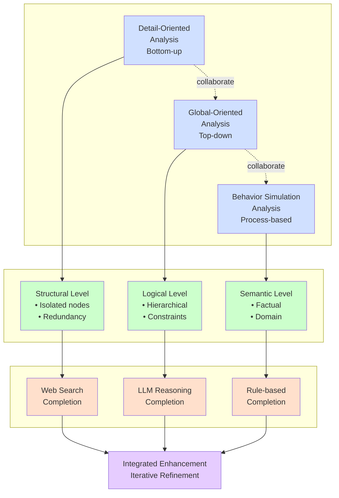
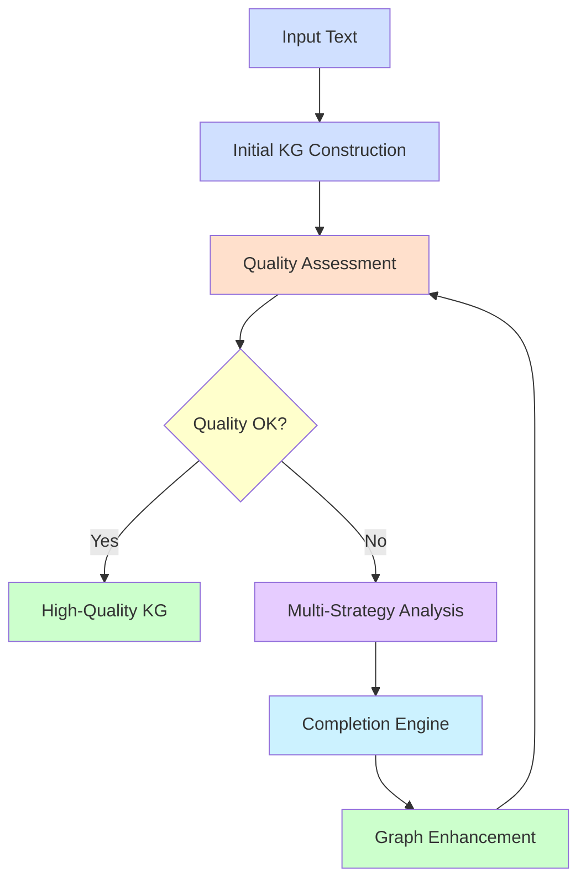
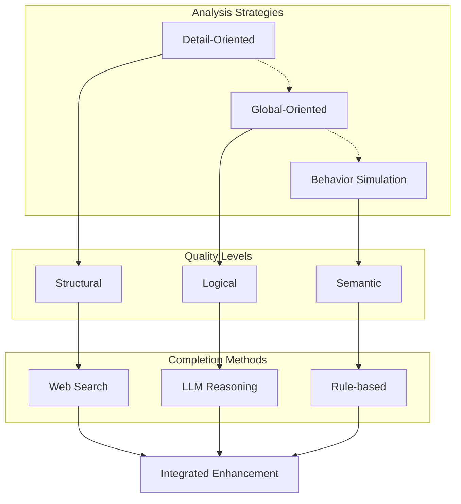

# Flowcharts in Mermaid Format

## Figure 1: Overall Framework Architecture

```mermaid
flowchart TD
    Input[Input Text]
    Construct[Initial KG Construction<br/>LLM + Rules]
    Assess[Quality Assessment<br/>Q(G) = Σ w_i S(C_i)<br/>s.t. S(C_3) ≥ θ]
    Decision{Quality<br/>Threshold<br/>Met?}
    Analysis[Multi-Strategy Analysis<br/>• Detail-Oriented<br/>• Global-Oriented<br/>• Behavior Simulation]
    Completion[Completion Engine<br/>• Web Search<br/>• LLM Reasoning<br/>• Rule-based Inference]
    Enhance[Graph Enhancement<br/>3 Levels]
    Output[High-Quality KG]

    Input --> Construct
    Construct --> Assess
    Assess --> Decision
    Decision -->|Yes| Output
    Decision -->|No| Analysis
    Analysis --> Completion
    Completion --> Enhance
    Enhance --> Assess

    style Input fill:#d0e0ff
    style Construct fill:#d0e0ff
    style Assess fill:#ffe0cc
    style Decision fill:#ffffcc
    style Analysis fill:#e6ccff
    style Completion fill:#ccf2ff
    style Enhance fill:#ccffcc
    style Output fill:#ccffcc

    classDef note fill:#fff,stroke:#999,stroke-dasharray: 5 5
    Note[Level 1: Structural<br/>Level 2: Logical<br/>Level 3: Semantic]:::note
```

**Note:** Add annotation box near "Quality Assessment" showing the three levels.

---

## Figure 2: Multi-Strategy Collaborative Analysis Framework



---

## Alternative Simplified Version (Figure 1)

If the above is too complex, here's a simpler version:



---

## Alternative Simplified Version (Figure 2)



---

## Usage Instructions

1. **Online Rendering**: Copy the code blocks into:
   - [Mermaid Live Editor](https://mermaid.live/)
   - GitHub markdown files (native support)
   - GitLab markdown files (native support)

2. **In LaTeX**: Use the `mermaid` package or convert to PDF/PNG first

3. **In Word/PowerPoint**:
   - Render online and export as PNG/SVG
   - Or use plugins like "Mermaid Chart"

4. **Customization**:
   - Adjust colors by changing `fill:#xxxxxx` values
   - Modify box sizes by adjusting text content
   - Change arrow styles: `-->` (solid), `-.->` (dashed), `==>` (thick)

---
---

# Paper 2: RL-Driven Knowledge Graph Optimization via Automatic Rule Generation

## Figure 1: RL-Driven Co-Optimization Framework (Horizontal Layout)

```mermaid
graph LR
    subgraph Input["<b>EPISODE START</b>"]
        S0["<b>Initial State s₀</b><br/>────────<br/>Q(G₀) = 71.85<br/>Q(R₀) = 0.12<br/>────────<br/>Graph: 72 entities, 156 triples<br/>Rules: 37 expert rules"]
    end

    subgraph Agent["<b>RL AGENT (DQN)</b>"]
        direction TB
        QNet["<b>Q-Network</b><br/>Q(s, a; θ)"]
        Policy["<b>ε-greedy Policy</b><br/>────────<br/>ε = 0.8 (early)<br/>ε = 0.1 (late)"]
    end

    subgraph Actions["<b>ACTION SPACE</b>"]
        direction TB
        A1["<b>Graph Enhancement</b><br/>────────<br/>• Attribute completion<br/>• Logical inference<br/>• Rule-based repair"]
        A2["<b>Rule Generation</b><br/>────────<br/>• Deletion completion<br/>• Augmentation expansion<br/>• Pattern discovery"]
    end

    subgraph Execute["<b>EXECUTION</b>"]
        direction TB
        Exec["<b>Action Execution</b><br/>────────<br/>Update G_t or R_t"]
        Update["<b>State Update</b><br/>────────<br/>G_{t+1}, R_{t+1}"]
    end

    subgraph Assessment["<b>QUALITY ASSESSMENT</b>"]
        direction TB
        Eval["<b>Quality Evaluation</b><br/>────────<br/>Q(G_{t+1}) = Σ w_i S(C_i)<br/>Q(R_{t+1}) = metrics"]
        Reward["<b>Reward Calculation</b><br/>────────<br/>R_t = ΔQ(G) + λ·ΔQ(R)<br/>────────<br/>Example: +2.3"]
    end

    subgraph Memory["<b>EXPERIENCE REPLAY</b>"]
        Buffer["<b>Replay Buffer 𝒟</b><br/>────────<br/>Store: (s_t, a_t, R_t, s_{t+1})<br/>Sample: batch=32<br/>Size: 10,000"]
    end

    subgraph Output["<b>EPISODE END</b>"]
        Final["<b>Final State s_T</b><br/>────────<br/>Q(G_T) = 87.7<br/>Q(R_T) = 0.75<br/>────────<br/>Graph: 72 entities, 178 triples<br/>Rules: 294 generated rules"]
    end

    S0 --> QNet
    QNet --> Policy
    Policy --> A1
    Policy --> A2
    A1 --> Exec
    A2 --> Exec
    Exec --> Update
    Update --> Eval
    Eval --> Reward
    Reward --> Buffer
    Buffer -.sample.-> QNet
    Reward --> QNet

    Update -.convergence?.-> Final

    style S0 fill:#e1f5fe,stroke:#0277bd,stroke-width:2px
    style QNet fill:#fff3e0,stroke:#ef6c00,stroke-width:2px
    style Policy fill:#fff3e0,stroke:#ef6c00,stroke-width:2px
    style A1 fill:#e8f5e9,stroke:#2e7d32,stroke-width:2px
    style A2 fill:#e8f5e9,stroke:#2e7d32,stroke-width:2px
    style Exec fill:#f3e5f5,stroke:#7b1fa2,stroke-width:2px
    style Update fill:#f3e5f5,stroke:#7b1fa2,stroke-width:2px
    style Eval fill:#ede7f6,stroke:#512da8,stroke-width:2px
    style Reward fill:#ede7f6,stroke:#512da8,stroke-width:2px
    style Buffer fill:#fff9c4,stroke:#f57f17,stroke-width:2px
    style Final fill:#c8e6c9,stroke:#388e3c,stroke-width:3px
```



**Key Innovation**: The RL agent learns **when** to optimize graphs vs. **when** to generate rules through Q-learning. Early episodes prioritize rule generation (building comprehensive rule base), while later episodes focus on graph enhancement (applying refined rules).

**Data Transformation**:
- Episode 1-15: 65% rule generation → Q(R) grows from 0.12 to 0.45
- Episode 16-35: 50% balanced → Both Q(G) and Q(R) improve
- Episode 36-50: 70% graph enhancement → Q(G) reaches 87.7

**Convergence**: 50 episodes (37.5% faster than fixed strategies)

---

## Figure 2: Dual-Strategy Rule Generation - Complementary Coverage (Horizontal Layout)

```mermaid
graph LR
    subgraph Input["<b>INPUT</b>"]
        Source["<b>Source Text T + KG G</b><br/>────────<br/>陕西省环保局发布了<br/>关于某企业的处罚决定...<br/>────────<br/>Initial: 37 expert rules<br/>Coverage: 6.4%"]
    end

    subgraph Strategy1["<b>STRATEGY 1: DELETION COMPLETION</b>"]
        direction TB
        S1_1["<b>Step 1: Adversarial Masking</b><br/>────────<br/>Mask entities (p=0.15)<br/>陕西省[MASK]发布了<br/>关于[MASK]的处罚决定"]
        S1_2["<b>Step 2: LLM Inference</b><br/>────────<br/>LLM completes [MASK]<br/>Extracts implicit constraints<br/>PMI(rule, context) > θ"]
        S1_3["<b>Step 3: Rule Extraction</b><br/>────────<br/>If freq(entity_type, property) ≥ 0.7:<br/>  Generate constraint rule"]
        S1_Result["<b>Output: R_deletion</b><br/>────────<br/>156 hierarchical rules<br/>31 procedural rules<br/>────────<br/>Total: 187 rules"]
    end

    subgraph Strategy2["<b>STRATEGY 2: AUGMENTATION EXPANSION</b>"]
        direction TB
        S2_1["<b>Step 1: Data Generation</b><br/>────────<br/>Generate n=5 variants<br/>T₁: different amounts<br/>T₂: different dates<br/>T₃: different entities..."]
        S2_2["<b>Step 2: Pattern Mining</b><br/>────────<br/>Extract KG: {G₁, G₂, ..., G_n}<br/>Mine common patterns<br/>P(R | P_data) ≈ Σ P(R | T_i)"]
        S2_3["<b>Step 3: Rule Synthesis</b><br/>────────<br/>If support(pattern) ≥ 0.6:<br/>  Synthesize boundary rule"]
        S2_Result["<b>Output: R_augmentation</b><br/>────────<br/>88 boundary rules<br/>19 constraint rules<br/>────────<br/>Total: 107 rules"]
    end

    subgraph Merge["<b>DEDUPLICATION & MERGE</b>"]
        direction TB
        Dedup["<b>Semantic Clustering</b><br/>────────<br/>DBSCAN (ε=0.3)<br/>Subsumption check<br/>Generalization"]
        Final["<b>Final Rule Set R*</b><br/>────────<br/>294 unique rules<br/>────────<br/>Precision: 100%<br/>Recall: 26.9%<br/>Coverage: 100%<br/>────────<br/>vs Expert (37 rules):<br/>• 7.95× quantity<br/>• 15.69× coverage<br/>• 40% unique detection"]
    end

    Source --> S1_1
    Source --> S2_1

    S1_1 --> S1_2
    S1_2 --> S1_3
    S1_3 --> S1_Result

    S2_1 --> S2_2
    S2_2 --> S2_3
    S2_3 --> S2_Result

    S1_Result --> Dedup
    S2_Result --> Dedup
    Dedup --> Final

    style Source fill:#e1f5fe,stroke:#0277bd,stroke-width:2px
    style S1_1 fill:#fff3e0,stroke:#ef6c00,stroke-width:2px
    style S1_2 fill:#fff3e0,stroke:#ef6c00,stroke-width:2px
    style S1_3 fill:#fff3e0,stroke:#ef6c00,stroke-width:2px
    style S1_Result fill:#ffccbc,stroke:#d84315,stroke-width:2px
    style S2_1 fill:#e8f5e9,stroke:#2e7d32,stroke-width:2px
    style S2_2 fill:#e8f5e9,stroke:#2e7d32,stroke-width:2px
    style S2_3 fill:#e8f5e9,stroke:#2e7d32,stroke-width:2px
    style S2_Result fill:#c8e6c9,stroke:#1b5e20,stroke-width:2px
    style Dedup fill:#f3e5f5,stroke:#7b1fa2,stroke-width:2px
    style Final fill:#c5cae9,stroke:#283593,stroke-width:3px
```



**Key Innovation**: Two complementary strategies explore different regions of the rule space:

1. **Deletion Completion** (Adversarial): Discovers **implicit constraints** by masking entities and observing LLM's inference → High PMI signals strong constraints
   - Excels at: Hierarchical rules (156), Procedural rules (31)
   - Example: "Government agencies must be penalty issuers"

2. **Augmentation Expansion** (Exploratory): Discovers **boundary cases** by generating data variants and mining patterns → Robust posterior estimation
   - Excels at: Boundary rules (88), Constraint rules (19)
   - Example: "Penalty amounts must be positive", "Violation dates precede penalty dates"

**Complementary Coverage**: 0 overlap in rule types → 156+31 vs 88+19 = 294 unique rules

**Improvement over Expert Rules**: 15.69× coverage, 2.33× recall, 100% precision maintained

---

## Data Flow Example for Paper 2

### RL Optimization Loop (Episode 10):

```
Episode 10, Step 0:
  State: Q(G)=79.2, Q(R)=0.38
  Agent: Selects "Rule Generation - Deletion Completion"
  Execute: Generates 23 new hierarchical rules
  Update: Q(R)=0.42
  Reward: R = (79.2 - 79.2) + 0.4*(0.42 - 0.38) = +0.016

Episode 10, Step 1:
  State: Q(G)=79.2, Q(R)=0.42
  Agent: Selects "Graph Enhancement - Logical Inference"
  Execute: Fixes 8 hierarchical conflicts
  Update: Q(G)=81.3, Q(R)=0.42
  Reward: R = (81.3 - 79.2) + 0.4*(0.42 - 0.42) = +2.1
```

### Rule Generation Example:

```
Input Text: "陕西省环保局于2023年3月15日对某企业作出处罚决定"

Deletion Completion:
  Masked: "[MASK]于[MASK]对[MASK]作出处罚决定"
  LLM completes: "政府机构于日期对企业作出处罚决定"
  → Rule: "Penalty decisions must be issued by government entities"

Augmentation Expansion:
  Variant 1: Amount=5000元 → Pattern: amount > 0
  Variant 2: Date=2024-06-20 → Pattern: date format YYYY-MM-DD
  Variant 3: Entity=工厂 → Pattern: penalty target is organization
  → Rules: "Amounts positive", "Dates valid", "Targets organizations"
```

---

## Comparison: Paper 1 vs Paper 2 Diagrams

| Aspect | Paper 1 | Paper 2 |
|--------|---------|---------|
| **Focus** | Quality assessment & enhancement | RL-driven optimization & rule generation |
| **Main Loop** | Quality → Analysis → Completion → Enhancement | State → Agent → Action → Reward → State |
| **Innovation 1** | Constrained optimization (4 dimensions) | RL co-optimization (G and R) |
| **Innovation 2** | Multi-strategy analysis (3 levels) | Dual-strategy rule generation |
| **Key Metric** | Q(G) with constraints | Q(G) + λ·Q(R) |
| **Data Flow** | Text → G₀ → G_enhanced | G₀ + R₀ → (G_T, R_T) via RL |
