# Improved Flowcharts in Mermaid Format (Professional Version)

This document contains professional, publication-ready versions of all flowcharts for both papers.

---

## Paper 1: Constraint-Based KG Quality Enhancement

### Figure 1: Overall Framework Architecture (Horizontal Flow)

```mermaid
graph LR
    subgraph Input["<b>INPUT</b>"]
        T["<b>Unstructured Text</b><br/>────────<br/>Shaanxi EPA issued a<br/>penalty decision against<br/>a certain enterprise<br/>────────<br/>Domain: Gov. Penalty Document"]
    end

    subgraph Construction["<b>CONSTRUCTION</b>"]
        direction TB
        LLM["<b>LLM Extraction</b><br/>Entity Recognition<br/>Relation Extraction"]
        Rule["<b>Rule Extraction</b><br/>Pattern Matching<br/>Template Filling"]
        G0["<b>Initial KG G₀</b><br/>────────<br/>72 entities<br/>156 triples<br/>────────<br/><b>Q = 71.85</b>"]

        LLM --> G0
        Rule --> G0
    end

    subgraph Assessment["<b>QUALITY ASSESSMENT</b>"]
        direction TB
        QM["<b>Optimization Model</b><br/>────────<br/>Q(G) = Σwᵢ·S(Cᵢ)<br/>s.t. S(C₃) ≥ θ"]

        Metrics["<b>Quality Scores</b><br/>────────<br/>C₁: 78.2 (22% isolated)<br/>C₂: 76.3 (23% redundant)<br/>C₃: 86.3 (13.7% conflicts)<br/>C₄: 55.6 (semantic errors)<br/>────────<br/><b>Overall: 71.85</b>"]

        QM --> Metrics
    end

    subgraph Control["<b>CONTROL</b>"]
        Check{{"<b>Quality Check</b><br/>────────<br/>Q ≥ θ?<br/>────────<br/>71.85 < 85<br/><b>✗ NO</b>"}}
    end

    subgraph Enhancement["<b>ENHANCEMENT</b>"]
        direction TB

        subgraph Strategies["Multi-Strategy Analysis"]
            S1["<b>Detail-Oriented</b><br/>Bottom-up<br/>Found: 16 isolated"]
            S2["<b>Global-Oriented</b><br/>Top-down<br/>Found: hierarchy error"]
            S3["<b>Behavior Simulation</b><br/>Process-based<br/>Found: semantic error"]
        end

        subgraph Completion["Completion Engine"]
            C1["<b>Web Search</b><br/>Attribute completion"]
            C2["<b>LLM Reasoning</b><br/>Relation inference"]
            C3["<b>Rule Inference</b><br/>Constraint propagation"]
        end

        Opt["<b>Graph Optimizer</b><br/>────────<br/>43 repairs applied<br/>4 iterations<br/>────────<br/>71.85→79.2→84.5→87.7"]

        S1 --> C1
        S2 --> C2
        S3 --> C3
        C1 --> Opt
        C2 --> Opt
        C3 --> Opt
    end

    subgraph Output["<b>OUTPUT</b>"]
        GF["<b>High-Quality KG G*</b><br/>────────<br/>72 entities<br/>178 triples (+22)<br/>────────<br/>C₁: 99.8 (+21.6)<br/>C₂: 99.3 (+23.0)<br/>C₃: 86.3 (±0)<br/>C₄: 71.8 (+16.2)<br/>────────<br/><b>Q = 87.7 (+15.85)</b>"]
    end

    %% Main flow
    T --> LLM
    T --> Rule
    G0 --> QM
    Metrics --> Check
    Check -->|"Iterate"| Strategies
    Opt --> QM
    Check -->|"Converged"| GF

    %% Styling
    style T fill:#e3f2fd,stroke:#1565c0,stroke-width:3px,color:#000
    style LLM fill:#e1f5fe,stroke:#0277bd,stroke-width:2px,color:#000
    style Rule fill:#e1f5fe,stroke:#0277bd,stroke-width:2px,color:#000
    style G0 fill:#fff3e0,stroke:#ef6c00,stroke-width:3px,color:#000

    style QM fill:#f3e5f5,stroke:#6a1b9a,stroke-width:2px,color:#000
    style Metrics fill:#ffebee,stroke:#c62828,stroke-width:2px,color:#000

    style Check fill:#fff9c4,stroke:#f57f17,stroke-width:3px,color:#000

    style S1 fill:#e0f2f1,stroke:#00695c,stroke-width:2px,color:#000
    style S2 fill:#e0f2f1,stroke:#00695c,stroke-width:2px,color:#000
    style S3 fill:#e0f2f1,stroke:#00695c,stroke-width:2px,color:#000

    style C1 fill:#e8f5e9,stroke:#2e7d32,stroke-width:2px,color:#000
    style C2 fill:#e8f5e9,stroke:#2e7d32,stroke-width:2px,color:#000
    style C3 fill:#e8f5e9,stroke:#2e7d32,stroke-width:2px,color:#000

    style Opt fill:#ede7f6,stroke:#512da8,stroke-width:3px,color:#000
    style GF fill:#c8e6c9,stroke:#1b5e20,stroke-width:4px,color:#000

    style Input fill:#fafafa,stroke:#424242,stroke-width:2px
    style Construction fill:#fafafa,stroke:#424242,stroke-width:2px
    style Assessment fill:#fafafa,stroke:#424242,stroke-width:2px
    style Control fill:#fafafa,stroke:#424242,stroke-width:2px
    style Enhancement fill:#fafafa,stroke:#424242,stroke-width:2px
    style Output fill:#fafafa,stroke:#424242,stroke-width:2px

    style Strategies fill:#ffffff,stroke:#00695c,stroke-width:1px,stroke-dasharray: 5 5
    style Completion fill:#ffffff,stroke:#2e7d32,stroke-width:1px,stroke-dasharray: 5 5
```



**Architecture Highlights:**

| Stage | Input | Process | Output | Key Metrics |
|-------|-------|---------|--------|-------------|
| **Construction** | Raw text | LLM + Rule extraction | Initial KG G₀ | 72 ent, 156 tri, Q=71.85 |
| **Assessment** | KG G₀ | 4-dimension evaluation | Quality scores | C₁:78.2, C₂:76.3, C₃:86.3, C₄:55.6 |
| **Enhancement** | Low-quality KG | 3 strategies + 3 completions | Repairs | 43 fixes, 4 iterations |
| **Output** | Enhanced KG | Quality verification | High-quality G* | 178 tri (+22), Q=87.7 (+15.85) |

**Quality Progression:**
- **Round 1**: 71.85 → 79.2 (+7.35) — Structural fixes (deduplication, connectivity)
- **Round 2**: 79.2 → 84.5 (+5.3) — Logical repairs (hierarchy, constraints)
- **Round 3**: 84.5 → 86.8 (+2.3) — Semantic corrections (factual, domain)
- **Round 4**: 86.8 → 87.7 (+0.9) — Final refinement ✓ Converged

**Data Transformation Example:**
```
Input:  "Shaanxi EPA issued a penalty decision against a certain enterprise"
        ↓
KG G₀:  (EPA, issued, Penalty Decision)
        (Penalty Decision, subject, Enterprise) ❌ Error
        + 154 more triples...
        ↓
Issues: • 16 isolated nodes (e.g., "Shaanxi Province", degree=0)
        • Hierarchy reversed: (Undertaking Institution, is, Brigade) ❌
        • Wrong subject: Penalty Subject = Enterprise (should be EPA)
        ↓
Repair: • Connected: (Shaanxi Province, administers, EPA)
        • Fixed: (Brigade, is, Undertaking Institution) ✓
        • Corrected: Penalty Subject = EPA ✓
        ↓
KG G*:  High-quality graph with 178 triples (+22 added)
        Quality score improved from 71.85 to 87.7
```

---

### Figure 2: Multi-Strategy Collaborative Analysis Framework (Horizontal 3-Level Pipeline)

```mermaid
graph LR
    subgraph Input["<b>INPUT</b>"]
        KG["<b>Low-Quality KG G</b><br/>────────<br/>72 entities<br/>156 triples<br/>────────<br/>Examples:<br/>(Undertaking Inst., is, Brigade) ❌<br/>(Penalty Decision, subject, Enterprise) ❌<br/>────────<br/>Q = 71.85"]
    end

    subgraph Level1["<b>LEVEL 1: STRUCTURAL</b>"]
        direction TB
        S1["<b>Detail-Oriented Strategy</b><br/>Bottom-up Analysis"]

        D1["<b>Defects Detected</b><br/>────────<br/>• 16 isolated nodes<br/>&nbsp;&nbsp;'Shaanxi Province' degree=0<br/>• 36 redundant triples<br/>&nbsp;&nbsp;(A, is, B) × 3 times<br/>• 8 type conflicts"]

        R1["<b>Structural Repair</b><br/>────────<br/>Deduplication: 36→1<br/>Type correction: 8 fixes<br/>Connectivity: +12 links"]

        C1["<b>Web Search<br/>Completion</b><br/>────────<br/>Query: 'Shaanxi Province EPA'<br/>Added: (Shaanxi Prov., administers, EPA)"]

        S1 --> D1
        D1 --> R1
        R1 --> C1
    end

    subgraph Level2["<b>LEVEL 2: LOGICAL</b>"]
        direction TB
        S2["<b>Global-Oriented Strategy</b><br/>Top-down Pattern Mining"]

        D2["<b>Defects Detected</b><br/>────────<br/>• Hierarchy conflict<br/>&nbsp;&nbsp;(Undertaking Inst., is, Brigade) ⚠️<br/>&nbsp;&nbsp;Should: (Brigade, is, Undertaking Inst.)<br/>• Missing constraints<br/>&nbsp;&nbsp;Penalty Decision lacks Date<br/>• Statistical outliers<br/>&nbsp;&nbsp;2 nodes z-score > 3"]

        R2["<b>Logical Repair</b><br/>────────<br/>Reversed: hierarchy<br/>Added: (Decision, date, 2023-05-10)<br/>Normalized: outliers"]

        C2["<b>LLM Reasoning<br/>Completion</b><br/>────────<br/>Prompt: 'Infer attributes'<br/>Generated: Penalty Amount, Violation Facts"]

        S2 --> D2
        D2 --> R2
        R2 --> C2
    end

    subgraph Level3["<b>LEVEL 3: SEMANTIC</b>"]
        direction TB
        S3["<b>Behavior Simulation Strategy</b><br/>Process Validation"]

        D3["<b>Defects Detected</b><br/>────────<br/>• Factual error<br/>&nbsp;&nbsp;Penalty Subject = Enterprise ❌<br/>&nbsp;&nbsp;Correct: Penalty Subject = EPA<br/>• Domain inconsistency<br/>&nbsp;&nbsp;'Driving Subject' → 'Regulatory Subject'<br/>• Process violation<br/>&nbsp;&nbsp;Missing: Case Filing step"]

        R3["<b>Semantic Repair</b><br/>────────<br/>Corrected: Subject = EPA<br/>Replaced: Driving → Regulatory<br/>Added: process steps"]

        C3["<b>Rule-based<br/>Completion</b><br/>────────<br/>Applied: Penalty Procedure Rules<br/>Added: (Case, step, Case Filing)"]

        S3 --> D3
        D3 --> R3
        R3 --> C3
    end

    subgraph Integration["<b>INTEGRATION</b>"]
        direction TB
        Fusion["<b>Multi-level Fusion</b><br/>────────<br/>Merging repairs:<br/>Level 1: 12 fixes<br/>Level 2: 15 fixes<br/>Level 3: 16 fixes<br/>────────<br/>Conflicts: 2 resolved"]

        Refine["<b>Iterative Refinement</b><br/>────────<br/>Round 1: 71.85→79.2<br/>Round 2: 79.2→84.5<br/>Round 3: 84.5→86.8<br/>Round 4: 86.8→87.7 ✓"]

        Fusion --> Refine
    end

    subgraph Output["<b>OUTPUT</b>"]
        Enhanced["<b>Enhanced KG G'</b><br/>────────<br/>72 entities<br/>178 triples (+22)<br/>────────<br/>Corrected examples:<br/>(Brigade, is, Undertaking Inst.) ✓<br/>(Decision, subject, EPA) ✓<br/>(Decision, date, 2023-05-10) ✓<br/>────────<br/><b>Q = 87.7 (+15.85)</b>"]
    end

    %% Main flow
    KG --> S1
    KG --> S2
    KG --> S3

    C1 --> Fusion
    C2 --> Fusion
    C3 --> Fusion

    Refine --> Enhanced

    %% Cross-level collaboration
    S1 -.info sharing.-> S2
    S2 -.info sharing.-> S3

    %% Styling
    style KG fill:#ffebee,stroke:#c62828,stroke-width:3px,color:#000
    style Enhanced fill:#c8e6c9,stroke:#1b5e20,stroke-width:4px,color:#000

    style S1 fill:#e1f5fe,stroke:#0277bd,stroke-width:2px,color:#000
    style D1 fill:#e1f5fe,stroke:#0277bd,stroke-width:2px,color:#000
    style R1 fill:#b3e5fc,stroke:#01579b,stroke-width:2px,color:#000
    style C1 fill:#81d4fa,stroke:#0277bd,stroke-width:2px,color:#000

    style S2 fill:#fff3e0,stroke:#ef6c00,stroke-width:2px,color:#000
    style D2 fill:#fff3e0,stroke:#ef6c00,stroke-width:2px,color:#000
    style R2 fill:#ffe0b2,stroke:#e65100,stroke-width:2px,color:#000
    style C2 fill:#ffcc80,stroke:#ef6c00,stroke-width:2px,color:#000

    style S3 fill:#fce4ec,stroke:#c2185b,stroke-width:2px,color:#000
    style D3 fill:#fce4ec,stroke:#c2185b,stroke-width:2px,color:#000
    style R3 fill:#f8bbd0,stroke:#880e4f,stroke-width:2px,color:#000
    style C3 fill:#f48fb1,stroke:#c2185b,stroke-width:2px,color:#000

    style Fusion fill:#e1bee7,stroke:#6a1b9a,stroke-width:3px,color:#000
    style Refine fill:#ce93d8,stroke:#4a148c,stroke-width:3px,color:#000

    style Input fill:#fafafa,stroke:#424242,stroke-width:2px
    style Level1 fill:#e3f2fd,stroke:#1976d2,stroke-width:3px
    style Level2 fill:#fff8e1,stroke:#f57c00,stroke-width:3px
    style Level3 fill:#fce4ec,stroke:#c2185b,stroke-width:3px
    style Integration fill:#f3e5f5,stroke:#7b1fa2,stroke-width:2px
    style Output fill:#fafafa,stroke:#424242,stroke-width:2px
```



**Three-Level Parallel Processing Pipeline:**

| Level | Strategy | Input Defects | Repair Actions | Completion Method | Output |
|-------|----------|---------------|----------------|-------------------|--------|
| **Level 1<br/>Structural** | Detail-Oriented<br/>(Bottom-up) | • 16 isolated nodes<br/>• 36 duplicates<br/>• 8 type errors | • Dedup: 36→1<br/>• Type fix: 8<br/>• Connect: +12 | Web Search<br/>External KB | 12 fixes<br/>Uniqueness↑ |
| **Level 2<br/>Logical** | Global-Oriented<br/>(Top-down) | • Hierarchy reversed<br/>• Missing dates<br/>• 2 outliers | • Reverse relation<br/>• Add attributes<br/>• Normalize | LLM Reasoning<br/>Inference | 15 fixes<br/>Consistency↑ |
| **Level 3<br/>Semantic** | Behavior Simulation<br/>(Process-based) | • Wrong subject<br/>• Wrong terms<br/>• Missing steps | • Correct subject<br/>• Replace terms<br/>• Add steps | Rule-based<br/>Domain KB | 16 fixes<br/>Soundness↑ |

**Concrete Repair Examples:**

**Structural Level:**
```
Problem:  (A, is, B) appears 3 times (hash collision)
Fix:      Deduplicate → Keep 1 instance
Result:   36 redundant triples → 1 unique triple
Impact:   Uniqueness +23.0 points
```

**Logical Level:**
```
Problem:  (Undertaking Institution, is, Brigade) — hierarchy reversed
Fix:      Global pattern analysis → Reverse relationship
Result:   (Brigade, is, Undertaking Institution) ✓
Impact:   Consistency maintained at 86.3
```

**Semantic Level:**
```
Problem:  (Penalty Decision, Penalty Subject, Enterprise) — factually wrong
Fix:      Process simulation → Domain knowledge correction
Result:   (Penalty Decision, Penalty Subject, EPA) ✓
Impact:   Soundness +16.2 points
```

**Quality Progression Through Levels:**
- **After Level 1**: 71.85 → 79.2 (+7.35) — Structural cleaned
- **After Level 2**: 79.2 → 84.5 (+5.3) — Logical fixed
- **After Level 3**: 84.5 → 86.8 (+2.3) — Semantic corrected
- **Final Refinement**: 86.8 → 87.7 (+0.9) — Converged ✓

**Multi-level Synergy:**
- **Individual best**: Level 3 alone achieves 78.44
- **Combined system**: All 3 levels achieve 87.7
- **Synergy gain**: +9.26 points from multi-level integration
- **Collaboration**: Information sharing between levels improves detection accuracy

---

## Paper 2: RL-Driven KG Optimization via Automatic Rule Generation

### Figure 1: RL-Driven Co-Optimization Framework (Simplified 3-Stage Flow)

```mermaid
graph LR
    subgraph Input["<b>INPUT (Episode 0)</b>"]
        S0["<b>Initial State</b><br/>────────<br/>Graph Quality: Q(G₀) = 71.85<br/>• 72 entities, 156 triples<br/>• 16 isolated nodes<br/>• 36 redundant triples<br/>────────<br/>Rule Quality: Q(R₀) = 0.35<br/>• 37 expert rules<br/>• Coverage: 6.4%<br/>• Recall: 11.5%"]
    end

    subgraph RL["<b>RL OPTIMIZATION MODULE</b>"]
        direction TB

        subgraph Layer1["Agent Decision"]
            State["<b>State Observation</b><br/>────────<br/>s_t = [Q(G_t), Q(R_t)]<br/>────────<br/><b>Example:</b><br/>Q(G)=79.2, Q(R)=0.38"]
            Agent["<b>DQN Agent</b><br/>────────<br/>Q-network (7→128→64→8)<br/>ε-greedy policy<br/>────────<br/>Select best action"]
        end

        subgraph Layer2["Action Execution"]
            Actions["<b>Action Space</b><br/>────────<br/>• Graph Enhancement (5)<br/>• Rule Generation (2)<br/>────────<br/><b>Selected:</b> Generate rules"]
            Execute["<b>Execute & Update</b><br/>────────<br/>Deletion completion<br/>+23 rules extracted<br/>────────<br/>Q(R): 0.38 → 0.42"]
        end

        subgraph Layer3["Learning Process"]
            Reward["<b>Reward Calculation</b><br/>────────<br/>R_t = ΔQ(G) + 0.4·ΔQ(R)<br/>────────<br/><b>Result:</b> +0.016"]
            Learn["<b>Iterative Refinement</b><br/>────────<br/>Ep 1-15: Rules (65%)<br/>Ep 16-35: Balanced (50%)<br/>Ep 36-50: Graph (70%)<br/>────────<br/>Converges in 50 episodes"]
        end

        State --> Agent
        Agent --> Actions
        Actions --> Execute
        Execute --> Reward
        Reward --> Learn
    end

    subgraph Output["<b>OUTPUT (Episode 50)</b>"]
        SF["<b>Final State (Converged)</b><br/>────────<br/>Graph Quality: Q(G_T) = 87.7 <b>(+15.85)</b><br/>• 72 entities, 178 triples <b>(+22)</b><br/>• 0 isolated nodes <b>(-16)</b><br/>• 1 redundant triple <b>(-35)</b><br/>────────<br/>Rule Quality: Q(R_T) = 0.75 <b>(+0.40)</b><br/>• 294 generated rules <b>(+257)</b><br/>• Coverage: 100% <b>(+93.6%)</b><br/>• Recall: 26.9% <b>(+2.33×)</b>"]
    end

    %% Flow
    S0 --> State
    Learn --> SF

    %% Styling - uniform, no yellow
    style S0 fill:#e3f2fd,stroke:#1976d2,stroke-width:3px,color:#000
    style SF fill:#c8e6c9,stroke:#2e7d32,stroke-width:3px,color:#000

    style State fill:#e1f5fe,stroke:#0277bd,stroke-width:2px,color:#000
    style Agent fill:#e1f5fe,stroke:#0277bd,stroke-width:2px,color:#000
    style Actions fill:#ffe0b2,stroke:#f57c00,stroke-width:2px,color:#000
    style Execute fill:#ffe0b2,stroke:#f57c00,stroke-width:2px,color:#000
    style Reward fill:#ffccbc,stroke:#e64a19,stroke-width:2px,color:#000
    style Learn fill:#ffccbc,stroke:#e64a19,stroke-width:2px,color:#000

    style Input fill:#fafafa,stroke:#616161,stroke-width:2px
    style RL fill:#fff3e0,stroke:#f57c00,stroke-width:3px
    style Output fill:#fafafa,stroke:#616161,stroke-width:2px
    style Layer1 fill:#ffffff,stroke:#0277bd,stroke-width:1px,stroke-dasharray: 5 5
    style Layer2 fill:#ffffff,stroke:#f57c00,stroke-width:1px,stroke-dasharray: 5 5
    style Layer3 fill:#ffffff,stroke:#e64a19,stroke-width:1px,stroke-dasharray: 5 5
```



**Three-Stage Architecture:**
1. **INPUT**: Initial low-quality KG with expert rules
2. **RL MODULE**: DQN agent learns to co-optimize G and R over 50 episodes
3. **OUTPUT**: High-quality KG with comprehensive auto-generated rules

**Key Innovation - Co-Optimization:**
```
Traditional: Optimize G only
Our Method: Optimize G + R simultaneously via RL

Learned Strategy:
  Early episodes → Generate rules (build rule base)
  Middle episodes → Balanced approach
  Late episodes → Apply rules to enhance graph
```

**Concrete Example (Episode 10, Step 5):**
```
Input:  State s_t with Q(G)=79.2, Q(R)=0.38
Agent:  DQN selects action "Rule Generation - Deletion Completion"
        (Q-value = 0.85, highest among 8 actions)

Execute: Mask text: "Shaanxi [MASK] issued on [MASK] a penalty decision
         against [MASK]"
        LLM infers: "Government Agency" (10/10 times)
        Extract: 23 new hierarchical/procedural rules

Output: State s_{t+1} with Q(G)=79.2 (unchanged), Q(R)=0.42 (+0.04)
        Reward R_t = 0 + 0.4×0.04 = +0.016
        Store transition, update Q-network parameters θ
```

---

### Figure 2: Dual-Strategy Rule Generation - Complementary Coverage (Horizontal Dual-Path Flow)

```mermaid
graph LR
    subgraph Input["<b>INPUT</b>"]
        Source["<b>Source Text T + KG G</b><br/>────────<br/>Shaanxi EPA on 2023-03-15<br/>issued a penalty decision<br/>against a certain enterprise<br/>────────<br/><b>Current Rules:</b><br/>37 expert rules<br/>Coverage: 6.4% (1/15 types)<br/>Recall: 11.5%"]
    end

    subgraph Path1["<b>PATH 1: DELETION COMPLETION</b>"]
        direction TB

        S1_Mask["<b>Step 1: Adversarial Masking</b><br/>────────<br/>p_mask = 0.15 (15% entities)<br/>────────<br/>Masked:<br/>'[MASK] on [MASK] issued a<br/>penalty decision against [MASK]'"]

        S1_LLM["<b>Step 2: LLM Completion</b><br/>────────<br/>Iterate N=10 times<br/>────────<br/>Inferred (7/10):<br/>'Government Agency' (entity type)<br/>'Date' (attribute)<br/>'Enterprise' (target type)"]

        S1_Extract["<b>Step 3: Rule Extraction</b><br/>────────<br/>Confidence ≥ 0.7:<br/>────────<br/>✓ 'Penalty Decision must have Gov. Agency'<br/>✓ 'Penalty Decision must have Date'<br/>✓ 'Penalty target is Enterprise'"]

        S1_Output["<b>R_deletion</b><br/>────────<br/><b>156 hierarchical rules</b><br/>&nbsp;e.g., 'Government<br/>&nbsp;agencies issue penalties'<br/>────────<br/><b>31 procedural rules</b><br/>&nbsp;e.g., 'Penalty requires<br/>&nbsp;violation evidence'<br/>────────<br/><b>Total: 187 rules</b>"]

        S1_Mask --> S1_LLM
        S1_LLM --> S1_Extract
        S1_Extract --> S1_Output
    end

    subgraph Path2["<b>PATH 2: AUGMENTATION EXPANSION</b>"]
        direction TB

        S2_Gen["<b>Step 1: Data Generation</b><br/>────────<br/>n=5 variants, τ=0.8, p=0.9<br/>────────<br/>T₁: amount=5000 CNY<br/>T₂: date=2024-06-20<br/>T₃: entity=Factory A<br/>T₄: violation=Excessive Discharge<br/>T₅: bureau=Municipal EPA"]

        S2_Mine["<b>Step 2: Pattern Mining</b><br/>────────<br/>Extract KG from each T_i<br/>Find common patterns<br/>────────<br/>Pattern 1 (5/5): amount > 0<br/>Pattern 2 (4/5): date format<br/>Pattern 3 (5/5): has violation"]

        S2_Synth["<b>Step 3: Rule Synthesis</b><br/>────────<br/>Support ≥ 0.6:<br/>────────<br/>✓ 'Amounts must be positive'<br/>✓ 'Dates use YYYY-MM-DD'<br/>✓ 'Penalties need violations'"]

        S2_Output["<b>R_augmentation</b><br/>────────<br/><b>88 boundary rules</b><br/>&nbsp;e.g., 'Penalty amount<br/>&nbsp;must be positive'<br/>────────<br/><b>19 constraint rules</b><br/>&nbsp;e.g., 'Violation date<br/>&nbsp;precedes penalty date'<br/>────────<br/><b>Total: 107 rules</b>"]

        S2_Gen --> S2_Mine
        S2_Mine --> S2_Synth
        S2_Synth --> S2_Output
    end

    subgraph Merge["<b>DEDUPLICATION & MERGE</b>"]
        direction TB

        Cluster["<b>Semantic Clustering</b><br/>────────<br/>Embed: e_r ∈ ℝ⁷⁶⁸<br/>DBSCAN: ε=0.3, minPts=2<br/>────────<br/>Result: K=58 clusters"]

        Subsume["<b>Subsumption Check</b><br/>────────<br/>Example:<br/>'Gov. Agency issue Penalty' ⊒<br/>'EPA issue Penalty'<br/>────────<br/>Keep general rule,<br/>remove 47 subsumed"]

        Final["<b>Final Rule Set R*</b><br/>────────<br/><b>294 unique rules</b><br/>────────<br/>vs Expert (37 rules):<br/>• Quantity: <b>7.95×</b><br/>• Coverage: <b>100%</b> (+93.6%)<br/>• Recall: <b>26.9%</b> (+2.33×)<br/>• Precision: <b>100%</b> (maintained)<br/>────────<br/><b>Unique detection: 40%</b><br/>(60 issues only new rules find)"]

        Cluster --> Subsume
        Subsume --> Final
    end

    %% Main connections
    Source --> S1_Mask
    Source --> S2_Gen
    S1_Output --> Cluster
    S2_Output --> Cluster

    %% Styling
    style Source fill:#e1f5fe,stroke:#0277bd,stroke-width:3px,color:#000

    style S1_Mask fill:#fff3e0,stroke:#ef6c00,stroke-width:2px,color:#000
    style S1_LLM fill:#fff3e0,stroke:#ef6c00,stroke-width:2px,color:#000
    style S1_Extract fill:#fff3e0,stroke:#ef6c00,stroke-width:2px,color:#000
    style S1_Output fill:#ffccbc,stroke:#d84315,stroke-width:3px,color:#000

    style S2_Gen fill:#e8f5e9,stroke:#2e7d32,stroke-width:2px,color:#000
    style S2_Mine fill:#e8f5e9,stroke:#2e7d32,stroke-width:2px,color:#000
    style S2_Synth fill:#e8f5e9,stroke:#2e7d32,stroke-width:2px,color:#000
    style S2_Output fill:#c8e6c9,stroke:#1b5e20,stroke-width:3px,color:#000

    style Cluster fill:#f3e5f5,stroke:#7b1fa2,stroke-width:2px,color:#000
    style Subsume fill:#f3e5f5,stroke:#7b1fa2,stroke-width:2px,color:#000
    style Final fill:#c5cae9,stroke:#283593,stroke-width:4px,color:#000

    style Input fill:#fafafa,stroke:#424242,stroke-width:2px
    style Path1 fill:#fff8e1,stroke:#f57c00,stroke-width:2px
    style Path2 fill:#e8f5e9,stroke:#2e7d32,stroke-width:2px
    style Merge fill:#f3e5f5,stroke:#7b1fa2,stroke-width:2px
```



**Key Features:**
- **Dual parallel paths**: Clearly shows complementary strategies working simultaneously
- **Step-by-step breakdown**: Each strategy has 3 explicit steps with concrete examples
- **English text examples**: Real penalty text showing masking and augmentation
- **Quantitative results**: Specific counts for hierarchical (156), procedural (31), boundary (88), constraint (19) rules
- **Deduplication pipeline**: Mathematical notation showing clustering and subsumption
- **Performance metrics**: Direct comparison with expert rules (7.95× quantity, 15.69× coverage)

**Complete Data Flow Example:**

```
Input: "Shaanxi EPA on 2023-03-15 issued a penalty decision against a certain enterprise"

PATH 1 - Deletion Completion:
  Round 1:  Mask 'EPA'          → LLM infers 'Government Agency' ✓
  Round 2:  Mask '2023-03-15'   → LLM infers 'Date' ✓
  Round 3:  Mask 'enterprise'   → LLM infers 'Enterprise' ✓
  ...
  Round 10: Mask 'penalty decision' → LLM infers 'administrative action' ✓

  Confidence = 7/10 = 0.70 (threshold met!)
  → Extract rule: "Penalty decisions must specify government agency, date, and target entity"

PATH 2 - Augmentation Expansion:
  Variant 1: "...penalty amount 5000 CNY..."  → Pattern: amount field exists
  Variant 2: "...2024-06-20..."               → Pattern: YYYY-MM-DD format
  Variant 3: "...Factory A..."                → Pattern: target is organization
  Variant 4: "...excessive discharge..."      → Pattern: violation specified
  Variant 5: "...Municipal EPA..."            → Pattern: issuer hierarchy

  Support(amount>0)      = 5/5 = 1.00 ✓
  Support(date_format)   = 4/5 = 0.80 ✓
  Support(has_violation) = 5/5 = 1.00 ✓
  → Extract rules about boundary conditions

MERGE:
  187 + 107 = 294 raw rules
  Clustering → 58 clusters
  Subsumption removal → 47 redundant rules removed
  Final: 294 unique rules

Result:
  Expert rules:    37  (coverage 6.4%,  recall 11.5%)
  Generated rules: 294 (coverage 100%, recall 26.9%)
  Improvement:     7.95× quantity, 15.69× coverage, 2.33× recall
```

---

## Annotations for All Figures

**Typography:**
- Use `<b>` for bold titles and key terms
- Use `<i>` for subtitles and descriptive text
- Use `<sub>` for subscripts and `<sup>` for superscripts

**Statistics (Figure 2, Paper 2):**
- R<sub>deletion</sub>: 156 hierarchical + 31 procedural = 187 rules
- R<sub>augmentation</sub>: 88 boundary + 19 constraint = 107 rules
- Total before deduplication: 294 rules
- Final R*: 294 rules (after semantic clustering)

---

## Usage Instructions

### Online Rendering
1. **Mermaid Live Editor**: https://mermaid.live/
2. **GitHub/GitLab**: Native support in markdown files
3. **VS Code**: Install "Markdown Preview Mermaid Support" extension

### Export for Publications
1. Render in Mermaid Live Editor
2. Export as SVG (best quality) or PNG (high DPI: 300)
3. Import into LaTeX using `\includegraphics`

### Color Scheme Reference

**Professional Academic Palette:**
- Blue (`#d5e8f7`, `#5a7fa8`): Primary nodes, states
- Green (`#d4edda`, `#5a8a69`): Positive outcomes, enhancements, final outputs
- Orange (`#ffe7cc`, `#d4894a`): Intermediate results, rewards
- Teal (`#d1ecf1`, `#5a9fb3`): Assessment, processing
- Purple (`#e8d6f0`, `#9a6eb3`): Integration, execution
- Yellow (`#fff3cd`, `#d4a843`): Decisions, buffers
- Red (`#f8d7da`, `#c77883`): Agent (emphasized)

**Design Principles:**
- Muted, professional tones (avoid bright saturated colors)
- Sufficient contrast for B&W printing
- Stroke width 2px for visibility
- Consistent typography hierarchy
