# 基于来源的约束验证：文档级知识图谱修复

**英文题名：** Source-Grounded Constraint Validation for Document-Level Knowledge Graph Repair

**作者：** Hua Peng¹、Zifu Tao²（共同第一作者）；Yu Guo¹、Qiang Zhou²、Tian Zhou³（通讯作者）、Bo Han³。

**单位：** ¹中移系统集成有限公司，中国；²同济大学，中国；³西安交通大学，中国。

**作者邮箱：** Hua Peng：penghua@cmict.chinamobile.com；Zifu Tao：2253323@tongji.edu.cn；Yu Guo：guoyu1@cmict.chinamobile.com；Qiang Zhou：zhouqiang@cmict.chinamobile.com；Tian Zhou：tianzhou@xjtu.edu.cn；Bo Han：bohan@xjtu.edu.cn。

> 译文依据 2026-10-02 的当前英文稿（源提交 `a1f9f85`），包括正文、表格、算法、声明及附录。公式保留原有数学含义，使用行内与独立行的 LaTeX 数学语法；需在支持 MathJax/KaTeX 的 Markdown 阅读器中预览。图使用原稿插图，图注译为中文；参考文献保留原始题名与出版信息。引用统一用数字索引对应文末条目，表格中的模型和方法缩写与原图保持对应。译文不修改实验结果或原稿结论。

# 摘要

从文档抽取的知识图谱可能存在字段缺失和数值错误。本文研究利用源文本、字段模式和语言模型进行修复。该流程先规范化输入，再生成候选图谱，并检查候选的头节点、关系、来源片段和字段数量。在包含 450 个受控缺陷的 225 个文档图谱上，“诊断 + 门控”（Diagnosis + Gate）修复了 98.00% 的缺陷。在 225 个实际抽取结果上，该方法将三元组 F1 从 87.99% 提升至 92.48%。对于这种序列化记录输入，直接复制字段能够恢复全部参考图谱。本文还研究了具有独立标注的收据转录文本。最初的 60 文档测试发现了字段选择与文本规范化错误；后续使用 20 个开发文档和冻结的 60 个测试文档，比较共享字段定义、字段证据索引和 SHACL 上下文。在新的测试集上，初始抽取图谱的 F1 为 78.33%；经过过滤的 Simple、Evidence Index 和 SHACL 分别达到 78.75%、83.51% 和 78.33%。Evidence Index 相对于 Simple 的配对差值为 4.76 个百分点，95% 置信区间为 2.50 至 7.26。在 56 份留出的 CUAD 合同上，带索引的修复和重新抽取分别达到 44.84% 和 44.12% 的来源片段 F1；配对差值为 0.72 个百分点，95% 置信区间为 $-4.80$ 至 6.48。这些比较表明，证据上下文和已有图谱的价值取决于具体文档任务。代码、提示词、预测结果和标注材料均已提供，以支持进一步评估。

**关键词：** 知识图谱修复；来源依据；约束验证；文档抽取。

# 1 引言

从文档抽取的知识图谱经常出现字段缺失、取值错误、三元组重复和模式违反。这些错误会降低信息检索和决策支持的质量 [17, 28]。在许多抽取流程中，源文本仍然可用，能够为图谱检查和修复提供证据。

模式检查与语言模型在这个过程中承担不同职责。模式检查能够识别无效关系或重复值。语言模型能够阅读来源并恢复缺失字段，但也可能修改正确值或添加不受支持的事实。知识图谱质量与 SHACL 验证研究提供了检查图约束的工具 [42, 19, 18]。Lin 等人将约束与图上下文结合到 LLM 修复提示中 [22]。这些方法引出三个问题：修复何时能改善抽取图谱，上下文与验证各自贡献多少，以及现有图谱何时比重新抽取更有用？

本文研究具有声明文档节点、允许关系集合、且每种关系至多对应一个值的文档字段图谱。流程首先规范化输入图谱，随后语言模型结合源文本和可选的诊断报告提出完整图谱。确定性过滤器逐一检查候选三元组的头节点是否合法、关系是否允许、取值是否出现在来源中，以及是否满足每字段至多一个值的规则，并记录每个被拒绝三元组的原因。

评估将生成与验证分开。在相同指令和输出预算下，比较基础上下文、诊断上下文和 SHACL 上下文；对每次响应分别在过滤前后评分。这一设计既衡量上下文对生成的影响，也衡量过滤对固定候选集合的影响。此外，本文比较顺序选择器，并测量诊断报告更新的成本。

本文使用三个中文记录集合中的受控缺陷和实际抽取输出。这些源文本明确列出了目标字段，字段复制解析器能够恢复全部参考图谱。因此，我们增加了 SROIE 收据转录文本的外部测试，其文本与人工字段标签分别存储。两个场景可以比较序列化记录与独立标注文档文本上的行为。随后根据错误分析开展小规模后续实验，加入共享字段定义和确定性的来源证据行索引。在独立开发集上评估该变体，并在新文档测试前冻结设计。进一步的 56 份 CUAD 合同实验，在采集前固定解析器，比较修复和重新抽取，没有发现修复具有可靠优势。

本文提供以下三项主要结果：

- 一套基于来源的候选验证程序，明确规定输入要求、字段约束和拒绝日志。

- 覆盖受控缺陷、模型抽取错误、外部收据和合同字段的修复评估，衡量事实恢复、事实保留和有害编辑。

- 对诊断上下文、字段证据行、SHACL 上下文及候选过滤进行匹配对照，并提供逐文档预测、统计比较和执行轨迹。这些对照识别了特定任务上的收益，以及更简单的输入或选择器已经足够的情况。

第 2 节回顾相关工作；第 3、4 节介绍方法和实现；第 5 节给出评估；第 6 节总结全文。

# 2 相关工作

## 2.1 知识图谱构建与质量感知抽取

传统知识图谱（KG）构建遵循信息抽取、实体链接、关系映射和图谱组装的系统化流程 [17]。DBpedia [3]、YAGO [34] 和 Freebase [5] 等早期系统从结构化及半结构化来源中抽取事实。构建过程中使用质量感知机制保障数据可靠性，包括基于置信度的过滤、来源投票和实体消歧 [11]。概率知识融合结合多种抽取信号，为生成的三元组赋予可靠性分数，从而在抽取流程内部建立基础质量控制层 [11]。

嵌入模型将实体和关系映射到连续向量空间，用于链接预测和下游推理 [6, 35]；图神经网络聚合关系邻域信息 [32]。综述和观点论文讨论了 LLM 如何支持知识图谱构建、补全和知识融合 [26, 27, 4]。通用提示方法包括思维链推理 [37] 和可复用提示模式 [38]；检索增强生成提供了以外部证据为条件进行生成的机制 [21]。这些通用方法应与直接评估文本到知识图谱抽取的工作区分。Neo4j Labs 的 LLM Knowledge Graph Builder 等公开系统提供可配置模式的文档到图谱应用和开源抽取流程 [23]。附录 A.2 将其可复现的核心抽取器作为外部 Text-to-KG 基线。

## 2.2 知识图谱质量评估

知识图谱质量评估从准确性、完整性、一致性和时效性等维度描述图谱可靠性 [42, 28]。自动评估采用不同计算方法：统计异常检测通过建模取值分布识别数值与字面量数据中的异常 [39, 29]；嵌入模型通过连续向量空间中的距离评估三元组可信度，从全局语义角度判断图谱完整性 [24]；基于规则的验证框架使用形式化约束语言检查逻辑结构和模式合规性，保证显式本体一致性 [19]。这些方法提供了从局部结构到全局语义的多种质量指标。

Lin 等人通过引入违反约束的操作构造受控 SHACL 修复任务，并比较基于 LLM 的修复策略 [22]。其结果强调了相关约束和局部图上下文在修复提示中的价值。对于存在歧义的质量判断，众包可以补充自动评估 [1]。更广泛的综述从多个维度，以及知识图谱构建和精化的不同阶段组织质量控制方法 [36, 28]。本文的诊断报告记录单个文档图谱内部可执行的结构和来源支持检查。

## 2.3 知识图谱质量增强与工具编排

知识图谱增强处理缺失事实和错误断言。基于关系路径 [20]、嵌入 [6, 40, 33] 和神经网络 [9] 的补全方法预测缺失链接。MINERVA 学习在知识图谱上导航的策略以回答查询 [8]，MetaR 则处理少样本链接预测 [7]。这些任务提供推理机制，但不同于评估一项编辑能否在损坏图谱中保留有效事实。AMIE 挖掘正逻辑规则 [12]，RuDiK 发现正、负规则 [25]；其他方法将逻辑规则或简单约束加入嵌入目标 [14, 10]。

神经与概率方法进一步结合逻辑结构和学习预测。RNNLogic 通过基于 EM 的过程联合训练规则生成器和推理预测器 [31]。NBFNet 使用广义 Bellman–Ford 形式学习链接预测的路径表示 [43]。pLogicNet 将马尔可夫逻辑网络中的一阶规则与基于嵌入的变分推断结合 [30]。这些工作启发了将结构先验与学习预测结合的设计。本文评估的流程规范化文档字段三元组并验证生成候选，同时将候选过滤与对试验图谱评分的顺序选择器进行比较。

已有工作通过显式 SHACL 违反和不同提示策略评估 LLM 图谱修复 [22]。更一般地，ReAct 展示了如何将语言模型推理和动作交替执行，以从外部来源收集信息 [41]，本文的 ReAct 风格基线借鉴了这一交互方式。通过共享指令和冻结候选响应，本文分别考察诊断提示与来源约束候选过滤。五部分 SHACL 上下文基线将 Lin 等人的设计适配到相同文档字段任务和模型预算下；共享提示及同响应配对评分用于区分上下文和过滤的作用。

# 3 问题设定与修复方法

本文研究以来源为依据的小型文档级知识图谱修复。输入包括三元组多重集 $G$、源文本 $X$、声明的文档节点 $h_0$ 和允许关系词表 $\mathcal R_X$。图谱面向字段：对一个文档，每种允许关系至多具有一个非空值。该设定覆盖文档元数据和收据字段抽取等任务。参考图谱 $G^*$ 仅用于评分。

本文采用字面来源匹配：当某个值出现在 $X$ 中时，视为得到来源支持。关系正确性和可接受的释义在评估阶段判断。

主要对照使用单调用流程：规范化输入，生成完整候选图谱，再过滤其中的三元组。诊断上下文与字段证据行为可选的生成输入。图 1 和图 3 中的顺序变体加入学习路由与试验图选择，并在第 4.4 节用固定提案单独评估；单调用结果使用下文定义的直接过滤器。

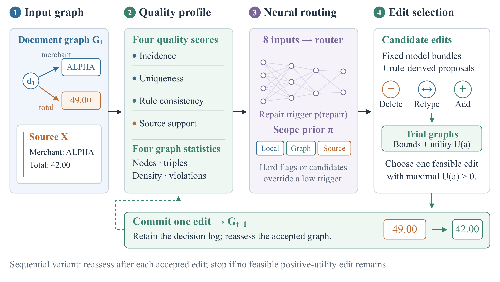

**图 1：** 单独评估的基于质量画像的顺序修复。四个质量分数和四个图统计量输入学习得到的修复触发器与作用域先验。模型编辑包与规则提案在试验图上评估；每轮提交正效用最高的可行编辑，再评估已接受的图谱。字段值和网络示意用于说明机制。第 4.4 节描述固定提案评估。

## 3.1 结构规范化与诊断上下文

图 2 将诊断信息划分为局部、图谱和来源三个范围。在文档字段修复中，这些检查通过重复计数、声明的头节点和关系模式，以及来源匹配实现。

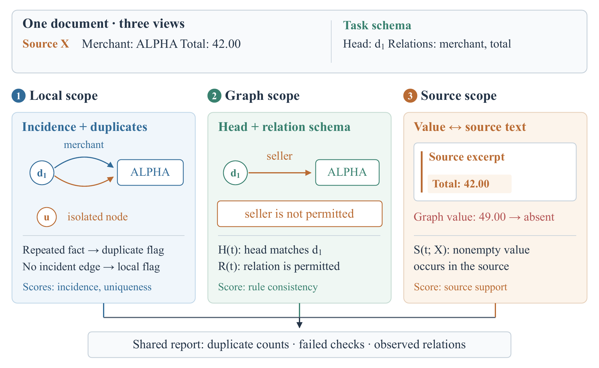

**图 2：** 单文档图谱的三个诊断作用域，由单调用与顺序实现共用。示意例分别展示重复事实和孤立节点（局部）、声明模式之外的关系（图级）以及来源中不存在的值（来源）。所有作用域汇入共享报告。可执行的文档字段谓词由式（1）定义。

确定性预处理器 $P$ 删除完全重复项；当边的宾语等于 $h_0$ 而主语不等于时修正方向；删除头节点或关系违反给定模式的三元组。记 $G_s=P(G;h_0,\mathcal R_X)$。

对于三元组 $t=(h,r,o)$，定义以下可执行谓词：

$$
H(t)=\mathbf1[h=h_0],\quad
    R(t)=\mathbf1[r\in\mathcal R_X],\quad
    S(t;X)=\mathbf1[o\ne\emptyset\ \wedge\ o\text{ occurs in }X].
\tag{1}
$$

诊断上下文记录重复次数、未通过 $H$、$R$ 或 $S$ 的索引，以及 $G_s$ 中出现的关系：

$$
D(G_s,X)=\big(n_{\mathrm{dup}},I_H,I_R,I_S,\mathcal R(G_s)\big).
\tag{2}
$$

例如，$I_S=\{i:S(t_i;X)=0\}$。报告根据规范化输入计算。由于预处理已删除相应缺陷，部分条目可能为空。匹配实验检验在提示中加入该报告的作用。

允许字段并非必填。图谱可能通过所有可见检查，却仍然遗漏来源中的事实。因此主流程对每个文档都进行一次模型调用。

## 3.2 基于来源的候选生成

语言模型生成有序的候选三元组列表：

$$
C=L_\theta(X,h_0,\mathcal R_X,G_s,D(G_s,X)).
\tag{3}
$$

模型被要求返回完整图谱、复制来源片段、保留正确字段，并恢复缺失或损坏的值。固定 JSON 解析器将格式错误响应转为空输出；失败仍计入端到端评估分母。基础设置省略诊断报告，而指令、来源、结构输入、模型、温度和输出 token 上限均保持一致。

## 3.3 约束引导的候选选择

门控只接受满足式（1）的生成候选，且每种关系至多保留一个三元组。用 $\operatorname{uniq}(C)$ 表示按生成顺序完全去重后的列表，定义：

$$
C_X=\{t\in\operatorname{uniq}(C):H(t)R(t)S(t;X)=1\}.
\tag{4}
$$

允许的输出集合族为：

$$
\mathcal F(C_X)=\left\{A\subseteq C_X:
    \sum_{t\in A}\mathbf1[r_t=r]\leq1,\ \forall r\in\mathcal R_X\right\}.
\tag{5}
$$

门控按顺序扫描候选，为每种关系保留第一个合格候选。得到的 $\widehat G$ 满足：

$$
|\widehat G|=\max_{A\in\mathcal F(C_X)}|A|
    =|\{r:\exists t\in C_X,\ r_t=r\}|.
\tag{6}
$$

每种关系构成一个容量为一的独立组，因此得到式（6）。过滤器保留所提供候选中数量最多的可行子集。多个值均合格时，依据生成顺序打破平局。事实准确性与输入事实保留情况分别测量。

## 3.4 字段定义与证据行

允许关系的名称可能无法明确其目标值。例如，收据中可能同时出现商业品牌、注册公司、小计和最终应付金额。在收据后续实验中，每个字段都有所有修复方法共享的简短定义，各方法也接收相同的编号来源行。

证据索引变体为每个字段增加行锚点。固定模式定位公司名称词、地址词和邮编、日期表达式，以及总金额标签。索引包含锚点本身、前一行和后两行，为模型提供可结合当前值重新检查的来源位置。简单基线接收同样的来源和定义，但没有该索引。

我们还使空白处理与候选解析保持一致。令 $N(s)$ 将连续空白替换为一个空格，并去除首尾空白。后续过滤器使用：

$$
S_{\mathrm{ws}}(t;X)=\mathbf1[|N(o)|>0\ \wedge\
    N(o)\text{ occurs in }N(X)].
\tag{7}
$$

保留词边界、大小写和标点。在后续比较中，该谓词替代 $S$；早期实验保留原来的字面检查。

# 4 实现与实验比较

## 4.1 修复过程

算法 1 描述“诊断 + 门控”。诊断报告与过滤器是确定性的，字段值由语言模型提出。

**算法 1：基于来源的文档图谱修复**

**输入：** 输入多重集 $G$、来源 $X$、文档节点 $h_0$、关系词表 $\mathcal R_X$。

**输出：** 修复图谱 $\widehat G$ 和拒绝日志 $J$。

1. $G_s\gets P(G;h_0,\mathcal R_X)$。

2. $D\gets D(G_s,X)$。

3. $C\gets\operatorname{Parse}(L_\theta(X,h_0,\mathcal R_X,G_s,D))$。

4. 初始化 $\widehat G\gets\emptyset$、$J\gets\emptyset$、$B\gets\emptyset$。

5. 按生成顺序遍历每个候选 $t=(h,r,o)$：

- 如果 $t$ 已在 $C$ 中出现：

将 $(t,\text{duplicate})$ 加入 $J$，表示重复。

- 否则，如果 $H(t)R(t)S(t;X)=1$ 且 $r\notin B$：

执行 $\widehat G\gets\widehat G\cup\{t\}$；$B\gets B\cup\{r\}$。

- 否则：

将 $(t,\text{failed check})$ 加入 $J$，表示未通过检查。

- 条件分支结束。

6. 遍历结束。

<!-- return statement follows -->

7. 返回 $\widehat G,J$。

运行器通过专用输入对象传递来源、文档节点、允许关系和输入三元组；参考答案由评分器加载。测试验证：修改参考值和缺陷标签不会改变模型输入。文档节点属于任务元数据；旧数据加载器从参考记录读取其标识符。

采用基于哈希的模式和重复检查时，预处理的期望开销为 $O(|G|)$ 次三元组操作。过滤 $k$ 个候选的成本为 $O(k(1+c_X))$，其中 $c_X$ 是字面来源匹配的成本；辅助存储为 $O(k+|\mathcal R_X|)$。字符串操作开销取决于文本长度，模型推理单独测量。

## 4.2 匹配的上下文与过滤比较

同一个系统提示词配合三种上下文：基础输入、基础输入加诊断，以及基础输入加 SHACL 验证。每个输入调用三次模型，对每个响应分别在过滤前后评分，得到六种配置。原始输出与门控输出共享完全相同的候选。

匹配实验使用 `google/gemma-4-26B-A4B-it`，温度为零，输出上限为 4,000 token。各设置的调用次数和输出上限相同；由于上下文长度不同，输入 token 单独报告。请求时间包括记录的重试和节流等待。所有完成的结果均被保存，格式错误响应也保留在评估中。较早的 Claude 比较使用方法专属提示词，衡量整个流程的差异。

## 4.3 SHACL 上下文基线

Lin 等人使用五类提示组件：入门说明、违反上下文、SHACL 清单、图上下文和指令 [22]。我们将其完整清单与完整图谱（$M+G$）配置适配到文档字段修复。pySHACL 验证器检查文档头节点、允许谓词、非空值和最大字段数量；SPARQL 约束检查值是否出现在源文本中。

适配后的基线返回完整 JSON 图谱、包含源文本，并将一个文档的全部违反合并为一次调用。这些选择与本文任务和调用预算一致，称为 *Lin 风格 SHACL 上下文（适配版）*。RDF 存储唯一三元组，共享 JSON 输入则同时保留重复出现。每种上下文都对原始输出与过滤输出评分。

## 4.4 顺序选择比较

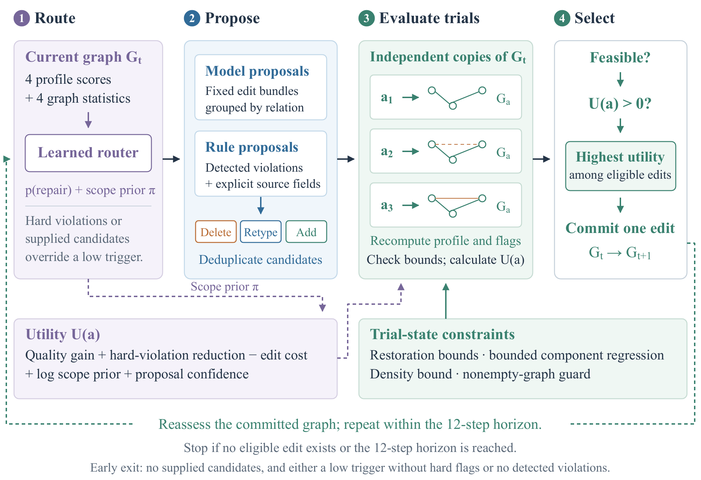

**图 3：** 单独评估的顺序选择器的一轮操作。路由提供修复触发与作用域先验。固定模型编辑包和规则提案分别作用于当前图谱的独立副本。试验状态边界决定可行性，效用对合格编辑排序。选择器提交一个正效用最高的候选，记录所有决策并重新评估。试验图仅为示意；对照采用 12 步时域。

图 3 展开图 1 的路由与编辑阶段。画像包括非孤立节点百分比（$Q_{\mathrm{inc}}$）、三元组唯一性（$Q_{\mathrm{uniq}}$）、与已实现规则的一致性（$Q_{\mathrm{rule}}$）以及来源支持度（$Q_{\mathrm{src}}$）。路由网络接收分数 $\mathbf{s}$ 和图统计量 $\mathbf{g}$（节点数、三元组数、密度和违反数），输出修复概率 $p_{\mathrm{repair}}$ 与范围先验 $\boldsymbol{\pi}$。选择器将先验与试验状态增益、操作成本和可行性检查结合。

即使 $p_{\mathrm{repair}}<\tau_{\mathrm{repair}}$，存在硬违反或外部候选仍会触发评估。没有候选且没有检测到违反时停止；否则评估候选试验图谱，提交正效用最高的可行编辑。若不存在这样的编辑，则保留当前图谱并停止。每次接受编辑后重新计算画像和路由输出，直到迭代上限。

在固定提案对照中，规范化输入与候选图谱之间的差异为每种关系定义一个编辑包。提案置信度为 0.7，时域为 12 步。试验图必须满足恢复边界才能被接受。使用默认效用系数，对比学习先验与始终启用的均匀先验。

轨迹记录每个试验图谱、质量画像、效用、决策和停止原因。来源匹配从来源与候选值中同时移除空白。归档还保留早期非对称规范化的轨迹，以便复现。该选择器与算法 1 分开评估。

## 4.5 训练与执行共享画像

修订后的选择器在数据集构建与执行时使用同一个特征函数。八个输入是四项画像分数、节点数、三元组数、有向简单投影密度和检测到的违反数。标签描述注入缺陷，但不进入特征函数。文档标识符和允许关系属于公开任务元数据。模型检查点与缩放器带有特征版本标识；权重不兼容时显式回退为均匀先验。

来源字段检查识别文档、行或句子边界处，显式允许字段标签后面的非空值。仅当来源存在这样的值时才报告字段缺失。同一标签重复且对应值冲突时放弃判断。关系词表本身不意味着所有关系都必须出现。来源字段报告进入违反计数和候选池，但不改变节点关联度的含义：不完整的星形图仍可能获得 100 分的关联度。

层级检查区分向下关系（管理和监督）与向上隶属关系；含义不明确的关系不检查。只有明确标记为实体引用的端点，才对照声明实体检查成员资格；字面字段值不视为悬空实体。空图保护同时适用于单项编辑和编辑包。给定候选会绕过低概率和无违反的提前停止，使每个提议变更都接受试验评估。

对于画像质量 $Q\in[0,100]$、硬违反数 $h$、操作成本 $c(a)$、范围 $s(a)$ 和提案置信度 $z(a)$，默认效用为：

$$
\begin{split}
U(a)={}&\frac{Q(G_a)-Q(G)}{100}
+0.20\frac{\max(0,h(G)-h(G_a))}{\max(1,h(G))}\\
&-0.35c(a)+0.05\log\!\left(\max(\pi_{s(a)},0.05)+10^{-6}\right)
+0.02z(a).
\end{split}
\tag{8}
$$

其中 $G_a$ 为试验图谱。删除、重新赋型和添加的成本分别为 0.30、0.16 和 0.06，编辑包成本为各操作之和。只有效用为正且在已评估编辑中最高的可行编辑才被接受。四项质量指标维持相同权重。可行性检查保持已满足的下界，不恶化未达标维度，将被检查分量的回退限制为两分，并满足密度边界。这些是局部约束，不保证参考 F1 单调。对 $m$ 个三元组进行成对冗余评估的成本为 $O(m^2)$；$T$ 轮、每轮至多 $K$ 个试验候选的成本为 $O(TKm^2)$，另计来源字符串操作。这与主过滤器线性扫描候选的开销不同。

我们预先定义第二种效用，从默认表达式中减去 $0.05\log(1/3+10^{-6})$，使均匀分布下的先验项为零。对于固定路由器，这不改变单步内部排序，但会改变哪些候选具有正效用。两种公式都未在归档提案上调参。

# 5 评估

我们在受控缺陷、实际抽取输出及外部收据文本上评估修复。先比较完整流程，再通过匹配提示和共享响应衡量上下文与过滤的效果。具体研究问题为：**RQ1**，相对于简单替代方法，修复何时能改善抽取图谱；**RQ2**，上下文、过滤与顺序选择各自贡献多少；**RQ3**，现有图谱何时比重新抽取更有用？表 16 汇总相应证据。

## 5.1 实验协议

### 来源记录与受控配对

来源语料包括陕西省政府网站的 4,728 条政务记录、国家金融监督管理总局的 1,000 条金融监管记录，以及生态环境部的 500 条环境监管记录。每个领域最多采样 500 个文档，并为每个文档构建小型字段级知识图谱。证据字符串将非空结构化字段序列化为“字段名：值”，用中文句子分隔符连接；每个字段值最多保留 320 个字符，服务标签最多 100 个字符。同样的规范化字段值定义参考三元组。在注入损坏前，按来源身份和随机种子 42，以 70/15/15 划分训练、验证和测试集，避免干净与损坏变体跨分区。

每个受控实例恰好接受两项有效变更，从缺失三元组、重复三元组、无效关系、反向边、无来源支持值和层级冲突六类中选择。清单记录每个干净与损坏三元组。留出集包括 225 个文档，每领域 75 个，以及 450 个已记录缺陷（表 1）。缺陷类别和数量由受控协议固定。

**表 1：** 受控配对基准。最后三列为文档数量。

| 领域 | 文档数 | 缺陷数 | 训练 | 验证 | 测试 |
| :------------ | ----------: | --------: | ------: | -----: | -----: |
| 政务 | 499 | 998 | 349 | 75 | 75 |
| 金融 | 500 | 1,000 | 350 | 75 | 75 |
| 环境 | 500 | 1,000 | 350 | 75 | 75 |
| 合计 | 1,499 | 2,998 | 1,049 | 225 | 225 |

### 自然抽取错误

对于相同的 225 个留出来源，重新调用 Claude Haiku，仅提供源文本、要求的文档节点和关系词表，从头构建图谱。结构化字段提供用于评分的银标准参考。这些输入包含抽取调用产生的错误。10 个格式错误的 JSON 响应作为空输出保留在端到端评估中。总体解析成功率为 95.56%；225 个输出图谱中有 77 个与参考不同，共有 302 处多重集三元组差异。对冻结差异样本的独立人工复核尚未完成。

### 比较的修复方法

所有方法接收相同输入图谱、来源证据、要求的文档节点和关系词表。

- **Source-field Copy（来源字段复制）**：解析证据中声明的字段名分隔符，不调用模型即可重建字段值。

- **No Repair（不修复）**：原样返回输入。

- **Rule Only（仅规则）**：去重；当边的宾语为要求的文档节点时反转边；删除无效头节点或关系。

- **SHACL-style Repair（SHACL 风格修复）**：使用规范头节点和允许谓词形状 [18]，无法从文本重建缺失值。

- **Direct LLM（直接 LLM）**：进行一次基于来源的调用并返回完整图谱。

- **ReAct-style Agent（ReAct 风格智能体）**：先进行诊断调用，再进行动作调用 [41]。

- **Simple Pipeline（简单流程）**：使用与“诊断 + 门控”相同的确定性预处理，进行一次基于来源的调用，仅对响应去重；不使用诊断报告或候选门控。顺序选择器单独评估。

- **Diagnosis + Gate（诊断 + 门控）**：使用诊断上下文补全，拒绝头节点无效、关系无效、无来源支持、重复及违反关系基数限制的提案。

除非另有说明，使用模型的方法均采用相同服务端检查点 `claude-haiku-4-5-20251001` [2]、零温度和同一端点。失败保留在分母中。受控集上，Direct LLM 与 Simple Pipeline 各有一个格式错误的 JSON 响应，Diagnosis + Gate 和 ReAct 没有。

### 指标与统计

在受控基准中，缺陷修复要求恢复干净三元组的重数并移除损坏形式。本文还报告干净事实保留率、过度修复率、三元组 F1、多重集图谱完全匹配率、调用次数和延迟。对于自然抽取输入 $G_0$、输出 $G_1$ 和参考 $G^*$，令 $d$ 为多重集对称差大小。自然错误减少率为：

$$
1-\frac{d(G_1,G^*)}{d(G_0,G^*)},
$$

该指标在 77 个非完全正确输入上取平均；负值意味着修复引入的错误多于消除的错误。新增比较的置信区间使用 10,000 次配对 bootstrap 重采样。缺陷结果和图谱完全匹配采用精确 McNemar 检验，作为历史比较的描述性统计；自然错误数量比较另用单侧配对 Wilcoxon 检验。匹配比较中的配对 bootstrap 和双侧符号随机化检验，以整个来源文档为重采样单位（10,000 次，种子 42），将同一文档的两个受控缺陷保持在一起。机制比较作为探索性结果报告，不进行多重检验校正。

## 5.2 受控修复结果

来源格式基线改变了主要结果的解释：Source-field Copy 不调用模型即可获得 100% 修复率与完全匹配率，因为来源显式列出参考字段，解析器能够直接恢复它们。表 2 显示，Diagnosis + Gate 修复 98.00% 的缺陷、保留 99.32% 的干净事实，三元组 F1 达到 99.17%。相同单次调用预算下，较强的 Simple Pipeline 达到 95.11% 修复率和 96.34% F1。Diagnosis + Gate 独有地修复了 Simple Pipeline 遗漏的 15 个缺陷，反向情况有 2 个（精确 McNemar $p=0.00235$）。按文档配对重分析，修复率增益为 2.89 个百分点（95% CI：1.11–4.89），双侧随机化 $p=0.0067$；对应 F1 增益为 2.84 个百分点（95% CI：1.65–4.25）。Simple Pipeline 也优于修复率为 92.44% 的 Direct LLM。

**表 2：** 225 个文档、450 个缺陷上的受控留出结果。除过度修复、调用次数和延迟外，均为越高越好。

| 方法 | 缺陷修复率 | 保留率 | 过度修复 | 三元组 F1 | 完全匹配 | 调用/文档 | 延迟/文档 |
| :--- | :--: | :--: | :--: | :--: | :--: | :--: | :--: |
| 来源字段复制 | **1.0000** | **1.0000** | **0.0000** | **1.0000** | **1.0000** | 0.00 | $<0.001$ s |
| 不修复 | 0.0000 | **1.0000** | **0.0000** | 0.7615 | 0.0000 | 0.00 | $<0.001$ s |
| 仅规则 | 0.3200 | **1.0000** | **0.0000** | 0.8472 | 0.0622 | 0.00 | $<0.001$ s |
| SHACL 风格修复 | 0.0000 | **1.0000** | **0.0000** | 0.7998 | 0.0000 | 0.00 | $<0.001$ s |
| 直接 LLM | 0.9244 | 0.9687 | 0.0758 | 0.9520 | 0.8267 | 1.00 | 7.25 s |
| ReAct 风格智能体 | 0.8911 | 0.9324 | 0.1667 | 0.9213 | 0.5956 | 2.00 | 20.50 s |
| 简单流程 | 0.9511 | 0.9723 | 0.0705 | 0.9634 | 0.8400 | 1.00 | 9.27 s |
| 诊断 + 门控 | 0.9800 | 0.9932 | 0.0167 | 0.9917 | 0.9333 | 1.00 | 11.44 s |

Diagnosis + Gate 修复了 Direct LLM 未修复的 28 个缺陷，反向为 3 个（$p=4.65\times10^{-6}$）；修复了 ReAct 未修复的 42 个缺陷，反向为 2 个（$p=1.13\times10^{-10}$）。这些检验针对受控缺陷分布。

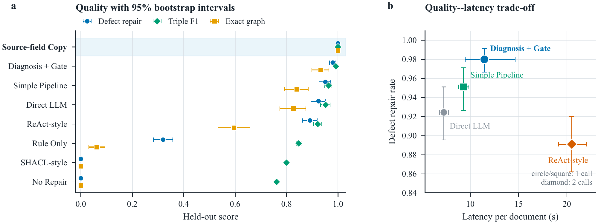

**图 4：** 受控修复结果。**a**：缺陷修复、三元组 F1 和图谱完全匹配率，含 95% 文档 bootstrap 区间。**b**：一次或两次模型调用方法的质量—延迟权衡。

## 5.3 自然产生的抽取错误

表 3 评估序列化记录输入上的实际抽取错误。Source-field Copy 再次重建全部参考图谱。模型方法中，未修复抽取输出的 F1 为 87.99%，完全匹配率为 65.78%。Simple Pipeline 对完全匹配结果改变较少，但在 77 个不完美输入上的平均错误减少率为 $-59.15\%$：激进补全引入了更多与参考不一致之处。相比之下，Diagnosis + Gate 将错误减少 27.75%，平均保留全部原本正确事实，并将 F1 提高到 92.48%。相对于 Simple Pipeline，其配对 F1 优势为 4.40 个百分点（95% CI：3.07–5.77），平均每文档避免 1.03 个错误（95% CI：0.77–1.32；单侧 Wilcoxon $p=3.18\times10^{-12}$）。完全匹配的配对不一致仅为 3 对 0（$p=0.25$），三元组层面的收益大于完整图谱恢复收益。

**表 3：** 修复实际抽取调用生成的图谱。错误减少率在 77 个非完全正确输入上平均，其他质量指标使用全部 225 个文档。

| 方法 | 解析成功率 | 错误文档数 | 错误减少率 | 保留率 | 过度修复 | 三元组 F1 | 完全匹配 |
| :--- | :--: | :--: | :--: | :--: | :--: | :--: | :--: |
| 来源字段复制 | 1.0000 | 77 | 1.0000 | 1.0000 | 0.0000 | 1.0000 | 1.0000 |
| 抽取图谱，未修复 | 0.9556 | 77 | 0.0000 | 1.0000 | 0.0000 | 0.8799 | 0.6578 |
| 简单流程 | 1.0000 | 77 | $-0.5915$ | 0.9971 | 0.2389 | 0.8807 | 0.6711 |
| 诊断 + 门控 | 0.9956 | 77 | 0.2775 | 1.0000 | 0.0292 | 0.9248 | 0.6844 |

### 区分格式失败与事实差异

215 个解析成功的抽取输出，初始 F1 为 92.09%；经 Diagnosis + Gate 后为 93.53%，经 Simple Pipeline 后为 88.85%。其中 67 个非完全正确输入平均错误减少率为 24.00%，F1 从 74.61% 升到 79.22%。148 个初始完全正确且解析成功的图谱，在 Diagnosis + Gate 下均保持完全正确。10 个格式错误输入恢复到 69.91% F1，但没有一个完全正确。修复既改善合法格式图谱，也恢复格式错误输出；三元组 F1 的提升大于图谱完全恢复的提升。

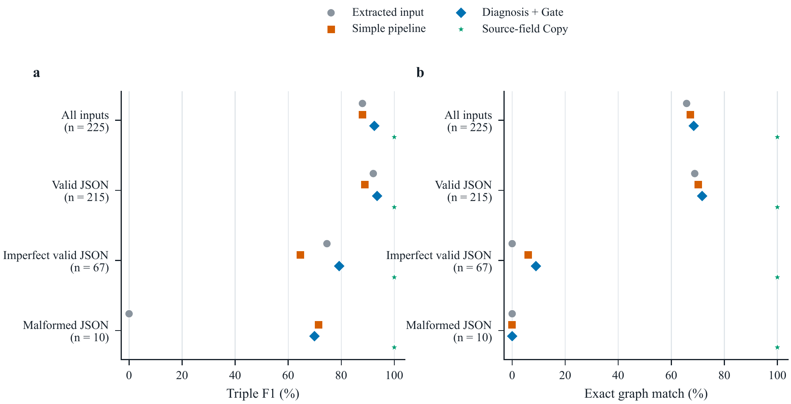

**图 5：** 按输入状态划分的修复结果。合法 JSON 子集用于区分事实修复与解析失败后的恢复。参考来自结构化来源记录。

## 5.4 组件与约束门控分析

表 4 比较已保存的组件设置。没有 LLM 补全时，输出就是预处理图谱。Direct LLM 使用自己的提示词并跳过预处理。门控比较对同一提案在过滤前后评分。Direct LLM 属于流程比较，并非单独关闭预处理的消融。下一小节将提示上下文与其他流程选择分开，第 5.6 节测试各个过滤和优化器组件。

**表 4：** 受控流程设置。Direct LLM 行同时改变了提示词。

| 变体 | 修复率 | 过度修复 | F1 | 完全匹配 |
| :----------------------------- | :----------: | :-----------: | :----------: | :----------: |
| 无 LLM 补全 | 0.3200 | 0.0000 | 0.8472 | 0.0622 |
| 直接 LLM（独立提示） | 0.9244 | 0.0758 | 0.9520 | 0.8267 |
| 无约束门控 | 0.9800 | 0.0227 | 0.9895 | 0.9333 |
| **诊断 + 门控** | **0.9800** | **0.0167** | **0.9917** | **0.9333** |

LLM 补全贡献了大部分恢复字段。Diagnosis + Gate 的 F1 为 99.17%，Direct LLM 为 95.20%。在共享提案上，过滤不改变缺陷修复率，将过度修复降低 0.60 个百分点。它移除了 8 个没有来源支持的三元组，均不在参考图谱中。

## 5.5 匹配比较与顺序选择

首先使用相同归档提案，比较顺序选择器与直接候选过滤。在受控输入上，无论学习先验还是均匀先验，选择器都没有接受进一步编辑，修复率停留在 32.00%、F1 停留在 84.72%，即预处理结果。在自然输入上，其 F1 为 88.33%，完全匹配率为 65.78%。轨迹显示两点原因：看似完整的质量画像仍可能遗漏来源字段；默认评分下，有用的添加操作可能得到非正效用。

**表 5：** 每种输入条件固定 60 个文档的 Gemma 匹配比较。每个原始/门控输出对共享一次响应。

| 上下文 | 输出 | 受控修复率 | 受控 F1 | 自然 F1 | 自然完全匹配 |
| :-------------- | :------- | -------------: | ---------: | -----------: | --------------: |
| 基础 | 原始 | 0.9750 | 0.9951 | 0.9185 | 0.6667 |
| 基础 | 门控 | 0.9750 | 0.9962 | 0.9252 | 0.6667 |
| 诊断 | 原始 | 0.9250 | 0.9850 | 0.9079 | 0.6667 |
| 诊断 | 门控 | 0.9250 | 0.9861 | 0.9147 | 0.6667 |
| SHACL 上下文 | 原始 | 0.9500 | 0.9912 | 0.9322 | 0.7000 |
| SHACL 上下文 | 门控 | 0.9500 | 0.9912 | 0.9364 | 0.7000 |

Gemma 实验在受控和自然输入条件下，使用固定的 60 文档子集，每领域 20 个。三个上下文实验组共享系统提示词、确定性预处理、温度和输出上限。每个候选响应均用相同门控在过滤前后评分。表 5 报告六种组合；表 18 报告相同调用预算和输出上限下，不同输入 token 数与请求时间。SHACL 组采用第 4.3 节记录的适配方案。

相同过滤后，基础上下文的受控 F1 为 99.62%，缺陷修复率为 97.50%；加入诊断后分别为 98.61% 和 92.50%。配对 F1 差值（诊断减基础）为 $-1.01$ 个百分点（95% CI：$[-1.67,-0.38]$；探索性随机化 $p=0.0082$）。自然输入上，基础加门控为 92.52% F1，诊断加门控为 91.47%，适配的 SHACL 上下文加门控为 93.64%。诊断减 SHACL 的差值为 $-2.16$ 个百分点（95% CI：$[-5.26,0.02]$；$p=0.105$），区间包含零。

同响应配对的过滤影响较小。在诊断上下文的自然输出中，F1 从 90.79% 升至 91.47%，增益为 0.69 个百分点（95% CI：0.20–1.29；探索性 $p=0.0335$），完全匹配率不变。360 个响应中，门控拒绝 27 次候选出现，均不是参考三元组。在此设置中，过滤改善候选质量，而增加诊断上下文相对基础提示降低了 F1。

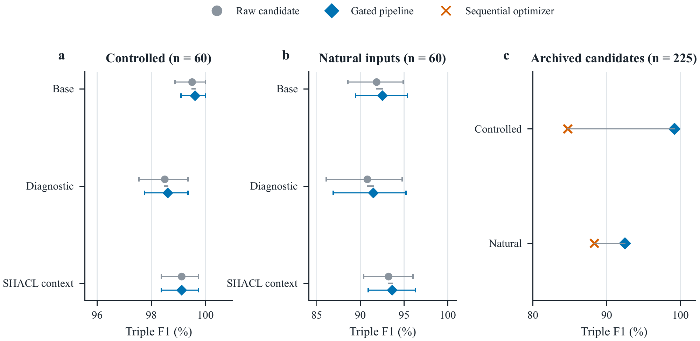

**图 6：** 上下文、过滤和选择比较。a–b 使用 60 个文档的 Gemma 响应，原始与门控输出共享候选，误差条为 95% 文档 bootstrap 区间。c 在 225 个文档的归档 Claude 提案上比较过滤与顺序选择。

我们还重放依据可见头节点、关系、重复、基数和来源支持违反进行决策的调用策略，为每个文档在输入与归档修复输出之间选择。在 450 项自然/干净混合流中，不使用参考答案的可见违反策略仅路由 6.22% 的输入，却漏掉 63.64% 的不完美图谱；其输出 F1 为 94.46%，始终调用修复则为 95.82%。主方法对每个文档调用修复；可见检查策略会漏掉许多缺失或关系分配错误的字段。

## 5.6 单项过滤与优化器消融

在匹配上下文研究的 360 个 Gemma 响应和收据后续实验的 180 个响应上，测试过滤检查。每个响应在八种配置下重新评分：全部检查、分别去掉五项检查之一、同时去掉重复与基数检查，以及去掉全部检查。4,320 个评分输出共享 540 个模型响应，候选顺序固定。联合移除用于测试基数限制是否掩盖重复检查的作用。

表 6 报告完整过滤器 F1 减修改后过滤器 F1。先在每个文档的三个生成组内平均配对变化，再跨文档平均。过滤器拒绝 28 次候选出现，均不属于参考：11 次头节点错误，17 次来源支持失败。其他检查未额外移除候选。自然输入上，来源支持贡献 0.505 个 F1 百分点，头节点检查贡献 0.085 个百分点。对 21 项队列/检查比较进行 Holm 校正后，这些探索性效应均未通过显著性检验。响应级审计还记录关闭检查后被挤出的正确事实。

**表 6：** 各过滤检查的配对 F1 贡献，单位为百分点。每个队列含 60 个文档、每文档三个生成组。正值有利于完整过滤器。

| 移除的检查 | 受控 | 自然 | 收据 |
| :------------------------ | -----------: | --------: | ---------: |
| 重复 | +0.000 | +0.000 | +0.000 |
| 文档头节点 | +0.037 | +0.085 | +0.000 |
| 关系类型 | +0.000 | +0.000 | +0.000 |
| 来源支持 | +0.037 | +0.505 | +0.060 |
| 基数 | +0.000 | +0.000 | +0.000 |
| 重复 + 基数 | +0.000 | +0.000 | +0.000 |
| 全部检查 | +0.073 | +0.590 | +0.060 |

### 当前顺序优化器组件

在 225 个受控输入和 225 个自然输入的固定提案上，重放当前版本 2 选择器。默认绝对先验下，13 种设置产生 5,850 个结果；使用相对均匀分布的偏移重复全部设置，另产生 5,850 个敏感性结果。两者均使用共享 `public-profile-v2` 特征和重新训练的路由器；版本 1 文件仍保留在归档中。主文单次调用结果与该选择器研究分开。

参考设置使用始终启用的均匀先验。每个设置修改其命名组件；触发器比较则以始终启用的学习先验为参考。移除分数项时，将对应项置零并删除其边界，不重新缩放其他权重。检测器和硬违反奖励仍然有效。去掉规则候选时，排除检测器动作及显式来源字段添加，但保留诊断画像和固定模型提案。

**表 7：** 当前版本 2 优化器，使用默认绝对先验。接受数为动作或编辑包，按“受控 / 自然”展示。每个 F1 在 225 个文档上平均。

| 设置 | 受控 F1 | 自然 F1 | 接受数 |
| :-------------------------- | --------------: | -----------: | ---------: |
| 始终启用均匀先验 | 0.8472 | 0.8833 | 0 / 10 |
| 学习先验，始终启用 | 0.8472 | 0.8799 | 0 / 10 |
| 学习先验与触发器 | 0.8472 | 0.8799 | 0 / 10 |
| 无先验惩罚 | 0.8472 | 0.8833 | 0 / 10 |
| 无动作成本 | 0.8930 | 0.8813 | 68 / 13 |
| 无密度边界 | 0.8472 | 0.8833 | 0 / 10 |
| 无质量边界 | 0.8472 | 0.8833 | 0 / 10 |
| 单次迭代 | 0.8472 | 0.8833 | 0 / 10 |
| 无规则候选 | 0.8472 | 0.8833 | 0 / 9 |
| 仅规则候选 | 0.8472 | 0.8799 | 0 / 10 |
| 无局部分数/边界 | 0.8472 | 0.8799 | 0 / 0 |
| 无图级分数/边界 | 0.8472 | 0.8833 | 0 / 10 |
| 无来源分数/边界 | 0.8472 | 0.8799 | 0 / 10 |

默认均匀选择器在受控输入上达到 84.72% F1，不接受任何编辑。移除动作成本后，F1 升至 89.30%，接受 68 个动作。自然输入上，均匀参考为 88.33%，学习先验及其触发器为 87.99%。两组中均没有设置丢失初始正确的参考事实。因此，学习路由器在这里没有表现出一致的修复收益。逐文档对比、候选试验、拒绝原因和停止原因均已发布。每个先验偏移分别对 24 项组件比较进行 Holm 校正。

### 路由器训练与先验敏感性

版本 2 路由器采用 $8\!\rightarrow\!32\!\rightarrow\!16$ 网络，含一个修复输出和三个范围输出，共 884 个参数。缩放器在 2,098 个训练行上拟合；验证集与测试集各有 450 行，按文档分组。受控修复分类和范围分类均达到 100%。这些监督标签由注入缺陷决定，衡量对其的识别能力。

**表 8：** 相同归档提案上的版本 2 选择器。相对先验以均匀分布为零点。接受编辑数按“受控 / 自然”显示。

| 先验 / 偏移 | 受控 F1 | 自然 F1 | 接受数 |
| :------------------- | --------------: | -----------: | ---------: |
| 均匀 / 绝对 | 0.8472 | 0.8833 | 0 / 10 |
| 均匀 / 相对 | 0.8472 | 0.8833 | 0 / 10 |
| 学习 / 绝对 | 0.8472 | 0.8799 | 0 / 10 |
| 学习 / 相对 | 0.8929 | 0.8764 | 156 / 51 |

表 8 展示早期版本 2 检查中的四种路由器/偏移组合，也包含在扩展重放中。使用学习先验时，相对偏移将受控 F1 从 84.72% 提高到 89.29%，但自然输入 F1 从 87.99% 降到 87.64%。两种均匀设置输出相同。默认设置保持不变。这些此前已经评估的提案用于执行比较，不构成新的留出评估。

早期选择器的瓶颈分析见附录 A。

## 5.7 跨模型稳健性

跨模型比较在固定 60 案例子集（每领域 20 个）上，使用 Claude Haiku 和 `google/gemma-4-26B-A4B-it` [13]，比较 Direct LLM、Simple Pipeline 与 Diagnosis + Gate。对于同一方法，跨模型固定输入、提示模板、温度和单次调用预算。表 9 显示 Diagnosis + Gate 在两个模型上都具有最高修复率。相对 Simple Pipeline 的绝对 F1 优势在 Claude 上更大；Gemma 的直接输出较强，后处理提升空间更小。此比较衡量跨模型的完整流程行为，第 5.5 节单独考察诊断上下文作用。

**表 9：** 相同 60 案例上的跨模型受控结果。

| 模型 | 方法 | 修复率 | F1 | 完全匹配 |
| :------- | :--------------- | :---------: | :---------: | :---------: |
| Claude | 直接 | 0.958 | 0.970 | 0.867 |
| Claude | 简单 | 0.958 | 0.966 | 0.833 |
| Claude | **诊断 + 门控** | **0.975** | **0.991** | **0.917** |
| Gemma | 直接 | 0.958 | 0.988 | 0.883 |
| Gemma | 简单 | 0.967 | 0.984 | 0.867 |
| Gemma | **诊断 + 门控** | **0.983** | **0.990** | **0.917** |

## 5.8 外部收据文本

使用 SROIE 收据转录文本和人工关键信息标签 [16]，测试中文记录集合之外的修复。固定随机样本从社区修正版 trainval 镜像的 626 个文档中抽取 60 个（种子 20260922）。文本行按存储顺序连接。模型接收文本和 company、date、address、total 四个字段名；字段值由评分器单独读取。一张收据缺少地址标注，因此共评估 239 个字段；所有方法评分时均排除该缺失标注，而模型仍可使用全部四个字段。

先调用 Gemma 抽取每个图谱，然后三种修复上下文接收同一抽取图谱，使用第 4.2 节的设置。采样和设置在推理前固定，共产生 60 次抽取调用和 180 个修复结果，每个结果都在过滤前后评分。来源复制与结构基线直接复用，不做收据专属调优。主指标采用三元组精确匹配；次指标忽略字段值中的大小写与空白，将这些格式差异与其他错误分开。

**表 10：** 60 个收据转录文本的外部 SROIE 结果。完全匹配针对已标注字段；规范化 F1 忽略值的大小写和空白。

| 方法 | 三元组 F1 | 完全匹配 | 规范化 F1 | 保留率 |
| :-------------------- | ----------: | ------------: | --------------: | -------------: |
| 抽取输入 | 0.7944 | 0.3333 | 0.8153 | 1.0000 |
| 仅规则 | 0.7944 | 0.3333 | 0.8153 | 1.0000 |
| 来源字段复制 | 0.0000 | 0.0000 | 0.0000 | 0.0000 |
| 基础，原始 | 0.7944 | 0.3333 | 0.8153 | 1.0000 |
| 基础，门控 | 0.7915 | 0.3333 | 0.8123 | 0.9944 |
| 诊断，原始 | 0.7944 | 0.3333 | 0.8153 | 1.0000 |
| 诊断，门控 | 0.7915 | 0.3333 | 0.8123 | 0.9944 |
| SHACL 上下文，原始 | 0.7986 | 0.3333 | 0.8194 | 1.0000 |
| SHACL 上下文，门控 | 0.7956 | 0.3333 | 0.8165 | 0.9944 |

抽取图谱达到 79.44% F1。过滤后，基础、诊断和 SHACL 上下文分别达到 79.15%、79.15% 和 79.56%（表 10）。诊断减基础的差值为 $0.00$ 个百分点（95% CI：$[0.00, 0.00]$；配对随机化 $p=1.0000$）。字段复制解析器在这些转录文本上只有 0.00% F1，而在序列化记录上为 100%。

239 个参考值中，220 个按字面出现在转录文本内，另外 19 个不存在完全相同的来源字符串。180 个修复响应中，过滤拒绝了 3 次候选出现，均与参考值匹配：它们对应三个实验组中的同一地址，来源含双空格，而 JSON 解析器折叠了候选空白。运行后检查对来源应用相同空白规范化，在三个组中均保留该地址。使用原响应，基础和诊断 F1 变为 79.44%，SHACL 为 79.86%，图谱完全匹配仍为 33.33%。主表保留固定协议结果，单独检查说明规范化不一致的影响。

本次运行记录 240 次请求（包括重试）和 240 个解析成功结果。基础、诊断及 SHACL 的平均修复请求时间分别为 7.87、7.92 和 8.05 秒，平均输入长度为 661、715 和 2276 token。时间包括请求节流，不包括共享抽取和上下文准备。

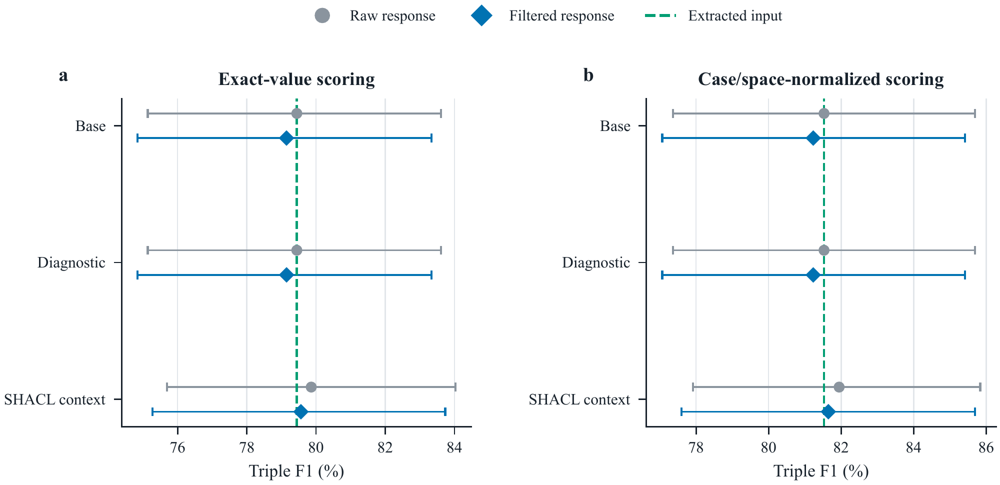

**图 7：** 独立收据文本上的修复。点表示平均三元组 F1，区间为 95% 文档 bootstrap 区间。原始和门控结果共享模型响应；虚线为初始抽取输入。

## 5.9 新文档上的字段证据后续实验

首次收据研究表明，可见模式违反会漏掉许多字段选择错误。基础和诊断提示都原样返回全部 60 个输入图谱。239 个参考字段中有 190 个完全匹配，49 个差异包括：27 个大小写、空白、标点或金额格式差异，10 个片段边界差异，8 个选择了不同来源值，以及 4 个值不在规范化来源中。这些类别描述相对于参考的差异，将格式问题与其他修复目标分开。

在 20 个新收据上开发第 3.4 节的字段证据索引，随后冻结设计，再测试另外 60 个收据。原始 60、开发 20 和测试 60 个文档的 ID 互不重叠，也不存在相同的规范化转录文本。样本用种子 20260923 固定；所有测试预测保存后才下载测试标签。各组接收相同字段定义、编号来源行、输入图谱和指令。Simple 直接使用这些输入；Evidence Index 加入字段锚点；SHACL 加入验证上下文。三者共享空白处理一致的过滤器。

开发集 F1：抽取图谱 80.00%，Simple 82.50%，Evidence Index 85.00%，SHACL 80.00%。测试保留一个固定索引设计和全部三个组。与代码及评分规则一起冻结的主要比较，是 Evidence Index 减 Simple 的文档平均三元组 F1。

**表 11：** 60 个新收据上的冻结后续实验。所有修复组共享字段定义和来源行。门控使用一致的空白匹配；完全匹配针对已标注字段。

| 方法 | 三元组 F1 | 图谱完全匹配 | 规范化 F1 | 保留率 |
| :--------------------- | ----------: | ------------: | --------------: | -------------: |
| 抽取输入 | 0.7833 | 0.3500 | 0.7958 | 1.0000 |
| 简单，原始 | 0.7875 | 0.2833 | 0.8083 | 0.9250 |
| 简单，门控 | 0.7875 | 0.2833 | 0.8083 | 0.9250 |
| 证据索引，原始 | 0.8333 | 0.4000 | 0.8625 | 0.9306 |
| 证据索引，门控 | 0.8351 | 0.4000 | 0.8643 | 0.9306 |
| SHACL 上下文，原始 | 0.7833 | 0.2833 | 0.8042 | 0.9347 |
| SHACL 上下文，门控 | 0.7833 | 0.2833 | 0.8042 | 0.9347 |

新测试中，抽取图谱 F1 为 78.33%；过滤后的 Simple、Evidence Index、SHACL 分别为 78.75%、83.51%、78.33%（表 11）。Simple 相对于输入的 F1 变化为 $0.42$ 个百分点（95% CI：$[-4.17, 5.00]$）。主要的 Evidence Index 减 Simple 差值为 $4.76$ 个百分点（95% CI：$[2.50, 7.26]$；双侧配对随机化 $p=0.0004$）。三个修复组的图谱完全匹配率分别为 28.33%、40.00% 和 28.33%。

在 52 个初始非精确字段值中，Simple 恢复 16 个，同时将 15 个原本精确的值改为非精确；Evidence Index 恢复 26 个、改坏 14 个；SHACL 恢复 13 个、改坏 13 个。索引恢复了 11 个仅标点不同的值和 6 个片段边界差异。其丢失的精确匹配中，10 个保留数值金额但改变显示格式。另一个数值检查去除 total 字段的货币前缀及千位分隔符：输入准确率为 58/60，Simple 为 59/60，Evidence Index 为 59/60，SHACL 为 58/60。这一区分用于判断是金额改变还是显示格式改变。

过滤拒绝 1 次候选出现，没有被拒绝候选与参考值匹配。被拒绝的地址将多个来源片段拼接成文本中不存在的片段。过滤使 Evidence Index F1 改变 0.18 个百分点，另外两组不变。

三个组分别修改 60 个输入图谱中的 31、39 和 28 个。平均修复请求时间为 7.91、7.88、8.11 秒，输入 token 为 1784、2153、3404。本次 60 个抽取和 180 个修复结果对应 240 次实际请求。原始与门控评分共享响应；请求时间包括节流和重试。

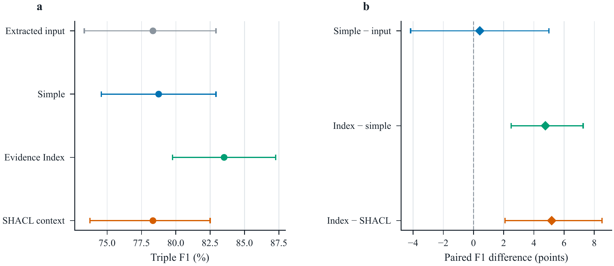

**图 8：** 新收据后续实验。左：平均三元组 F1 及 95% 文档 bootstrap 区间。右：配对 F1 变化，以完整文档重采样构造区间。所有修复方法共享字段定义和来源行。

## 5.10 共享证据下的修复与重新抽取

在相同 60 个收据文档上再收集 240 个 Gemma 响应：修复或重新抽取，分别有或无固定证据索引。所有组共享来源行、字段定义、要求的文档 ID 和输出预算；修复额外接收已有图谱。主要比较是过滤后的带索引修复减带索引抽取。所有请求均返回 HTTP 200，没有重试；但每个响应都将 JSON 对象包在 Markdown 代码围栏中。冻结的严格解析器将全部 240 个结果判为失败，所有组 F1 为零。

发现该格式问题后，另行增加兼容性分析：仅去除外层代码围栏，再应用原模式检查，恢复了全部 240 个响应。表 12 报告该分析，原始响应和严格评分仍然保留。带索引修复 F1 为 83.93%，带索引抽取为 61.05%，配对差值为 22.88 个百分点（95% CI：14.84–31.35）。

**表 12：** 60 个收据的同响应诊断。“围栏兼容”先移除外层 Markdown 围栏，再使用不变的过滤器；“ID 规范化”还会在过滤前赋予公开文档 ID，以区分头节点错误和字段选择。两者都是事后分析。

| 方法 | 围栏兼容 F1 | ID 规范化 F1 | ID 错误图谱数 |
| :------------------- | --------------------: | -----------------: | ----------------: |
| 重新抽取 | 0.6333 | 0.7256 | 18/60 |
| 带索引抽取 | 0.6105 | 0.7486 | 28/60 |
| 修复率 | 0.7917 | 0.7917 | 0/60 |
| 带索引修复 | 0.8393 | 0.8393 | 0/60 |

头节点错误解释了很大部分差距：带索引抽取在 28 个图谱中使用了错误文档 ID，而带索引修复在全部 60 个图谱中 ID 正确。统一给四组赋予已知 ID 后，带索引抽取 F1 升到 74.86%；带索引修复仍领先 9.07 个百分点（95% CI：5.22–13.10）。该诊断固定关系值，说明完整的 22.88 点差距并非完全来自字段修复。比较衡量复用收据上已有初始图谱的价值，初始图谱构建成本不计入这些修复/抽取请求。

### 索引在哪里定位到有用证据

对原后续实验的独立分析，用固定索引定位 240 个参考字段。匹配保留大小写与标点，仅规范化空白。跨行值只有在某次实际来源出现涉及的全部行均被纳入时才计为覆盖。240 个值中，188 个出现在索引或邻近行，36 个只出现在索引之外，16 个与来源不匹配。对 188 个覆盖值，Simple 精确返回 163 个，Evidence Index 返回 174 个；对索引外的 36 个，两者都返回 26 个；16 个不匹配值均未返回。因此，净增的 11 个精确字段全部来自覆盖组。来源不匹配与索引遗漏分别统计；这些描述性关联补充了随机上下文比较。

## 5.11 同期因子实验与证据对照

服务恢复后，将冻结的 840 请求协议作为一批新的 Gemma 实验执行，全部响应成功返回并解析，没有重试。四种生成设置将预处理（$P$）与诊断上下文（$D$）交叉，在 60 个受控和 60 个自然输入上产生 480 个响应；过滤（$G$）则对同一响应分别启用和关闭相同检查。另 360 个响应用于比较 60 个后续收据文档上的六种上下文设置。这些是复用的评估文档；原中断批次单独归档。

**表 13：** 因子的 F1 主效应，单位为百分点，对另外两个开关取平均。每个队列含 60 个配对文档。区间为边际 95% 文档 bootstrap 区间；$p_H$ 对六项主效应进行 Holm 校正。

| 输入 | 组件 | 变化 | 95% 区间 | $p_H$ |
| :----------- | :-------------- | -------: | -------------------: | --------: |
| 受控 | 预处理 | -0.028 | [-0.797, 0.778] | 1.000 |
| 受控 | 诊断 | -0.651 | [-1.348, -0.056] | 0.164 |
| 受控 | 门控 | +0.164 | [0.054, 0.301] | 0.156 |
| 自然 | 预处理 | +0.697 | [0.000, 1.905] | 1.000 |
| 自然 | 诊断 | -0.535 | [-2.376, 0.842] | 1.000 |
| 自然 | 门控 | +0.707 | [0.225, 1.316] | 0.086 |

六项主效应均未通过 Holm 校正（表 13）。诊断上下文在两个队列中的平均效应均为负。门控使受控 F1 平均提高 0.164 个百分点，自然输入提高 0.707 个百分点。全检查审计跨队列拒绝 47 次候选出现：17 次头节点错误，30 次无来源支持，没有任何候选与参考三元组精确匹配。交互效应和单项检查移除结果与配对评分一起发布。

**表 14：** 相同模型、来源与输出预算下的收据上下文对照。每行均使用相同过滤器，每行 60 个文档。随机上下文近似匹配索引字符长度，而非精确 token 数。

| 上下文 | 精确 F1 | 规范化 F1 |
| :--------------------------- | ---------: | --------------: |
| 简单 | 0.7917 | 0.8125 |
| 完整索引 | 0.8351 | 0.8643 |
| 仅锚点 | 0.8351 | 0.8643 |
| 随机索引 | 0.8167 | 0.8458 |
| 简单，无定义 | 0.8083 | 0.8292 |
| 完整索引，无定义 | 0.7470 | 0.7762 |

完整索引比 Simple 高 4.35 个 F1 百分点（95% CI：1.25–7.86），但五项预定义比较下该对比的 $p_H=0.065$。完整索引与仅锚点的平均 F1 相同；完整索引减随机上下文为 1.85 个百分点（CI：$[-0.65,4.52]$，$p_H=0.696$）。完整索引去掉字段定义后，F1 降低 8.81 个百分点（CI：$[4.23,13.39]$，$p_H=0.006$）；本批次中，字段定义并未改善简单组。这些对照支持字段定义与索引上下文的组合，但邻近行的额外价值，以及定向上下文相对随机上下文的优势，仍未明确。

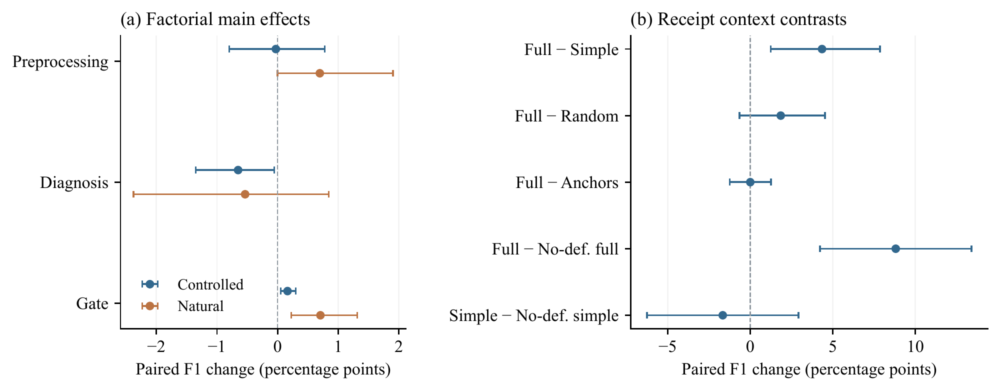

**图 9：** 已完成的恢复后对照。点为配对平均 F1 差值，误差条为边际 95% 文档 bootstrap 区间。主效应与收据对比两组分别进行 Holm 校正，区间本身未做多重性校正。

## 5.12 向合同字段迁移

本文从 CUAD [15] 构建来源片段字段任务。五个字段是文档名称、协议日期、生效日期、到期日期或初始期限，以及适用法律。每份合同的每个字段最多允许一个不同的空白规范化参考值，来源长度不超过 40,000 字符。保留完整来源并核对标注偏移。开发集为官方训练集中的 20 份合同；固定条件筛出 56 份官方测试合同，全部纳入。这评估的是较短、单值合同，不是完整 CUAD 问答任务。四种输出为初始抽取、简单修复、带索引修复和带索引重新抽取。两种修复组接收相同初始图谱；索引组在保留完整来源的同时增加确定性字段锚点窗口。各组使用相同 Gemma 模型、字段定义和 4,000 token 输出上限。采集前固定 JSON 围栏处理，并由代码赋予文档 ID。仅进行一轮开发，测试前不修改提示或筛选条件。该比较分离来源上下文和已有图谱的作用，不评估顺序选择器。

**表 15：** 56 个测试文档上的 CUAD 合同字段结果。F1 使用空白规范化后的来源片段精确匹配。“丢失”统计输出移除的初始参考正确事实。初始创建成本与每次修复调用分开。

| 输出 | F1 (%) | 丢失 | 新增错误 | 请求数 |
| :---------------------- | -------: | -----: | --------------: | ---------: |
| 初始抽取 | 46.76 | 0 | 0 | 59 |
| 简单修复 | 43.35 | 7 | 2 | 71 |
| 带索引修复 | 44.84 | 5 | 12 | 69 |
| 带索引重新抽取 | 44.12 | 8 | 32 | 71 |

主要配对差值（带索引修复减带索引抽取）为 0.72 个 F1 百分点（95% 文档 bootstrap 区间 [-4.80, 6.48]；配对符号翻转 $p=0.810$）。测试产生 224 个输出，实际请求含重试共 270 次。失败输出作为空图谱评分。来源片段精确一致性衡量与 CUAD 标注的吻合程度；编辑的独立语义复核仍待完成。

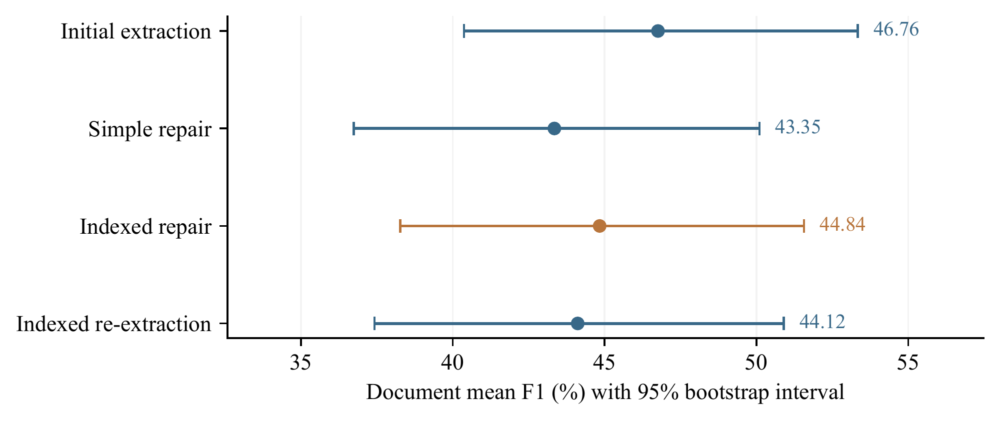

**图 10：** 合同字段比较。点表示文档平均 F1，误差条为边际 95% 文档 bootstrap 区间。主要比较使用正文报告的配对区间。

## 5.13 范围与局限

评估图谱描述每种关系只有一个值的文档字段。跨文档对齐、因果推理和大型连通知识图谱修复需要不同的数据与约束。扩展性结果针对互不相连的文档批次，不包含模型推理。

三个中文集合使用字段序列化证据和银标准参考，来源复制的满分反映了这种来源格式。SROIE 增加了独立转录文本与人工字段标签，包括最初的 60 文档研究，以及同一英语/马来语收据集合中的独立 20 文档开发集和 60 文档测试集。其转录文本与字段标签有时存在拼写或空格差异，影响严格匹配及字面来源检查。更广泛的领域和模型仍可用于检验迁移能力。

新增修复/抽取比较复用了 60 个收据输入，其严格格式失败与两项同响应诊断见第 5.10 节。第 5.12 节测试新的合同任务，解析在采集前固定；主要比较没有显示提供初始图谱具有可靠收益。

过滤器只检查字面出现与字段数量，可能在错误关系下保留一个值、拒绝有效释义，或在多个候选合格时保留错误值。生成也可能遗漏正确输入事实。这些问题说明需要关系感知验证，以及下文的两项独立人工复核任务。

## 5.14 可复现性与资源开放

代码、提示词、数据清单、预测和分析脚本见 <https://github.com/turambar928/MCP_based_KG_construction>。每项实验记录模型设置、解析状态、请求和 token 用量。所有完成响应，包括失败结果，均予保留。各实验 README 列出数据来源、固定样本、校验和与运行命令。

人工复核包包含两个独立任务：200 项输入/参考差异和 200 项实际系统编辑。每位标注者获得独立盲化工作簿与离线表单，并附中文说明和示例。协调者合并完成的标签，在仲裁前计算一致性，并单独报告不确定案例。复核尚未完成，包中标签为空。SROIE 结果使用数据集已有的人工字段标注。

**表 16：** 研究问题及已完成对照提供的证据。

| 问题 | 对照 | 发现 |
|:---|:---|:---|
| RQ1 | 中文记录的受控输入与抽取输入；简单修复与来源复制 | 修复改善了这些抽取输入；在其序列化格式下，字段复制能恢复全部参考值。 |
| RQ2 | 共享响应、过滤消融、收据上下文与固定提案选择器 | 来源和头节点检查能拒绝错误。收据索引在冻结测试中有收益；诊断上下文和学习路由未显示稳定的独立增益。 |
| RQ3 | 收据重新抽取对照与留出 CUAD 合同 | 区分格式和 ID 影响后，收据诊断结果支持使用旧图谱；合同测试未确立修复优势。 |

# 6 结论

本文通过基于来源的生成与字段验证研究文档图谱修复，结合结构规范化、可选诊断上下文、一次模型调用和候选过滤。在中文记录基准上，Diagnosis + Gate 修复 98.00% 的受控缺陷，将抽取图谱 F1 从 87.99% 提升到 92.48%。直接字段复制在该来源格式上达到 100%。

独立收据文本暴露出字段选择和规范化错误。在共享字段定义并一致处理空白字符后，加入证据索引使冻结的 60 文档测试 F1 提高 4.76 个百分点（95% 区间：2.50 至 7.26）。

组件重放显示，动作成本惩罚抑制受控修复，而移除惩罚并不改善自然输入 F1。在采样的模型响应中，过滤主要通过来源支持与文档头节点检查发挥作用。

进一步的同文档对照发现，完整索引与仅锚点具有相同平均 F1，且未能证明相对随机上下文的增益。字段定义改善了完整索引组。修复/抽取比较还说明，应将输出格式和文档 ID 错误与字段选择分开。

在 56 份留出 CUAD 合同上，带索引修复与重新抽取的差值为 0.72 个百分点，95% 区间为 $-4.80$ 至 6.48。因此，该任务尚未确立保留初始图谱的优势。全部七个失败输出均保留在分析中。

这些结果区分了完整模式感知修复步骤与证据上下文、过滤的额外作用。后续工作包括对采样编辑的独立复核、关系感知验证，以及更广泛文档模式上的测试。

# 声明

## 数据可用性

实验清单、固定样本标识符、预测和评分脚本见 <https://github.com/turambar928/MCP_based_KG_construction>。实验 README 说明原始数据集、获取入口和本文使用的转换。系统编辑的独立复核尚未完成，仓库目前提供复核材料，而非已完成的人工判断。

## 代码可用性

同一仓库提供实现、实际使用的提示词、配置清单，以及复现本文分析的命令。

# 附录 A 补充诊断

以下分析保留历史选择器诊断和次要检查。主要模块消融、收据及合同测试仍在实验章节中。

### 早期选择器在哪里丢失了有用编辑

使用早期选择器保存的提案和试验图谱定位选择瓶颈。这些轨迹早于表 8 中共享特征与候选覆盖提前停止条件的修正。对每个文档，枚举其模型提案编辑包的每个子集，并根据参考图谱评分。使用与运行时相同的编辑操作，但省略停止、成本和可行性检查。该参考引导的预言机衡量固定子集内可达到的最佳 F1，只是分析工具，不是修复方法；不包含检测器生成的动作。

枚举覆盖 450 个输入的 2,144 个子集。表 17 区分候选可用性与停止、评分问题。受控输入中，86 个图谱没有检测到初始违反，但其中 72 个仍缺少参考字段；这些初始无违反图谱中，70 个已经具有可提高 F1 的提案子集。已评估试验中，212 个提高参考 F1，却获得非正效用。自然输入的对应数量为 8 个图谱和 1 次试验。

**表 17：** 每种条件 225 个输入上的早期选择器事后诊断。预言机仅在分析中使用参考标签；试验数量可能超过文档数。

| 诊断 | 受控 | 自然 |
| :------------------------------------------- | -----------: | --------: |
| 预处理图谱 F1 | 0.8472 | 0.8799 |
| 均匀优化器 F1 | 0.8472 | 0.8833 |
| 固定提案预言机 F1 | 0.9964 | 0.9173 |
| 初始未检测到违反 | 86 | 198 |
| 其中不完美图谱 | 72 | 50 |
| 其中存在可改善提案的图谱 | 70 | 8 |
| 提高 F1 但效用非正的试验 | 212 | 1 |

移除动作成本后，67 个受控文档 F1 提高、158 个不变、0 个下降；自然输入中，0 个提高、222 个不变、3 个下降。3 个变差图谱在预处理后已经不完美，148 个完全正确自然输入均未丢失 F1。受控配对变化为 4.58 个百分点（95% 文档 bootstrap CI：3.69–5.54）。这些文档级结果解释了相同成本修改为何在两种条件下作用不同。没有依据此分析修改参数。

## A.1 诊断批次扩展性

在包含 1K–50K 三元组的互不相连文档批次上，计时式（2）的输入导出诊断报告。全量处理访问每个文档，局部更新仅重算一个变更文档。全量时间取 7 次运行中位数，局部时间取 200 次中位数。表 19 报告测量结果。内存为构建批次时新增 Python 分配的峰值，来源文本和模式对象共享。测量操作是诊断构建与更新；模型调用另行计时。

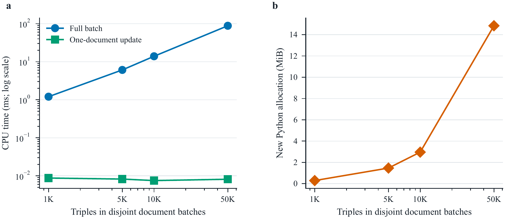

**图 11：** 互不相连文档批次上的输入导出诊断扩展性。局部更新重算一个文档，内存记录共享来源文本下的新增批次分配。

## A.2 次要检查

独立 Gemma 评判模型在隐藏方法身份的条件下评估 180 个来源—三元组对。其来源支持评分与精确参考有效性之间，Pearson 相关为 $r=0.794$，Spearman 相关为 $\rho=0.807$，二者均有 $p<2.4\times10^{-40}$。固定的 50 项子集在额外 5 次运行中均得到相同均值 0.96。这衡量模型评判器的可重复性。

我们还在 45 个均衡 TNEWS 文档上，与 Neo4j Labs 可复现的 `LLMGraphTransformer` 核心比较抽取流程 [23]。本文模式引导抽取器的类别准确率为 0.556，Graph Builder 为 0.533；配对结果无差异（$p=1.00$）。TNEWS 没有金标准三元组，因此仅支持该抽取协议下行为相近的结论。

## A.3 补充成本与扩展性表格

**表 18：** 最终运行请求成本。均值包含重试与速率节流等待，不包括来源准备和执行器排队时间。

| 输入 | 上下文 | 调用数 | 输入 token | 输出 token | 墙钟时间 (s) |
| :----------- | :----------- | ------: | -------------: | --------------: | ---------: |
| 受控 | 基础 | 1.00 | 947 | 517 | 8.58 |
| 受控 | 诊断 | 1.00 | 1017 | 512 | 8.61 |
| 受控 | SHACL | 1.00 | 3080 | 513 | 8.45 |
| 自然 | 基础 | 1.00 | 832 | 458 | 7.51 |
| 自然 | 诊断 | 1.00 | 901 | 462 | 7.90 |
| 自然 | SHACL | 1.00 | 2822 | 455 | 8.16 |

**表 19：** 输入导出诊断的扩展性。内存为新增批次分配峰值，单位 MiB；来源文本共享。

| 三元组数 | 文档数 | 全量 (ms) | 局部 (ms) | 分配内存 (MiB) |
| --------: | ----------: | ----------: | -----------: | -----------------: |
| 1,000 | 143 | 1.20 | 0.009 | 0.29 |
| 5,000 | 716 | 6.08 | 0.008 | 1.47 |
| 10,000 | 1,434 | 13.90 | 0.008 | 2.96 |
| 50,000 | 7,173 | 88.10 | 0.008 | 14.84 |

# 参考文献

[1] Acosta M, Zaveri A, Simperl E, et al (2013) Crowdsourcing linked data quality assessment. In: International Semantic Web Conference, pp 260–276, <https://doi.org/10.1007/978-3-642-41338-4_17>

[2] Anthropic (2025) Introducing Claude Haiku 4.5. Anthropic model release announcement, <https://www.anthropic.com/news/claude-haiku-4-5>, published 15 October 2025; accessed 17 September 2026

[3] Auer S, Bizer C, Kobilarov G, et al (2007) DBpedia: A nucleus for a web of open data. In: The Semantic Web: 6th International Semantic Web Conference and 2nd Asian Semantic Web Conference (ISWC/ASWC 2007). Springer, pp 722–735, <https://doi.org/10.1007/978-3-540-76298-0_52>

[4] Bian H (2025) LLM-empowered knowledge graph construction: A survey. arXiv preprint, <https://doi.org/10.48550/arXiv.2510.20345>, [arXiv:2510.20345](https://arxiv.org/abs/2510.20345)

[5] Bollacker K, Evans C, Paritosh P, et al (2008) Freebase: A collaboratively created graph database for structuring human knowledge. In: Proceedings of the 2008 ACM SIGMOD International Conference on Management of Data, pp 1247–1250, <https://doi.org/10.1145/1376616.1376746>

[6] Bordes A, Usunier N, Garcia-Duran A, et al (2013) Translating embeddings for modeling multi-relational data. In: Advances in Neural Information Processing Systems, <https://papers.nips.cc/paper_files/paper/2013/hash/1cecc7a77928ca8133fa24680a88d2f9-Abstract.html>

[7] Chen M, Zhang W, Zhang W, et al (2019) Meta relational learning for few-shot link prediction in knowledge graphs. In: Proceedings of the 2019 Conference on Empirical Methods in Natural Language Processing and the 9th International Joint Conference on Natural Language Processing (EMNLP-IJCNLP), pp 4217–4226, <https://doi.org/10.18653/v1/D19-1431>

[8] Das R, Dhuliawala S, Zaheer M, et al (2018) Go for a walk and arrive at the answer: Reasoning over paths in knowledge bases using reinforcement learning. In: International Conference on Learning Representations, <https://arxiv.org/abs/1711.05851>

[9] Dettmers T, Minervini P, Stenetorp P, et al (2018) Convolutional 2D knowledge graph embeddings. In: Proceedings of the AAAI Conference on Artificial Intelligence, <https://doi.org/10.1609/aaai.v32i1.11573>

[10] Ding B, Wang Q, Wang B, et al (2018) Improving knowledge graph embedding using simple constraints. In: Proceedings of the 56th Annual Meeting of the Association for Computational Linguistics, pp 110–121, <https://doi.org/10.18653/v1/p18-1011>

[11] Dong X, Gabrilovich E, Heitz G, et al (2014) Knowledge vault: A web-scale approach to probabilistic knowledge fusion. In: Proceedings of the 20th ACM SIGKDD International Conference on Knowledge Discovery and Data Mining, pp 601–610, <https://doi.org/10.1145/2623330.2623623>

[12] Galárraga LA, Teflioudi C, Hose K, et al (2013) AMIE: Association rule mining under incomplete evidence in ontological knowledge bases. In: Proceedings of the 22nd International Conference on World Wide Web, pp 413–422, <https://doi.org/10.1145/2488388.2488425>

[13] Gemma Team (2026) Gemma 4 technical report. arXiv preprint, <https://doi.org/10.48550/arXiv.2607.02770>, [arXiv:2607.02770](https://arxiv.org/abs/2607.02770)

[14] Guo S, Wang Q, Wang L, et al (2016) Jointly embedding knowledge graphs and logical rules. In: Proceedings of the 2016 Conference on Empirical Methods in Natural Language Processing, pp 192–202, <https://doi.org/10.18653/v1/d16-1019>

[15] Hendrycks D, Burns C, Chen A, et al (2021) CUAD: An expert-annotated nlp dataset for legal contract review. In: Advances in Neural Information Processing Systems

[16] Huang Z, Chen K, He J, et al (2019) ICDAR2019 competition on scanned receipt OCR and information extraction. In: 2019 International Conference on Document Analysis and Recognition (ICDAR). IEEE, pp 1516–1520, <https://doi.org/10.1109/ICDAR.2019.00244>

[17] Ji S, Pan S, Cambria E, et al (2022) A survey on knowledge graphs: Representation, acquisition, and applications. IEEE Transactions on Neural Networks and Learning Systems 33(2):494–514. <https://doi.org/10.1109/tnnls.2021.3070843>

[18] Knublauch H, Kontokostas D (2017) Shapes constraint language (SHACL). W3C Recommendation, <https://www.w3.org/TR/2017/REC-shacl-20170720/>

[19] Kontokostas D, Westphal P, Auer S, et al (2014) Test-driven evaluation of linked data quality. In: Proceedings of the 23rd International Conference on World Wide Web, pp 747–758, <https://doi.org/10.1145/2566486.2568002>

[20] Lao N, Mitchell T, Cohen WW (2011) Random walk inference and learning in a large scale knowledge base. In: Proceedings of the 2011 Conference on Empirical Methods in Natural Language Processing, pp 529–539, <https://aclanthology.org/D11-1049/>

[21] Lewis P, Perez E, Piktus A, et al (2020) Retrieval-augmented generation for knowledge-intensive NLP tasks. In: Advances in Neural Information Processing Systems, pp 9459–9474, <https://papers.nips.cc/paper_files/paper/2020/hash/6b493230205f780e1bc26945df7481e5-Abstract.html>

[22] Lin TW, Fierro G, Li H, et al (2025) Systematic evaluation of knowledge graph repair with large language models. arXiv preprint, <https://doi.org/10.48550/arXiv.2507.22419>, [arXiv:2507.22419](https://arxiv.org/abs/2507.22419)

[23] Neo4j Labs (2024) LLM Knowledge Graph Builder. Open-source software repository, <https://github.com/neo4j-labs/llm-graph-builder>, version inspected at commit 5ff7af3e9bb9226e1bbecd02f70f8d98697727a7; accessed 16 September 2026

[24] Nickel M, Murphy K, Tresp V, et al (2016) A review of relational machine learning for knowledge graphs. Proceedings of the IEEE 104(1):11–33. <https://doi.org/10.1109/jproc.2015.2483592>

[25] Ortona S, Meduri VV, Papotti P (2018) Robust discovery of positive and negative rules in knowledge bases. In: Proceedings of the 34th IEEE International Conference on Data Engineering, pp 1168–1179, <https://doi.org/10.1109/icde.2018.00108>

[26] Pan JZ, Razniewski S, Kalo JC, et al (2023) Large language models and knowledge graphs: Opportunities and challenges. arXiv preprint, <https://doi.org/10.48550/arXiv.2308.06374>, [arXiv:2308.06374](https://arxiv.org/abs/2308.06374)

[27] Pan S, Luo L, Wang Y, et al (2024) Unifying large language models and knowledge graphs: A roadmap. IEEE Transactions on Knowledge and Data Engineering 36(7):3580–3599. <https://doi.org/10.1109/tkde.2024.3352100>

[28] Paulheim H (2017) Knowledge graph refinement: A survey of approaches and evaluation methods. Semantic Web 8(3):489–508. <https://doi.org/10.3233/sw-160218>

[29] Paulheim H, Bizer C (2014) Improving the quality of linked data using statistical distributions. International Journal on Semantic Web and Information Systems 10(2):63–86. <https://doi.org/10.4018/ijswis.2014040104>

[30] Qu M, Tang J (2019) Probabilistic logic neural networks for reasoning. In: Advances in Neural Information Processing Systems, <https://papers.nips.cc/paper_files/paper/2019/hash/13e5ebb0fa112fe1b31a1067962d74a7-Abstract.html>

[31] Qu M, Chen J, Xhonneux LP, et al (2021) RNNLogic: Learning logic rules for reasoning on knowledge graphs. In: International Conference on Learning Representations, <https://arxiv.org/abs/2010.04029>

[32] Schlichtkrull M, Kipf TN, Bloem P, et al (2018) Modeling relational data with graph convolutional networks. In: European Semantic Web Conference, pp 593–607, <https://doi.org/10.1007/978-3-319-93417-4_38>

[33] Shi B, Weninger T (2017) ProjE: Embedding projection for knowledge graph completion. In: Proceedings of the AAAI Conference on Artificial Intelligence, <https://doi.org/10.1609/aaai.v31i1.10677>

[34] Suchanek FM, Kasneci G, Weikum G (2007) YAGO: A core of semantic knowledge. In: Proceedings of the 16th International Conference on World Wide Web, pp 697–706, <https://doi.org/10.1145/1242572.1242667>

[35] Wang Q, Mao Z, Wang B, et al (2017) Knowledge graph embedding: A survey of approaches and applications. IEEE Transactions on Knowledge and Data Engineering 29(12):2724–2743. <https://doi.org/10.1109/tkde.2017.2754499>

[36] Wang X, Chen L, Ban T, et al (2021) Knowledge graph quality control: A survey. Fundamental Research 1(5):607–626. <https://doi.org/10.1016/j.fmre.2021.09.003>

[37] Wei J, Wang X, Schuurmans D, et al (2022) Chain-of-thought prompting elicits reasoning in large language models. In: Advances in Neural Information Processing Systems, pp 24824–24837, <https://doi.org/10.52202/068431-1800>

[38] White J, Fu Q, Hays S, et al (2023) A prompt pattern catalog to enhance prompt engineering with ChatGPT. In: Proceedings of the 30th Conference on Pattern Languages of Programs. ACM, <https://doi.org/10.64346/PLoP2023p05>

[39] Wienand D, Paulheim H (2014) Detecting incorrect numerical data in DBpedia. In: European Semantic Web Conference, pp 504–518, <https://doi.org/10.1007/978-3-319-07443-6_34>

[40] Yang B, Yih Wt, He X, et al (2015) Embedding entities and relations for learning and inference in knowledge bases. In: International Conference on Learning Representations, <https://arxiv.org/abs/1412.6575>

[41] Yao S, Zhao J, Yu D, et al (2023) ReAct: Synergizing reasoning and acting in language models. In: International Conference on Learning Representations, <https://arxiv.org/abs/2210.03629>

[42] Zaveri A, Rula A, Maurino A, et al (2016) Quality assessment for linked data: A survey. Semantic Web 7(1):63–93. <https://doi.org/10.3233/sw-150175>

[43] Zhu Z, Zhang Z, Xhonneux LP, et al (2021) Neural Bellman-Ford networks: A general graph neural network framework for link prediction. In: Advances in Neural Information Processing Systems, pp 29476–29490, <https://papers.nips.cc/paper_files/paper/2021/hash/f6a673f09493afcd8b129a0bcf1cd5bc-Abstract.html>
