# 知识图谱协同优化的强化学习方法：双策略规则生成框架

**英文题名：** Reinforcement Learning for Knowledge Graph Co-optimization: A Dual-Strategy Rule Generation Framework

**作者：** 匿名作者（沿用当前英文稿）。

# 摘要

知识图谱质量控制将两个决策联系起来：在有限预算下获取哪些约束，以及修复哪些图谱缺陷。本文将该交互建模为有限时域控制问题，在四个图谱操作与四个规则管理操作上训练 Double-DQN 策略。双策略模块通过删除补全与增强扩展提出文本规则。动作级审计发现，新引入违反的计数惩罚会抑制关系修复，因为恢复可能产生临时重复。通过 40 个神经模型、10 个拟合的一步对照，以及独立开发和测试场景，比较计数、初始规模比率及零惩罚。在同一基础图谱的 30 个未见损坏场景上，比率惩罚 Double DQN 将参考三元组 F1 从 94.67% 提升至 99.49%，并恢复 94.00% 的原无效关系。简单的先获取后按缺口修复启发式达到 99.91% F1；该研究证明奖励敏感性，但未证明学习策略优于最强简单对照。重放 9,456 个归档响应显示，两种策略在相同文档上提供互补规则候选，但等调用预算下单独增强产生更多约束。执行审计编译 18,143 个精确类型模式，其并集检测 RuleTest-94 中 64 个缺陷的 10 个。独立离线桥接激活这些模式，删除十个禁止记录，同时保留全部三十个干净记录。结果将奖励设计与修复行为联系起来，并区分候选多样性、可执行覆盖和参考事实恢复。

> 译文依据 2026-10-02 的当前英文稿（源提交 `a1f9f85`），包括正文、表格、算法、声明及附录。公式保留原有数学含义，使用行内与独立行的 LaTeX 数学语法；需在支持 MathJax/KaTeX 的 Markdown 阅读器中预览。图使用原稿插图，图注译为中文；参考文献保留原始题名与出版信息。引用统一用数字索引对应文末条目，表格中的模型和方法缩写与原图保持对应。译文不修改实验结果或原稿结论。

# I 引言

## I-A 研究背景与动机

知识图谱（KG）质量控制涉及两个相互关联的决策：修复哪些缺陷，以及获取哪些规则。一次修复可能需要尚未具备的验证器。获取更多规则会消耗资源，而只能覆盖少量剩余缺陷的规则，当前价值可能有限。固定顺序的规则生成与图谱修正无法利用这一动态变化的权衡。

规则还需要新的候选来源。专家约束描述已知要求，文本则可能提供额外的类型、层级和程序性约束。大语言模型（LLM）可以提出这类候选；但要将提案变成有用的验证器，还需要可执行语义、兼容词表和检测质量证据。

本文研究利用强化学习（RL）在图谱操作与规则操作之间分配有限预算，并结合两种互补的文本规则候选诱导方式。调度实验使用具有固定验证器注册表的受控环境；生成实验使用归档的 LLM 响应。这一区分使我们能够基于可复现输入检查策略行为和规则内容。

## I-B 本文贡献

本文作出三项贡献：

1. **可执行的图谱—规则协同优化环境。** 定义 14 项观测特征、8 个图谱与规则动作、可行性掩码，以及考虑成本的奖励。图谱动作改变存储记录，规则动作改变后续修复可用的验证器。

2. **训练的 Double-DQN 策略与匹配对照研究。** 动作级审计揭示：按数量惩罚新引入违反，会因临时重复而抑制有用的关系修复。40 个重新训练的神经策略、10 个拟合的一步基线和保留测试场景，使用参考事实与结构指标比较三种固定惩罚。早期组件消融另行测试图特征、规则特征、动作掩码与获取成本。比较揭示奖励敏感性，以及学习策略相对简单对照仍存在的性能差距。

3. **可追溯评估的双策略规则生成。** 删除补全与增强扩展在共享模式中提出候选。以相同调用预算比较候选多样性，区分声明与约束，并将精确类型规则的执行追溯到归档响应。这揭示了提案互补性，以及生成模式与测试套件之间的词表差距。

图 1 概括框架。策略接收描述图质量、规则质量、剩余缺陷、剩余预算及活跃规则比例的 14 项特征。可行性掩码控制动作选择。选定操作改变环境，环境再计算质量和奖励。独立诊断探针检查单步转移；受评估策略只能使用当前观测与掩码。

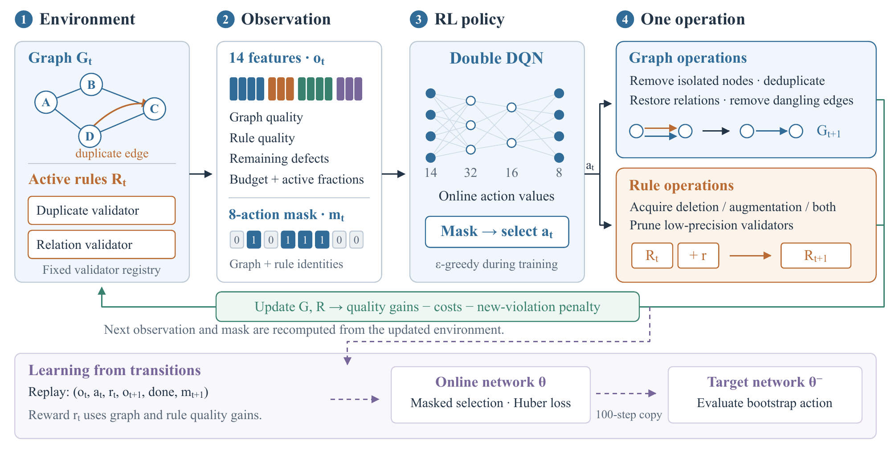

**图 1：** 基于 RL 的图谱—规则协同优化。环境提供 14 项观测特征和 8 动作可行性掩码，策略选择一个图谱或规则操作，环境随后更新质量与奖励。下方展示基于经验回放的 Double-DQN 训练。小型图谱与掩码值仅用于机制示意。调度循环使用固定验证器注册表；文本规则候选生成见图 2。

## I-C 论文组织

第 II 节回顾相关工作，第 III 节介绍调度模型与规则生成过程，第 IV 节报告实验，随后给出结论和复现细节。

# II 相关工作

## II-A 知识图谱中的强化学习

Das 等人的 MINERVA [1] 学习多跳问答策略；Xiong 等人的 DeepPath [2] 用强化学习发现推理路径；Lin 等人 [3] 研究多跳推理的奖励塑形。这些方法选择图遍历动作来回答查询，而本文动作空间改变图谱记录，并获取支持后续修复的验证器。

调度问题是：学习到的价值函数，能否比固定调度或基于观测的启发式更好地分配有限预算？我们在相同可执行转移上比较这些方案，并通过重新训练的消融测试观测特征和动作掩码的作用。受控注册表使每次转移均可复现；文本规则研究则独立检查候选来源。

## II-B 知识工程中的语言模型

KG-BERT [4] 使用语言模型进行三元组分类，KEPLER [5] 结合语言建模与知识嵌入。Pan 等人 [6] 回顾连接语言模型与知识图谱的方法。这些研究启发了以文本作为图谱构建和补全的信息来源。

思维链提示 [7] 和 ReAct [8] 探索结构化推理与工具使用。本文生成模块采用共享输出模式的两种单次调用任务：删除策略询问缺失片段暴露了哪些约束；增强策略询问补充条款暗示了哪些约束。我们通过归档来源链和可执行模式评估候选，而不将推理响应直接视为已验证规则。

## II-C 约束语言、规则挖掘与修复

SHACL [9] 和 ShEx [10] 表达图约束，其检测覆盖率取决于提供的形状。因此，应区分有限模式检查集与约束语言本身的表达能力。

AMIE [11] 从图事实挖掘 Horn 规则，RuDiK [12] 研究知识库规则发现，Neural LP [13] 通过可微操作学习逻辑规则。本文候选来自源文档，包含类型模式和程序性陈述。表示差异意味着它们必须先经过验证和编译，才能成为图验证器。

Lin 等人 [14] 系统评估基于 LLM 的图谱修复，使受控约束与修复比较直接关联到本文研究。我们关注验证器获取与图编辑的先后顺序，并对生成候选增加基于来源链的审计。若要与外部修复和规则挖掘方法进行端到端比较，需要对齐可执行约束、输入证据和评估预算。

# III 方法

## III-A 框架概述

框架维护图谱 $G_t$ 和规则集 $R_t$。每一步，策略选择获取或剪枝规则，或使用活跃验证器修复图谱。规则获取能够使后续修复成为可能，而剩余图缺陷决定进一步获取的价值。本文研究有限决策预算的分配。

调度基准通过图变更与固定的可执行验证器注册表实现。双策略模块提供独立的文本候选归档。候选多样性、可直接执行子集和调度分别评估。受控策略环境使用注册验证器；另一个离线桥接模块在词表匹配的测试套件上激活精确归档规则。图 1 展示调度循环，图 2 展示候选生成和离线执行路径。

## III-B 质量评估模型

### 图谱质量

每次图操作之后，确定性检查计算孤立率、完全重复关系率、模式无效关系率和悬空边率，记为 $I_r,D_r,V_r,L_r$。相应质量分量为：

$$
\begin{aligned} S(C_1)&=1-I_r,& S(C_2)&=1-D_r,\\ S(C_3)&=1-V_r,& S(C_4)&=1-L_r.\end{aligned}
\tag{1}
$$

受控环境采用：

$$
Q(G)=0.20S(C_1)+0.20S(C_2)+0.30S(C_3)+0.30S(C_4).
\tag{2}
$$

这些固定权重定义基准的优化目标，不估计任意三元组的事实正确性。

### 规则质量

活跃验证器在固定的 180 案例校准集合上评分，该集合独立于图损坏清单。其联合预测决定：

$$
\operatorname{Precision}(R)=\frac{TP}{TP+FP},\qquad \operatorname{Recall}(R)=\frac{TP}{TP+FN}.
\tag{3}
$$

在环境中，活跃集合为空时，两者均取零。覆盖率是四类注册缺陷中具有活跃验证器的比例。在线评分为：

$$
\begin{aligned}Q_{\mathrm{online}}(R)={}&0.35\operatorname{Precision}(R)+0.35\operatorname{Recall}(R)\\&+0.30\operatorname{Coverage}(R).\end{aligned}
\tag{4}
$$

校准预测由受控基准预先规定：每个高精度模块检测本类 30 个正例中的 27 个，同时标记 2 个干净案例。另有三个模块提供低精度替代项。这些分数描述该校准集合，不是从在线生产数据流估计的结果。生成归档的候选数量与规则精确率、召回率分别测量。

## III-C 基于 RL 的图谱—规则协同优化

### 环境与策略观测

底层有限时域状态包括图谱、活跃规则、剩余预算、初始缺陷计数，以及环境可信的关系恢复记录。这些记录仅对环境可见。策略接收 14 维观测：

$$
\begin{split}
o_t=[&S(C_1),S(C_2),S(C_3),S(C_4),\\
&\operatorname{Precision},\operatorname{Recall},\operatorname{Coverage},\tilde n_{\mathrm{iso}},\tilde n_{\mathrm{dup}},\\
&\tilde n_{\mathrm{invalid}},\tilde n_{\mathrm{dang}},\tilde b,\rho_{\mathrm{valid}},\rho_{\mathrm{noisy}}]_t.
\end{split}
\tag{5}
$$

违反计数除以该回合的初始计数，分母至少为一。最后几项为剩余预算比例，以及预定义高、低精度模块的活跃比例。观测逐分量裁剪到 $[0,1.5]$。在该注册表中，覆盖率与 $\rho_{\mathrm{valid}}$ 相同；保留两项以便进行架构匹配比较。压缩观测未必构成充分的马尔可夫状态。网络将其作为价值函数输入，并结合外部计算的可行动作掩码。

八个动作为：

$$
\begin{split}
\mathcal A=\{&a_{\mathrm{iso}},a_{\mathrm{dup}},a_{\mathrm{rel}},a_{\mathrm{dang}},\\
&a_{\mathrm{del}},a_{\mathrm{aug}},a_{\mathrm{mix}},a_{\mathrm{prune}}\}.
\end{split}
\tag{6}
$$

前四个动作分别移除孤立噪声节点、对关系去重、恢复无效关系名称，以及删除悬空边。每次处理的批量由剩余匹配缺陷的 60% 决定。关系恢复在检测之后使用私有损坏记录。其余动作分别激活删除类模块、激活增强类模块、从两类各激活一个可用模块，或剪枝校准精确率低于 0.5 的模块。模块按固定注册表顺序获取。仅当验证器已激活且仍有匹配缺陷时，修复动作才可行。

掩码由当前图谱与活跃规则身份计算，不一定能仅从 14 个观测值恢复。除显式无掩码消融外，所有匹配策略基线接收同一掩码。策略不能访问私有损坏记录，也不能查询未来转移；单独的具有环境模型信息的参考方法则可以克隆并探测环境。

### 奖励与 Double DQN

奖励使用 $\Delta Q(G_t)=Q(G_{t+1})-Q(G_t)$ 及相应规则评分变化，并加入获取、编辑和新违反成本：

$$
\begin{split}
r_t={}&\Delta Q(G_t)+0.4\Delta Q_{\mathrm{online}}(R_t)\\
&-0.004C_{\mathrm{call}}-2\times10^{-5}C_{\mathrm{edit}}-P_t.
\end{split}
\tag{7}
$$

$C_{\mathrm{call}}$ 对单类获取计一单位、混合获取计两单位；它是记账的模型调用成本，并非真实 API 请求。剪枝没有调用成本。修订后的环境根据动作前后的违反身份计算 $N_{\mathrm{new}}$，而不是固定返回零。节点具有持久标识符，每次边出现也有独立标识符，包括重复出现。编辑计数包含图变更及活跃规则变化，两部分另行报告。满足 $Q(G)\geq0.999$ 且 $Q_{\mathrm{online}}(R)\geq0.90$、达到 18 次决策，或无可行动作时结束回合。若破坏性提案会清空原本非空的节点集或边集，则回滚并结束回合。

令 $\mathcal V(G)$ 为检测到的违反身份多重集，则：

$$
N_{\mathrm{new}}=\left|\mathcal V(G_{t+1})\setminus_{\!m}\mathcal V(G_t)\right|,
\tag{8}
$$

其中 $\setminus_m$ 为多重集差。删除悬空边可能使其剩余端点孤立：一个旧违反消失，另一个不同违反出现，即使总数不变。新项会对该引入违反计罚。每次转移保存引入的身份和全部奖励分量。本文比较三种固定的 $P_t$ 定义。令 $n_{k,t}$ 为违反家族 $k$ 的新引入身份数量，$w_k$ 为其在式（2）中的权重。惩罚为：

$$
\begin{aligned}
P_t^{\mathrm{count}}&=0.01\sum_k n_{k,t},\\
P_t^{\mathrm{rate}}&=\sum_k w_k\frac{n_{k,t}}{D_{k,0}},\qquad
P_t^{\mathrm{zero}}=0,\\
D_{k,0}&=\begin{cases}
\max(1,|V_0|),&k=\text{isolation},\\
\max(1,|E_0|),&\text{otherwise}.
\end{cases}
\end{aligned}
\tag{9}
$$

其中 $V_0$ 和 $E_0$ 是初始损坏后的节点与边出现集合。分母在整个回合中固定，因此删除记录不能改变后续惩罚的尺度。比率变体根据初始图规模，对新引入违反计罚。它不改变调用与编辑成本，因此并未使完整奖励具有尺度不变性。三种变体共享观测、掩码和转移算子。重复出现属于结构违反，但不一定是新的错误事实，本文分别测量两者。

对于 $J_t=Q(G_t)+0.4Q_{\mathrm{online}}(R_t)$，折扣质量增益满足：

$$
\begin{split}
\sum_{t=0}^{T-1}\gamma^t(J_{t+1}-J_t)
={}&-J_0+\gamma^{T-1}J_T\\
&+(1-\gamma)\sum_{t=1}^{T-1}\gamma^{t-1}J_t.
\end{split}
\tag{10}
$$

因此，策略同时重视较早的改善与终止质量。

本文使用 DQN [15] 和 Double-DQN 目标 [16]。在线 Q 网络结构为 $14\rightarrow32\rightarrow16\rightarrow8$，采用 ReLU。回放缓冲区保存 $(o_t,a_t,r_t,o_{t+1},d_t)$ 和下一动作掩码。下一可行动作集非空时，$a^*$ 选择在线网络的最大值动作。目标为：

$$
\begin{aligned}
a^*&=\arg\max_{a'\in\mathcal A_{t+1}}Q(o_{t+1},a';\theta),\\
y_t&=\begin{cases}
r_t,&d_t=1\text{ or }\mathcal A_{t+1}=\emptyset,\\
r_t+\gamma Q(o_{t+1},a^*;\theta^-),&\text{otherwise},
\end{cases}\\
\mathcal L(\theta)&=\mathbb E[\operatorname{Huber}(Q(o_t,a_t;\theta)-y_t)].
\end{aligned}
\tag{11}
$$

终止状态或可行集为空时，自举项为零。目标参数每 100 个环境步骤复制一次。标准 DQN 仅将下一状态目标改为 $\max_{a'}Q(o_{t+1},a';\theta^-)$。

使用 Adam，学习率 $0.002$，折扣 $0.95$，回放容量 20,000，批量大小 64，预热 128 次转移。每个模型训练 250 回合。归档配置在 260 回合内线性衰减探索率，因此最后训练回合的 $\epsilon\approx0.0902$，尚未达到下限 0.05。奖励研究包含四种设置，每种保留十个检查点：计数、比率或零惩罚下的 Double DQN，以及比率惩罚下的标准 DQN。早期 60 模型组件研究使用计数惩罚，另见附录 E。训练使用本地环境，不调用 API。

## III-D 基于 LLM 的双策略规则生成

两种策略提出基于来源的候选，用于扩充规则集合。已保存实现对每个文档、每种策略使用一次生成调用。JSON 响应包含实体类型声明、关系类型声明、允许和禁止的类型—关系模式、层级陈述、地理层级模式及程序性陈述。在匹配预算分析中，声明与约束候选分别计数。

### 删除补全

实现删除短字符片段，而非实体级掩码。脚本默认最多选择五个起点，每个片段最多六个字符，并替换为缺失片段标记。提示提供原文、修改后文本、删除片段和共享 JSON 模式，要求模型描述缺失规则信息并提出可复用约束。由于提供原文，这是一项显式对照诱导任务，而非盲重建测试。

**算法 1：归档的删除补全过程**

**输入：** 文档标识符 $d$、源文本 $T$。

1. $(T^-,F)\leftarrow\operatorname{DeleteShortSpans}(T)$。

2. $P\leftarrow\operatorname{DeletionPrompt}(T,T^-,F)$。

2. $Y\leftarrow\operatorname{LLM}(P)$，在一次调用中生成条款和候选。

3. 解析 $Y$ 中 JSON 候选类别。

5. 记录 $(d,\text{deletion},F,Y)$。

<!-- return statement follows -->

5. 返回分类候选及解析状态。

### 增强扩展

增强提示提供来源，按脚本默认要求最多生成三个合理的补充条款。同一响应提出这些条款暗示的约束，不针对每个变体另行运行图谱抽取器。生成条款提供探索线索，不假定它们是来自真实文档分布的独立样本。

**算法 2：归档的增强扩展过程**

**输入：** 文档标识符 $d$、源文本 $T$。

1. $P\leftarrow\operatorname{AugmentationPrompt}(T)$。

2. $Y\leftarrow\operatorname{LLM}(P)$，在一次调用中生成条款和候选。

3. 解析 $Y$ 中 JSON 候选类别。

4. 记录 $(d,\text{augmentation},Y)$。

<!-- return statement follows -->

5. 返回分类候选及解析状态。

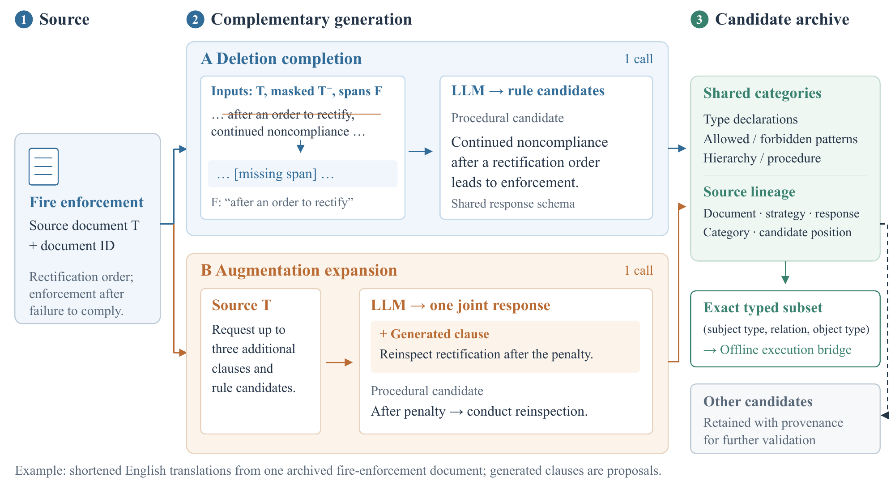

**图 2：** 双策略规则生成，使用一个归档消防执法文档的简化英文示例。删除补全接收原文、掩码文本和删除片段；增强扩展在同一响应中返回补充条款与规则候选。两种策略均保留候选来源链。精确类型模式进入离线执行桥接，其他候选保留以待进一步验证。

### 规则落地与验证

候选不会自动成为可执行或正确规则。我们保留源文档、策略、响应行、候选类别和顺序位置。直接执行审计支持由主语类型、关系和宾语类型组成的显式三元组。对于禁止模式 $r=(\tau_s,p,\tau_o)$，当以下条件满足时标记记录 $x$：

$$
V_r(x)=\mathbf1[(\operatorname{type}(s_x),p_x,\operatorname{type}(o_x))=r].
\tag{12}
$$

允许模式记录对精确组合的许可；未出现在允许集合中不意味着违反。允许与禁止同时匹配时，审计记录冲突并放弃判断。仅去除首尾空白，不推断别名或语义改写。

所有格式错误候选、不支持家族、未映射词项和未匹配的可执行模式均保留在审计中。可执行子集使用 RuleTest-94 保存的预期结果检查。这些标签描述人工设计套件，提供执行检查，不是对生成规则语义的独立裁决。程序性和结构家族检测器是另一个手工实现比较，不归因到单个生成候选。

### 聚合与来源追踪

使用归档聚合代码和规范序列化，在类别内对候选去重。实体及关系声明与约束区分。重放采用类别级规范去重，不增加语义合并。

生成脚本默认 Qwen3-32B、温度 0.2。逐调用记录未保留完整运行配置、精确渲染提示或解码元数据，因此这些值作为脚本默认值报告，而非每次历史调用均已核实的设置。提示构建器和翻译模板见附录 A，原始模板包含在补充材料中。独立抽取基准使用 Qwen3.8-27B-no-thinking，与规则生成分开。

## III-E 离线生成规则桥接

桥接模块使用与执行审计一致的精确匹配语义，编译归档允许与禁止类型模式。激活规则改变当前违反报告；无相反许可的禁止模式匹配记录时，启用删除动作。删除后重新计算匹配与动作可用性。每次匹配保留规则标识符及来源链。不支持候选记录日志，许可与禁止冲突时放弃判断。

独立重放适配器提供 reset、observation、available-action 和 step 接口。四个命令为加载删除规则库、加载增强规则库、移除禁止匹配记录，以及停止。策略接收记录数、标记数、冲突数、活跃规则数等聚合信息，以及获取状态、剩余预算和当前掩码。每个规则库至多加载一次；停止或六次决策上限结束重放。该适配器不输出奖励，也不替代八动作训练环境。

缺少端点或类型未知的记录会触发弃权。若许可在记录删除后才到达，则针对已删除记录记日志，不会悄悄重建。会清空非空记录集的删除被阻止。适配器保存每次激活、检测和删除及其来源链。参考标签仅进入评分器，不推断替代事实。加载完整归档规则库与模型调用分开计量。

# IV 实验

## IV-A 评估设计

### 研究问题

本文提出三个主要问题。**RQ1：** 学习的协同优化策略与可行动作调度、简单自适应启发式相比如何？**RQ2：** 新引入违反惩罚如何影响修复完成、事实保留和策略行为？当前奖励下的消融分别考察特征、掩码、调用成本和惩罚量级。**RQ3：** 相同调用预算下，两种生成策略分别贡献什么，哪些归档候选能够在有标签套件上执行？额外的结构和抽取测试描述修复层行为。

### 数据与协议

策略环境使用 450 个均衡 TNEWS/CLUE 文档，每类别 30 个，构建 873 节点、1,083 关系的图谱。独立种子控制孤立、重复、无效关系和悬空边损坏。奖励研究保留 20 个开发场景和 30 个测试场景，均共享相同基础文档与图谱。早期 10 个场景用于动作审计和历史组件研究。独立的 180 案例校准集合提供在线验证器精确率与召回率。规则获取激活注册模块；验证器发现无效关系后，关系恢复使用环境私有来源记录。

规则研究重放 9,456 个成功归档响应：4,728 个政务服务文档各有删除与增强响应。RuleTest-94 提供 30 个干净及 64 个有缺陷记录和保存的预期结果，是设计的测试套件。确定性修复测试使用 3,000 个 TNEWS 标题，早期 API 抽取测试使用另一个记录的 45 标题样本。这些测试衡量实现的不同部分。

### 可复现性

奖励研究在训练 40 个神经模型和 10 个岭回归基线前，冻结训练来源、成本、种子与回合预算。开发检查覆盖 1,600 个策略/运行/场景结果。完成检查后，第二份清单封存全部 50 个拟合模型和评分代码，再开放 30 个保留测试场景，得到 2,400 个测试结果。保留所有预定义策略，不搜索系数，也不根据开发集选择模型。初始图谱、逐步图变更、掩码、奖励分量和参考评分均归档；早期环境、检查点和结果按原版本保留。奖励研究训练与缓存评估不产生 API 请求。早期抽取测试使用 Qwen3.8-27B-no-thinking，历史规则生成设置见附录 A。

## IV-B 可执行图转移上的 RL 协同优化

### 奖励审计

早期计数惩罚研究报告 Double DQN 没有新引入违反。重放其十条轨迹发现，关系修复动作同样为零，每图仍残留 61.3 个无效关系。因此，从每个已访问状态分支检查可行动作。在早期 Double-DQN 和启发式的二十条轨迹中，审计执行 2,214 个单步分支，其中 311 个为关系修复分支。这些模拟器探针仅用于诊断，受评估策略无法访问。

早期 Double-DQN 轨迹上的 155 个可行关系修复分支，在计数惩罚下立即奖励全部为负。重叠分支合计引入 443 次重复出现，但未添加错误参考事实，也未移除正确事实。其平均立即回报从计数惩罚的 $-0.01990$ 变为比率惩罚的 $+0.00821$。修复后再去重，平均两步折扣回报分别为 $-0.01781$ 和 $+0.01030$。原惩罚因此会因临时重复而抑制有用修复。分支总数描述审计状态，不是独立测试样本。

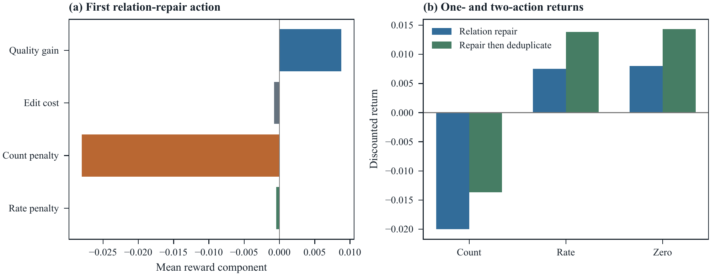

**图 3：** 早期十个场景的奖励分解。每个探针从初始损坏图谱开始，四个有效检测器均已激活。（a）第一次关系修复的平均质量增益、编辑成本和可选惩罚。（b）该动作以及修复后去重的回报，折扣为 0.95。（a）中的两项惩罚互为替代，不相加。

### 匹配策略与指标

新比较分别在三种惩罚下训练 Double DQN，并在比率惩罚下训练 DQN。八种受评估策略共享 14 项观测特征、可行动作掩码及 18 步时域。*先获取后按缺口修复（acquire-then-deficit）* 启发式首先按混合、删除、增强的优先级获取缺失高精度模块，然后选择当前加权质量缺口最大的可行图动作。随机可行动作与规则优先可行动作调度作为额外对照。

一步岭回归基线为每个动作拟合三项结果：联合质量增益、编辑数和新引入违反的比率负担。十次拟合各使用 250 个独立的均匀可行动作探索回合，与每个神经模型的回合预算相同。输入为 14 项公开特征，目标为观测奖励分量。每个动作独立在训练数据上拟合标准化，岭系数为一，截距不惩罚。推理时，将预测编辑数和负担截断为非负，选择包含已知调用成本的预测比率奖励最高的可行动作。其数据来自独立随机轨迹，监督使用奖励分量，因此相同回合预算不意味着相同训练数据或反馈。所有策略都不接收参考标签或探测未来转移。

令 $F^*$、$F_0$ 和 $F_T$ 分别是干净参考、初始损坏图谱与最终图谱的唯一三元组集合。主要参考指标为：

$$
\mathrm{F1}_{\mathrm{triple}}=\frac{2|F_T\cap F^*|}{|F_T|+|F^*|}.
\tag{13}
$$

第二项主要指标，是初始无效边身份中，最终仍存在且恢复参考关系的比例。删除无效边不得分；恢复后又被去重删除的边出现也不得分。三元组集合 F1 独立于这个更严格的出现级指标，衡量保留事实。正确事实保留率为 $|F_T\cap F_0\cap F^*|/|F_0\cap F^*|$。参考来自对确定性抽取结果的受控损坏，而非独立语义标注。

还报告残留缺陷、各家族新引入违反、正确及错误事实变化、编辑、获取单位、最终联合质量，以及共同预算下的轨迹质量：

$$
\begin{aligned}
\bar Q_t&=\frac{Q(G_t)+0.4Q_{\mathrm{online}}(R_t)}{1.4},\\
\mathrm{AUC}_{18}&=\frac1{18}\sum_{t=0}^{17}\frac{\bar Q_t+\bar Q_{t+1}}2.
\end{aligned}
\tag{14}
$$

提前终止的质量延续到第 18 步。全部评估回报使用比率惩罚，即使策略训练采用计数或零惩罚；归档也保存另外两种反事实回报。获取单位衡量模拟成本，真实 API 请求为零。

**表 I：** 相同基础图谱的 30 个未见损坏场景上的奖励验证。均值与标准差基于十个运行种子均值。F1 使用唯一参考三元组；恢复要求原错误边重新取得参考关系。所有回报使用比率惩罚。

| 策略 | 三元组 F1 (%) | 恢复率 (%) | 保留率 (%) | 新引入违反 | 调用数 | 回报 |
| :--- | ---: | ---: | ---: | ---: | ---: | ---: |
| DDQN（计数） | $94.67\pm0.00$ | $0.00\pm0.00$ | 100.00 | 0.00 | 6.27 | 0.3692 |
| DDQN（比率） | $99.49\pm0.64$ | $94.00\pm12.44$ | 100.00 | 4.20 | 4.42 | 0.3806 |
| DDQN（零） | $99.75\pm0.31$ | $99.06\pm1.37$ | 100.00 | 4.42 | 4.06 | 0.3803 |
| DQN（比率） | $99.77\pm0.34$ | $96.94\pm6.28$ | 100.00 | 4.33 | 4.21 | 0.3818 |
| 一步岭回归 | $99.88\pm0.01$ | $97.90\pm0.15$ | 100.00 | 4.37 | 4.04 | 0.3874 |
| 先获取后按缺口修复 | $99.91\pm0.00$ | $98.77\pm0.00$ | 100.00 | 4.37 | 4.00 | 0.3877 |
| 规则优先可行动作 | $99.40\pm0.00$ | $94.73\pm0.00$ | 100.00 | 4.27 | 8.00 | 0.3514 |
| 随机可行动作 | $97.84\pm0.19$ | $70.72\pm3.03$ | 100.00 | 3.12 | 9.72 | 0.3394 |

**表 II：** 比率惩罚 DDQN 减比较方法，单位为百分点。区间重采样十个运行种子均值，每个均值覆盖相同 30 个场景。精确符号随机化检验对八项对比作 Holm 校正。

| 比较方法 | 指标 | 差值 | 95% 区间 | Holm $p$ |
| :------------------ | :------------ | -----------: | ----------------------: | -----------: |
| DDQN（计数） | 三元组 F1 | +4.824 | $[+4.403,+5.141]$ | 0.0156 |
| DDQN（计数） | 恢复率 | +94.000 | $[+85.976,+99.919]$ | 0.0156 |
| DDQN（零） | 三元组 F1 | -0.255 | $[-0.673,+0.094]$ | 0.9375 |
| DDQN（零） | 恢复率 | -5.057 | $[-12.825,+0.509]$ | 0.9375 |
| 一步岭回归 | 三元组 F1 | -0.387 | $[-0.810,-0.069]$ | 0.1875 |
| 一步岭回归 | 恢复率 | -3.898 | $[-11.927,+2.006]$ | 0.9375 |
| 先获取后按缺口修复 | 三元组 F1 | -0.415 | $[-0.837,-0.099]$ | 0.1875 |
| 先获取后按缺口修复 | 恢复率 | -4.772 | $[-12.796,+1.147]$ | 0.9375 |

### 策略结果

表 I 显示计数惩罚 Double DQN 再次不执行关系修复，每图残留 60.03 个无效关系，三元组 F1 为 94.67%。比率惩罚 Double DQN 恢复 94.00% 的原无效边出现，F1 达 99.49%，增益 4.824 个百分点，95% 区间为 $[4.403,5.141]$。计数与比率的两项主要对比均通过 Holm 校正（$p=0.0156$）。比率策略平均执行 3.92 个关系修复动作，每图残留 3.57 个无效关系。

零惩罚策略的 F1 为 99.75%，恢复率为 99.06%；岭回归为 99.88% 和 97.90%；先获取后按缺口修复为 99.91% 和 98.77%。比率惩罚 Double DQN 两项均值均低于这三个对照，六项配对对比均未通过八检验 Holm 校正（表 II）。这些结果证明相对原计数惩罚有所改善，但没有证明优于零惩罚或简单对照。比率策略跨种子均值的恢复率标准差为 12.44 个百分点，图 4 展示训练变异。

八种策略均保留全部初始正确参考事实，且不引入新的错误参考事实。新引入违反均为重复出现。比率惩罚 Double DQN 每图引入 4.20 次，零惩罚为 4.42，启发式为 4.37。统一比率奖励下，平均折扣回报分别为 0.3806、0.3803 和 0.3877。启发式还使用更少获取单位：4.00，而比率 Double DQN 为 4.42。在该注册表中，简单拟合策略与固定启发式仍是强对照。

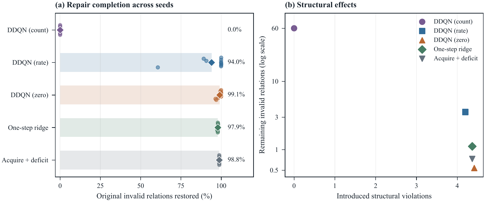

**图 4：** 30 个未见损坏场景上的行为。（a）恢复且保留的原无效边出现；小点为十个种子均值，菱形为其平均。（b）新引入结构违反与残留无效关系。每个种子均值覆盖 30 个场景；（b）展示跨种子平均，纵轴为对数尺度。

### 统计推断与早期组件消融

测试分析先在每个训练或运行种子内平均 30 个场景。统计单位是十个配对种子均值，而非 300 个独立场景；进行 10,000 次配对 bootstrap，以及全部 $2^{10}$ 种赋值上的精确双侧符号随机化。Holm 校正覆盖八项预定义对比：比率 Double DQN 对计数、零惩罚、岭回归和先获取后按缺口修复，在两项主要指标上分别比较。逐点区间描述给定固定测试集条件下的种子变异。确定性调度跨运行种子重复相同结果。

附录 E 保留早期计数惩罚下图特征、规则特征、动作掩码和调用成本研究，含全部 60 个训练模型与 110 次评估。去掉掩码使最终联合质量从 0.96855 降到 0.94800，每次运行产生 10.7 个无效动作；最终质量对比通过十检验 Holm 校正，其他组件对比没有通过。这些消融描述早期计数惩罚；下文在当前比率奖励下重复组件开关。

### 比率奖励下的组件

当前转移下新增五种设置：去掉图特征、去掉规则特征、去掉动作掩码、去掉训练调用惩罚，以及使用校准的小计数惩罚。每设置十个种子、每种子 250 回合，共 50 个新模型。十个已有比率 DDQN 检查点作为匹配的完整策略参考。全部设置在相同基础图谱的另外 30 个损坏种子上评估，包括启发式共 2,100 个策略—种子—场景结果，不依据这些结果选择模型。

特征消融在训练与评估时将指定观测项置零，其他观测和动作掩码仍可用。无掩码设置在行为和目标更新中都从全部八个动作选择。不可用图动作可能不产生变化，重复规则获取可能仍计调用成本；底层算子不变。无调用成本设置仅移除该训练奖励项，评估使用统一比率奖励。

**表 III：** 当前奖励的组件研究。数值为十个种子均值的平均，每个种子覆盖 30 个共同场景。调用数为模拟获取单位，实际 API 请求为零。

| 设置 | F1 | 恢复率 | 调用数 | 不可用选择 |
| :--------------------- | -------: | ------------: | ------: | ------------: |
| 比率 DDQN | 0.9952 | 0.9377 | 4.45 | 0.00 |
| 无图特征 | 0.9941 | 0.8938 | 4.10 | 0.00 |
| 无规则特征 | 0.9775 | 0.6682 | 7.39 | 0.00 |
| 无动作掩码 | 0.9702 | 0.5776 | 6.23 | 8.26 |
| 无调用惩罚 | 0.9854 | 0.7686 | 5.54 | 0.00 |
| 小计数惩罚 | 0.9905 | 0.9214 | 4.89 | 0.00 |
| 先获取后按缺口修复 | 0.9991 | 0.9884 | 4.00 | 0.00 |

去掉掩码使 F1 降低 2.50 个百分点（95% 种子 bootstrap CI：$[-3.45,-1.62]$；Holm $p=0.0234$），每回合产生 8.26 次不可用选择。它是 12 项 F1/恢复率比较中唯一通过校正的对比。移除规则特征也降低平均 F1 并增加获取成本，但校正检验未能确立跨种子的稳定效应。在该受控环境中，所有设置都保留初始正确参考事实。启发式再次具有最高平均 F1（99.91%）。

#### 惩罚量级对照

通过二十个均匀采样可行动作的开发轨迹校准固定计数系数。系数为总比率负担除以新引入违反总数：$\alpha=0.000164493$。它使用观测转移，不使用参考事实或测试结果。小计数 DDQN 的 F1 为 99.05%，比率 DDQN 为 99.52%；配对差值为 $-0.47$ 个百分点（CI：$[-1.73,0.46]$，Holm $p=1$）。在基础规模上，这些结果不能区分比率规范化的收益与大幅减小计数系数的收益。

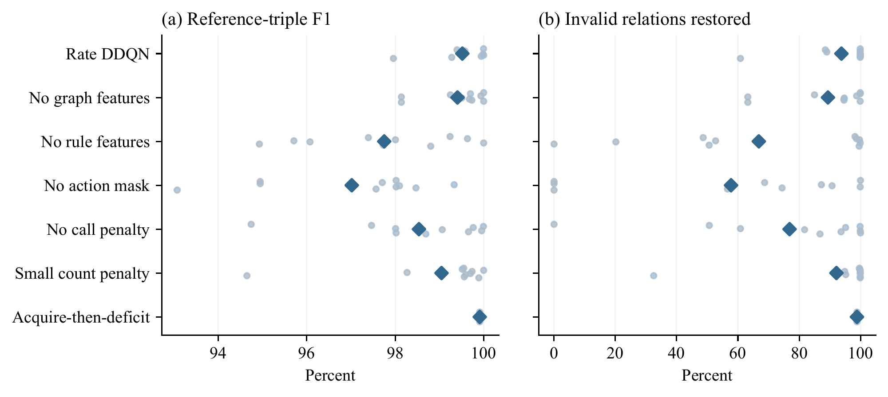

**图 5：** 当前奖励消融和校准计数对照。小点为十个训练种子均值，菱形为平均。每个种子均值使用 30 个共享损坏场景；启发式为确定性的。

### 复制图规模下的固定策略

将干净基础图谱复制为 1、2、4、8 个互不相连副本，各自使用独立节点 ID。最大干净输入有 6,984 个节点和 8,664 条边。每种规模使用十个固定策略种子及五个共同损坏种子，比较比率、原计数、小计数 DDQN 与先获取后按缺口修复，共 800 个结果。模型都只在基础规模训练。此扫描重复相同内容，检验固定策略迁移，而非新文档或大型连通图谱。

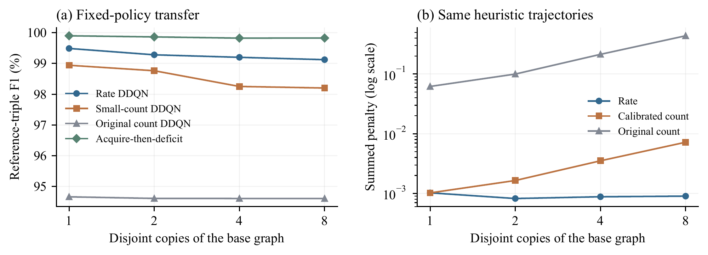

**图 6：** 不相连图规模对照。（a）每种规模上十个模型种子与五个损坏场景的平均 F1。（b）在相同启发式轨迹上评估三种惩罚。曲线为描述性结果，没有按规模重训或选择模型。

**表 IV：** 独立顺序启发式资源测量，每规模重复三次。时间包括环境构建和启用 `tracemalloc` 的运行；内存为 Python 跟踪分配峰值，不包括预先构建的干净图谱与原生张量存储，不是总 RSS。

| 干净边数 | 副本数 | 时间中位数（秒） | 峰值内存中位数 (MiB) |
| ------------: | -------: | ---------------: | ----------------: |
| 1,083 | 1 | 0.881 | 1.32 |
| 2,166 | 2 | 1.839 | 2.89 |
| 4,332 | 4 | 4.126 | 5.46 |
| 8,664 | 8 | 8.805 | 11.35 |

启发式轨迹中，从一份增至八份副本，固定小计数负担变为原来的 7.06 倍，比率负担为 0.88 倍。这衡量相同行为下惩罚如何随规模变化。固定策略结果和同轨迹惩罚并不能证明比率学习具有跨规模优势；证明这一点需要在各规模训练比较。

## IV-C 双策略候选生成

### 同文档与等调用比较

在完整配对归档上，删除产生 32,955 个不同分类候选，增强产生 41,683 个，并集为 71,656 个。这些总数包含实体和关系声明。并集比单独增强大 71.9%，但调用数翻倍：9,456 对 4,728。因此它衡量相同文档上的额外候选覆盖。

为在相同成本下比较候选多样性，固定调用预算为 100、500、1,000、2,000 和 4,000。对配对文档集合的三十个有种子排列，单策略处理 $B$ 个文档，每个一次；双策略对前 $B/2$ 个文档各执行两种策略。因此调用数匹配，文档覆盖不同。规范聚合遵循归档代码，声明与约束候选分开。表 V 给出代表预算，全部预算与样本均已发布。

**表 V：** 相同调用次数的候选比较，取 30 个文档排列的均值。声明指实体和关系类型，约束指候选模式或陈述。

| 调用数 | 策略 | 文档数 | 声明数 | 约束数 |
| ------: | :------------- | -----: | ------: | ------------: |
| 100 | 删除 | 100 | 468 | 702 |
| 100 | 增强 | 100 | 501 | 857 |
| 100 | 双策略 | 50 | 512 | 795 |
| 1000 | 删除 | 1000 | 2634 | 6044 |
| 1000 | 增强 | 1000 | 2887 | 7787 |
| 1000 | 双策略 | 500 | 2970 | 7126 |
| 4000 | 删除 | 4000 | 7249 | 21299 |
| 4000 | 增强 | 4000 | 7627 | 28407 |
| 4000 | 双策略 | 2000 | 8081 | 25901 |

在每个匹配预算下，增强都比双策略产生更多不同约束候选。1,000 次调用时，均值为 7,787 对 7,126。双策略对给定文档集合提供互补提案，但在本归档中没有显示每次调用的候选数量优势。候选正确性与多样性分别评估。

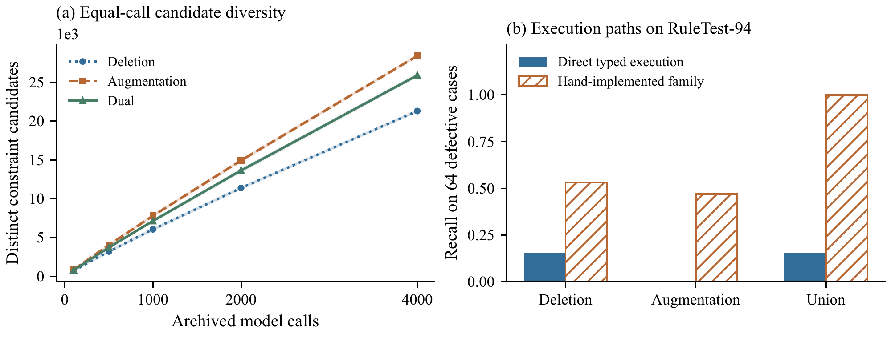

**图 7：** 规则生成分析。（a）相同调用预算下的不同约束候选数；阴影是三十个文档排列的经验 2.5–97.5 百分位区间，不是独立样本置信区间。（b）直接候选执行与独立手工家族检测器的召回率。

### 基于来源追踪的执行审计

归档含 181,851 次候选出现。精确允许/禁止类型模式编译为 18,143 个不同规则，保留每次出现的文档、策略、响应行、类别和序号。只有两个不同编译模式匹配任意 RuleTest-94 记录。在 32,360 次可编译出现中，32,348 次含测试套件相应位置没有的词项；9 次使用已出现词项但不匹配记录；3 次匹配记录。这揭示源归档与测试套件之间的模式对齐差距。

**表 VI：** 归档类型候选在 RuleTest-94 上的直接执行；包含 64 个缺陷案例和 30 个干净案例。

| 策略 | 模式数 | TP | FP | 召回率 | F1 |
| :------------- | ---------: | ----: | ----: | -------: | ------: |
| 删除 | 5794 | 10 | 0 | 0.156 | 0.270 |
| 增强 | 12617 | 0 | 0 | 0.000 | 0.000 |
| 双策略 | 18143 | 10 | 0 | 0.156 | 0.270 |

并集直接执行检测出 64 个缺陷中的 10 个，不标记任何 30 个干净案例，召回率 0.156，F1 0.270。增强单独没有正预测，精确率因此未定义。允许模式作为许可，而非封闭世界白名单；许可与禁止冲突时弃权。此套件未出现冲突。不支持及格式错误候选保留在审计计数和来源文件中。每种策略都在全部 94 案例上评分。

### 离线修复循环中的生成规则

**表 VII：** 此前已检查的 RuleTest-94 上的离线生成规则桥接。删除解除类型禁止，不重建参考事实。

| 规则包 | 规则数 | 删除缺陷记录 | 删除干净记录 | 保留数 |
| :------------- | ------: | ----------------: | ---------------: | ---------: |
| 删除 | 5794 | 10 | 0 | 84 |
| 增强 | 12617 | 0 | 0 | 94 |
| 并集 | 18143 | 10 | 0 | 84 |

第 III-E 节的桥接模块在 RuleTest-94 激活精确归档类型模式，重算检测及删除动作掩码，执行允许删除并记录下一状态。删除激活 5,794 个模式，增强 12,617 个，并集 18,143 个。删除与并集各移除十个缺陷记录，不移除干净记录；增强不改变记录。全部三十个干净记录均保留。已删除记录没有推断替代项，因此这是约束消除，而非事实重建。

我们扩展桥接，提供公开观测接口，支持加载任一策略的归档规则库、移除无相反许可的禁止匹配，或停止。两种获取顺序各结合立即或延迟删除，为每个输入形成四种调度。在 RuleTest-94 与三个归档图快照上保留十六条完整动作轨迹。RuleTest-94 上四种调度均删除相同十个设计缺陷，不删除干净记录。经验重放中没有迟到许可或冲突；单独合成测试验证冲突弃权，并记录删除后到达的许可，这些测试不增加经验案例。

**表 VIII：** RuleTest-94 和三个归档 CSV 图快照上的精确类型规则覆盖率。全部 18,143 个编译模式可用。原始图谱中的零反映节点类型缺失，不表示已验证没有缺陷。

| 输入 | 记录数 | 有类型记录 | 匹配规则数 | 标记记录数 |
| :------------ | --------: | ------: | ---------------: | --------: |
| RuleTest-94 | 94 | 94 | 2 | 10 |
| 政务 | 17,939 | 0 | 0 | 0 |
| 金融 | 8,180 | 0 | 0 | 0 |
| 环境 | 151 | 0 | 0 | 0 |

原始政务、金融和环境 CSV 快照分别含 17,939、8,180 和 151 次边出现，节点类型均为 `Unknown`，因此 26,270 条边缺少归档模式所需类型信息。进一步来源审计检查了 51 个受版本管理的节点 CSV、三个原始文档 JSONL 和两个独立任务抽取检查点，没有为这些图谱恢复可追溯类型。增强导出中的 `Enhanced` 是转换器赋予的处理标签，不是实体类别；数字 ID 本身也不能证明跨导出身份一致。运行时对这些记录弃权。表 VIII 区分类型信息缺失与有类型记录没有匹配规则。这些为单独固定的原始快照，不是下文早期 SHACL 比较的输入。

RuleTest-94 中，两个匹配模式都来自删除：一个许可匹配十条记录，一个禁止标记另外十条；增强不匹配任何记录。覆盖情况及不同调度下相同的最终记录，说明下一步集成要求是可信实体类型和更广适用规则覆盖，然后才能检验学习调度。重放接口不提供奖励，也不使用学习检查点。加载一个策略库按加载 4,728 个归档响应报告，真实 API 请求为零。

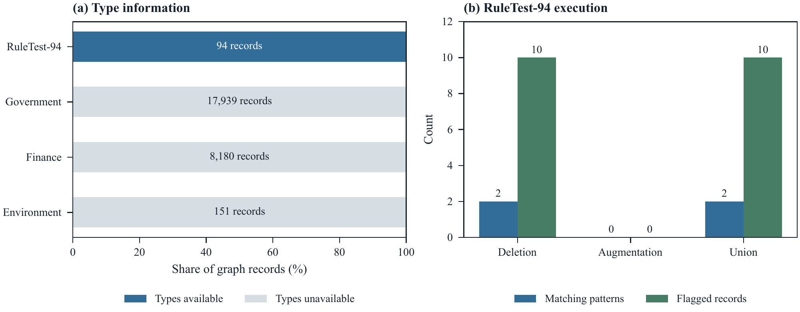

**图 8：** 归档规则集成审计。（a）各图快照的端点类型可用性，柱内数字为记录数。（b）RuleTest-94 上精确匹配模式和被标记记录。类型缺失导致弃权，不计为正确验证。

### 独立规则家族检查

**表 IX：** 手工实现家族检测器，按保存的套件标签重新评分。这些检测器与编译候选模式分开。

| 检测器 | TP | FP | FN | 召回率 | F1 |
| :-------------------- | ----: | ----: | ----: | -------: | ------: |
| 删除类 | 34 | 0 | 30 | 0.531 | 0.694 |
| 增强类 | 30 | 0 | 34 | 0.469 | 0.638 |
| 家族并集 | 64 | 0 | 0 | 1.000 | 1.000 |

手工删除类检测器覆盖 34 个程序、缺失字段和专业缺陷；增强类检测器覆盖其余 30 个结构缺陷。按保存的预期标签评分，并集检测全部 64 个缺陷且无误报。这些函数直接编码设计的缺陷家族，覆盖率构成相应家族的回归检查；表 VI 的直接执行结果才衡量归档生成模式。

## IV-D 与约束检查基线比较

本文比较通过 SHACL 风格 RDF 验证实现的确定性约束检查基线。它接收去重 RDF 三元组，检查模式符合性，但不访问源文本、LLM 提示或生成的程序性/取值规则。该比较衡量选定形状在这些输入上的覆盖。

**表 X：** 三个领域的 SHACL 风格结构验证基线。

| 领域 | 原始三元组 | RDF 去重后 | 删除数 | $Q$ |
| :------------- | ------------: | -----------: | :-------: | :-----: |
| 政务 | 13,892 | 10,771 | 0 | 79.87 |
| 金融 | 2,264 | 539 | 0 | 70.42 |
| 环境 | 2,345 | 378 | 0 | 65.25 |
| 平均 | 6,167 | 3,896 | 0 | 71.85 |

RDF 去重后，输入符合选定形状，因此基线不再删除三元组。在独立质量指标下，平均质量分数为 71.85。这些形状未实现该指标的全部来源依赖和程序检查。差异来自已实现约束的覆盖；SHACL 本身能表达比该基线更丰富的取值和逻辑约束。

## IV-E 确定性结构修复

独立确定性基准采用 TNEWS/CLUE 风格中文新闻标题。确定性抽取器从 15 类均衡的 3,000 个标题构建文档—类别—实体知识图谱，然后注入重复三元组、无效关系和孤立节点，再运行本地修复流程。该基准完全本地执行，不调用 LLM/API，因此评估知识图谱质量控制与规则执行，而非 LLM 抽取质量。

**表 XI：** TNEWS/CLUE 本地端到端知识图谱质量基准。

| 阶段 | 节点数 | 关系数 | 无效数 | $Q$ |
| :----------------- | :------: | :---------: | :-------: | :------: |
| 干净抽取 | 10,871 | 20,827 | 0.000 | 99.89 |
| 损坏图谱 | 11,414 | 22,909 | 0.050 | 94.93 |
| 修复图谱 | 10,822 | 19,799 | 0.000 | 100.00 |

修复流程删除注入的无效关系、重复三元组和孤立噪声节点，将结构 $Q$ 从 94.93 提升至 100.00。修复图谱的节点和关系少于干净抽取图，因此该分数不意味着每个原始事实都已恢复。完整报告由 `exps/external_benchmark_runner.py` 生成。

## IV-F 基于 API 的 LLM 抽取基准

上述本地 TNEWS/CLUE 基准在确定性抽取条件下单独测试质量控制层。为进一步测试完整抽取路径，归档 API 基准在覆盖 15 类的 45 个 TNEWS/CLUE 标题上评估，模型为 Qwen3.8-27B-no-thinking。TNEWS 类别标签作为类别推断银标准，给定标题关键词作为实体覆盖的弱银标准提及。测试衡量解析、弱抽取指标和模型输出的结构过滤。

**表 XII：** TNEWS/CLUE 标题上基于 API 的 LLM 抽取基准。

| 指标 | 原始 LLM 图谱 | 修复图谱 |
| :----------------------- | :----------: | :-----------: |
| 解析成功率 | 1.000 | — |
| 类别准确率 | 0.556 | 0.556 |
| 关键词召回率 | 0.178 | 0.178 |
| 含三元组文档数 | 1.000 | 1.000 |
| 平均三元组/文档 | 3.58 | 3.58 |
| 无效三元组率 | 0.000 | 0.000 |
| 三元组重复率 | 0.000 | 0.000 |
| 图谱质量分数 | 100.00 | 100.00 |

45 次调用耗时 1,190.90 秒，全部响应解析成功。Qwen3.8-27B-no-thinking 在每个采样标题上均遵循允许模式，因此保守修复层未作修改，原始与修复后的结构质量均为 100.00。此样本未检测到结构违反。类别准确率 0.556，弱关键词召回率 0.178，说明语义抽取仍是较大瓶颈；确定性结构检查无法修复遗漏或错误分类的内容。

## IV-G 运行时间与成本核算

最初的 20 模型 RL 运行记录 CPU 时间 1,278.99 秒，API 调用为零。早期 60 模型组件研究及新的 40 模型奖励研究也不发请求。新增岭回归对照在 2,500 个随机探索回合上进行十次拟合。当前奖励组件与小计数研究再增加 50 个训练模型，仍为零 API 请求。逐运行训练时长和评估时间均归档。评估计时包括策略推理与环境转移，不包括环境构建；有环境模型信息的前瞻还包括克隆转移探针。这些本地时间不估计 LLM 延迟。

早期 45 文档抽取测试进行了 45 次实际调用，耗时 1,190.90 秒。规则归档记录 9,456 个成功响应，但历史延迟、token、重试和失败请求记录不完整。因此，等调用候选比较衡量每个归档成功调用的多样性，而非总计费成本。环境获取单位在调度中模拟该成本。

## IV-H 范围与后续评估

奖励审计识别出抑制有用修复的机制：临时重复的计数惩罚可能超过质量增益。比率和零惩罚减弱该效应，但简单策略在固定注册表中仍具竞争力。基础规模上，校准的小计数对照与比率 DDQN 接近，配对差异不显著。单独的不相连复制测试检查固定策略行为和惩罚尺度；连通图及不同修复风险属于不同设定。参考保留结果描述受控算子，包括可信关系恢复；自然错误安全性需要独立标签。

生成类型规则与 RuleTest-94 的直接重叠有限，原始图快照也缺少实体类型。候选规则要替代 RL 循环中的注册表，需要可信类型信息、经验证的词汇映射及更多规则家族。初始带类型文档试验中，生成模式未触发删除（附录 C）。独立的来源证据版本在开发阶段产生了修复，但两轮均未满足全部扩展门槛（附录 C-A）。对归档开发规则包的穷举离线检查表明，第二轮相对于先获取后修复已没有额外的最终 F1 空间（表 XVII）。离线桥接在设计测试集上提供规则到动作的轨迹；后续整合仍需在生成规则到达和更广泛修复操作下评估学习调度。自然缺陷标注与留出领域随后检验语义正确性及迁移能力。现有抽取标签支持类别和关键词指标，而非参考三元组准确率。

# V 结论与未来工作

本文提出图谱—规则协同优化框架，包含训练的 Double-DQN 调度器及双策略文本规则生成。调度环境刻画验证器获取与图谱修复之间的依赖，并包含经验回放、目标网络更新、可行性掩码和归档图转移。

奖励研究解释了为何一个策略可以不引入任何违反，却遗漏有用修复。原奖励将临时重复计数，使关系恢复缺乏吸引力。初始规模比率惩罚使 Double-DQN 在保留损坏场景上的参考三元组 F1 从 94.67% 提高至 99.49%。零惩罚和简单对照也表现较强，先获取后按缺口修复达到 99.91%。证据支持修正惩罚，但学习调度相对这些对照的收益仍未确立。

当前比率奖励消融支持动作掩码的作用：去掉掩码使 F1 降低 2.50 个百分点，经过多重性校正后仍显著。基础图规模上，开发集校准的小计数惩罚与比率惩罚在统计上仍无法区分。

删除与增强在相同文档上贡献不同候选；等调用预算下，增强产生更多约束。离线桥接将精确归档模式连接到政务类型套件上的检测、动作可用性和记录删除。初始有类型文档试验编译两种策略，但不触发修复。独立两轮来源证据测试修正发现奖励并检查二十个开发文档。最后一轮删除七个注入项，不损失参考事实，但全部删除均来自类型约束；来源约束未达到扩展门槛。完成学习集成需要可靠的生成规则效应，再与相同简单对照比较。自然错误标签和留出文档领域将进一步检验受控损坏之外的事实正确性及迁移。

# 附录 A 生成提示与记录设置

补充材料提供从提示构建器导出的原始中文模板、SHA-256 哈希及英文翻译。下文对应同样任务和响应字段，并不把英文译文声称为历史调用所用语言。归档包含已解析响应和删除片段，但不包含每个完整渲染请求或完整历史解码配置。

## A-A 删除补全提示

实际构建器的要求是：“你是政务服务知识图谱规则抽取专家。某服务文档中的一些短语已被随机删除。请阅读原始和不完整版本，结合上下文与领域知识推断缺失规则信息，并将其表达为图谱验证约束。严格按给定模式只返回 JSON。”请求包含服务事项、原始来源、不完整来源和删除片段，要求一般类型与关系，而不仅是实例名称。

JSON 字段为 `strategy`、`service_item`、`analysis`、`removed_fragments`、`missing_rule_candidates` 和 `proposed_rules`。最后一项包含下文七类候选。每个文档调用一次；归档运行器不包含十次重复实体掩码，也不包含频率阈值过滤。

## A-B 增强扩展提示

实际构建器的要求是：“你是政务服务知识图谱规则抽取专家。请在保持合理性与合规性的前提下，为文档提出不超过三个合理补充条款，并从新增内容推断图谱验证规则。严格按给定模式只返回 JSON。”请求包含服务事项和原文，要求可复用候选，而非仅适用于特定实例的候选。

响应包含 `strategy`、`service_item`、`analysis`、`added_clauses` 和 `proposed_rules`。模式类别为实体类型、关系类型、禁止类型—关系模式、允许类型—关系模式、层级陈述、地理层级模式及程序性陈述。两种调用使用相同候选类别。

## A-C 默认值与缺失元数据

脚本默认为 Qwen3-32B、温度 0.2，最多删除五个片段、每段最多六字符，最多生成三个补充条款。客户端没有显式设置输出 token 上限或 top-$p$。历史逐调用记录包含文档标识符、服务事项、策略、解析结果，以及适用时的删除片段。这不能证明每次调用都采用当前默认值。独立 45 文档抽取实验记录了 Qwen3.8-27B-no-thinking。

# 附录 B RuleTest-94 与直接执行

套件含 30 个干净和 64 个缺陷记录：10 个层级反转、10 个荒谬关系、10 个反向监督、30 个程序或缺失字段案例，以及 4 个专业案例。修订评分器直接读取 `expected_detection`：`pass` 为负例，`fail` 和 `specialist_miss` 为正例，不通过运行被评估检测器来产生标签。这些是设计标签，没有独立标注者身份或分歧记录。

根据这些存储标签，手工家族并集仍检测全部 64 个缺陷，不标记 30 个干净记录。其精确率 Wilson 区间为 $[0.943,1.000]$，特异度区间为 $[0.886,1.000]$。家族并集评分与第 IV-C2 节的归档候选直接执行不同。

每个直接编译约束具有标识符、允许/禁止类别、精确主语类型/关系/宾语类型模式，以及原始来源位置列表。模式成员关系决定记录是否匹配；允许模式不定义封闭世界白名单。相互矛盾的许可与禁止产生显式弃权。不支持的自然语言候选保留，不为其编造形式解释。

# 附录 C 有类型文档生成试验

从 DocRED [17] 原始已标注训练语料构建按来源分组的独立样本：180 个训练、60 个开发、60 个测试文档。给定实体身份与提及类型。公开来源输入与关系参考分别存储；生成和策略观测不读取参考关系。

固定十个开发文档的试验，每文档用 Gemma 收集两个规则响应和一次自然抽取。30 个输出对应含重试的 34 次实际请求。20 个规则响应全部解析，产生 263 个编译候选：156 个允许、107 个禁止。一个抽取响应未通过冻结解析器，保留为空图；其余产生 106 个可执行关系。五个双文档回合分别重放立即停止与四种固定获取/修复调度。没有调度删除记录，每个回合内所有调度产生相同最终图谱。该试验揭示生成禁止模式与自然抽取输出之间的覆盖差距。类型兼容本身不证明事实正确。尚未在新语料启动正式学习调度；开发记录与实现归档于 `exps/paper2_docred`。

## C-A 来源证据开发测试

独立版本保留双策略生成和四动作调度器，并加入文档范围的来源约束。每个候选将具体记录标为有支持、有矛盾或证据不足。编译器验证编号原始句子中的精确引文，并记录字符偏移。假设性增强条款不能提供证据。证据不足时弃权，支持与矛盾冲突时也弃权；类型兼容本身不能取消来源矛盾。对于该版本，令 $V(g;R)$ 为无冲突违反集合，$N$ 为初始记录数（空输入时分母为一）。采用 $G(g;R)=1-|V(g;R)|/N$ 和初始记录上的覆盖率 $C$。图变更项在更新后规则下比较两个图谱：

$$
\begin{aligned}
r_t={}&0.5\left[G(g_{t+1};R_{t+1})-G(g_t;R_{t+1})\right] \\
&+0.5(C_{t+1}-C_t)-0.004a_t \\
&-0.00002d_t-|V_{\mathrm{edit},t}|/N,
\end{aligned}\tag{15}
$$

其中 $a_t$ 为获取响应数，$d_t$ 为删除记录数，$V_{\mathrm{edit},t}=V(g_{t+1};R_{t+1})\setminus V(g_t;R_{t+1})$。因此，规则获取可以揭示违反，而不被当作制造违反计罚。一个双记录合成反例在折扣 $0.95$ 下，将获取—修复折扣回报从 $-0.266519$ 改为 $0.483481$。这是记账检查，不是经验质量增益。来源支持仍是模型判断，引文验证不能证明语义。调用前固定前十个开发文档对，共 20 个文档；每对包含一个参考图谱，以及一个添加端点或关系替换项的参考图谱，添加数量为 $\lceil0.2|G^*|\rceil$。参考用于构造和评分，不进入提示、观测或奖励。观测含 14 项公开摘要与动作掩码，不宣称构成充分马尔可夫状态。每回合允许四次响应获取、每策略两次，最多十步；删除算子保留防清空保护。

**表 XIII：** 十个固定文档对的来源证据开发诊断。F1 与保留率为回合均值；“丢失”统计被移除参考事实。未评估学习策略。

| 调度 | F1 (%) | 保留率 (%) | 丢失 |
| :--------------------- | -------: | --------------: | -----: |
| 停止 | 94.42 | 100.00 | 0 |
| 先获取后修复 | 94.59 | 98.34 | 4 |
| 可行即修复 | 91.63 | 93.51 | 18 |
| 均匀可行动作 | 94.42 | 100.00 | 0 |

40 个输出对应 40 次实际 Gemma 请求，编译为 357 个类型规则、61 个来源支持规则和 6 个来源矛盾规则。来源约束在十回合中的四回合触发删除。调用前的扩展门槛要求至少两个回合出现此类删除，并且至少一种固定调度提高平均参考 F1，同时保留不少于 99% 的参考事实。该开发门槛未满足，因此不扩展到学习策略训练或留出评估。结果衡量参考恢复与注入项删除；自然关系和编辑的独立评估仍待完成。缓存调度重放不调用 API，生成请求另计。

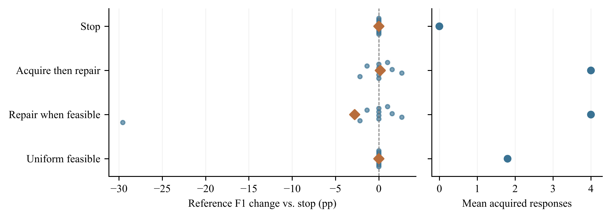

**图 9：** 来源证据开发重放。小点为十个回合相对停止策略的 F1 变化，菱形为均值。右图为缓存响应获取数量。

### 第二轮开发

保留相同二十文档、编译器、奖励、预算和门槛。仅增加可读实体名称，并澄清属性方向、历史角色，以及证据缺失与矛盾的区别。另四十请求全部完成，无传输失败；38 个响应通过固定规则解析器，产生 243 个类型规则和 14 个来源支持规则，但没有可执行来源矛盾规则。“先获取后修复”和“可行即修复”均达到 95.69% 参考 F1，停止策略为 94.42%。两者各删除 31 个注入项中的 7 个，不损失参考事实；全部七次删除来自类型约束。来源约束仍未达到所需修复效应门槛，两轮开发结束，不扩展训练或开展留出的生成规则策略评估。两轮编译器还分别拒绝 120 和 257 个类型候选，因为它们照抄示例字符串 `allowed or forbidden`，而未选择一种类别。采集后不放宽固定解析器。第一轮有害删除与第二轮来源修复覆盖为空的结果均保留。这些检查表明，仅有可执行引文与正确调度接口，不能证明来源约束有用。

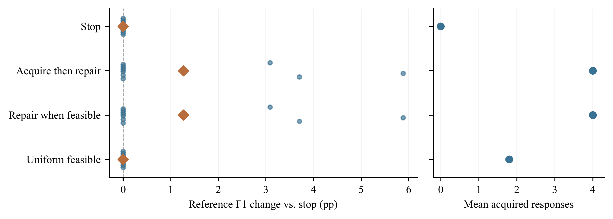

**图 10：** 相同十个文档对上的第二轮暨最后一轮开发。两种修复调度提高 F1 且不丢失参考事实，但全部删除使用类型约束。重复轮次不构成新测试文档。

# 附录 D 冻结的奖励验证协议

训练使用种子 $20000$–$20009$，种子 $s$、回合 $e\in\{0,\ldots,249\}$ 的环境种子为 $100000s+e$。独立可行随机岭回归轨迹使用 $30000$–$30009$ 和同一回合公式。开发场景为 $920000$–$920019$，保留测试场景为 $930000$–$930029$，均与早期十个审计场景不重叠。全部场景共享同一个 450 文档基础图谱。

训练清单固定来源、图数据、三种惩罚、四种神经设置、岭回归规格和统计比较，不利用开发分数选择检查点或惩罚。完成 40 个神经检查点、10 个岭回归拟合及开发检查后，第二份清单在测试前封存其哈希和评分代码。测试评估全部八个预定义策略；每次运行使用相同 30 个场景，支持配对比较，同时以十个运行种子均值作为统计单位。

评分与动作选择分开。策略接收公开观测及当前掩码，干净参考三元组和私有关系恢复记录均不进入输入。保存的初始图谱与逐步节点/边差分支持重建每条轨迹。材料基于重建轨迹核对最终参考指标、残留缺陷、掩码、奖励分解、累计成本和三种反事实回报。推理时不进行环境探测。

# 附录 E 早期计数惩罚组件研究

观测顺序为：四个图质量分量；规则精确率、召回率、覆盖率；四个规范化缺陷计数；剩余预算；高、低精度注册模块活跃比例。动作顺序为孤立清理、去重、关系修复、悬空边清理、删除获取、增强获取、混合获取与剪枝。

早期比较使用十个原场景 $900000$–$900009$。全部 60 个修订模型（DQN、Double DQN 和四项消融）采用训练种子 $10000$–$10009$，以及原 250 回合预算、网络维度、回放设置和 260 回合探索计划。图特征消融将观测索引 0–3、7–10 置零；规则特征消融将索引 4–6、12–13 置零，索引从零开始。其他输入和可行性掩码仍可用。这些是显式特征消融，因为掩码本身也能传递规则可用性。

无掩码变体移除行为与 Bellman 掩码；无调用惩罚变体在训练时加回已计入的获取惩罚。此组件研究的全部评估使用计数惩罚、不变的成本系数和 18 步预算。计算梯形 AUC 时，将提前终止质量延续至第 18 步。修订将原短轨迹 AUC 保留在历史归档，不混用两种定义。

双侧配对符号随机化枚举全部 $2^{10}$ 种符号赋值。置信区间使用种子 42 的 10,000 次整场景 bootstrap。Holm 校正覆盖十项比较：完整 Double DQN 与固定强启发式、四项消融，分别比较最终质量及共同预算 AUC。相同场景此前已评估，因此这些后续比较不构成新的留出测试。

**表 XIV：** 修正环境中十个配对场景的策略比较，报告均值 $\pm$ 样本标准差。调用数是记账获取单位。

| 策略 | 最终质量 | AUC$_{18}$ | 调用数 | 无效数 | 新引入违反 | 回报 |
| :--- | ---: | ---: | ---: | ---: | ---: | ---: |
| 随机可行动作 | $0.9642\pm0.0065$ | $0.9254\pm0.0152$ | 10.2 | 0.0 | 2.9 | 0.3163 |
| 交替可行动作 | $0.9677\pm0.0007$ | $0.9292\pm0.0020$ | 10.0 | 0.0 | 4.0 | 0.3102 |
| 规则优先可行动作 | $0.9747\pm0.0004$ | $0.9365\pm0.0024$ | 8.0 | 0.0 | 4.6 | 0.3255 |
| 先获取后按缺口修复 | $0.9825\pm0.0001$ | $0.9580\pm0.0014$ | 4.0 | 0.0 | 4.8 | 0.3508 |
| DQN | $0.9692\pm0.0037$ | $0.9454\pm0.0079$ | 5.2 | 0.0 | 0.0 | 0.3688 |
| Double DQN | $0.9686\pm0.0034$ | $0.9451\pm0.0096$ | 6.2 | 0.0 | 0.0 | 0.3660 |
| 基于环境模型的前瞻 | $0.9711\pm0.0048$ | $0.9516\pm0.0027$ | 5.1 | 0.0 | 0.2 | 0.3750 |

## E-A 早期策略结果

计数惩罚下，Double DQN 平均最终质量为 0.96855、AUC 为 0.94514，使用 6.2 次记账调用；先获取后按缺口修复启发式为 0.98248、0.95797，使用四次调用。完整 Double DQN 减启发式的差值分别为 $-0.01392$ 和 $-0.01283$，Holm 校正后两项 $p$ 均为 0.0195（表 XVI）。标准 DQN 的最终质量为 0.96920。

修正奖励现在对新引入违反计罚。十次评估中 Double DQN 没有引入违反，启发式每次平均引入 4.8 个。对于 $\mathcal R=\sum_{t=0}^{T-1}0.95^t r_t$，两者平均折扣回报分别为 0.3660 和 0.3508。第 IV-B 节动作审计显示，零违反来自避免关系修复。这些回报使用计数惩罚，与正文统一比率惩罚评估分开。每次转移保留全部奖励分量和新引入身份。

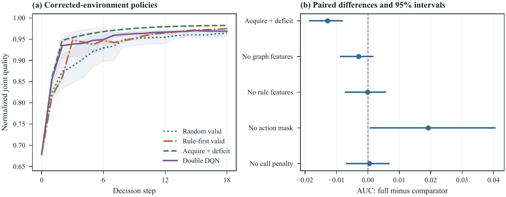

**图 11：** 十个复用场景上的早期计数惩罚策略研究。（a）十场景平均评估质量及一个标准差带，终止分数延续至第 18 步。（b）完整 Double DQN 减各对照的 AUC，附逐点 95% 配对 bootstrap 区间。多重性校正检验见表 XVI。

## E-B 重新训练的组件消融

四种变体各训练十个模型，每种子沿用 250 回合。分别移除显式图特征、显式规则特征、动作掩码或获取调用惩罚。特征移除同时应用于训练和评估；特征消融仍保留掩码，可能传递规则可用性。无掩码变体在动作选择和 Bellman 目标中都取消掩码。无调用惩罚变体只改变训练奖励；评估对全部设置使用相同修正奖励和成本系数。

**表 XV：** 修正环境中的消融，每设置十个重新训练模型。

| 设置 | 最终质量 | AUC$_{18}$ | 调用数 | 无效数 | 新引入违反 | 回报 |
| :--- | ---: | ---: | ---: | ---: | ---: | ---: |
| Double DQN | $0.9686\pm0.0034$ | $0.9451\pm0.0096$ | 6.2 | 0.0 | 0.0 | 0.3660 |
| 无图特征 | $0.9713\pm0.0041$ | $0.9481\pm0.0028$ | 5.1 | 0.0 | 0.9 | 0.3693 |
| 无规则特征 | $0.9692\pm0.0062$ | $0.9452\pm0.0034$ | 7.6 | 0.0 | 0.5 | 0.3594 |
| 无动作掩码 | $0.9480\pm0.0215$ | $0.9259\pm0.0278$ | 4.9 | 10.7 | 0.0 | 0.3430 |
| 无调用惩罚 | $0.9659\pm0.0051$ | $0.9446\pm0.0044$ | 8.1 | 0.0 | 0.0 | 0.3596 |

**表 XVI：** 修正环境中完整 Double DQN 减各对照。区间为逐点配对 bootstrap 95% 区间，Holm 校正十项检验。

| 比较方法 | 指标 | 差值 | 95% 区间 | $p_{\mathrm{Holm}}$ |
| :--- | :--- | ---: | ---: | ---: |
| 先获取后按缺口修复 | 最终 | -0.01392 | [-0.01604, -0.01205] | 0.0195 |
| 先获取后按缺口修复 | AUC | -0.01283 | [-0.01853, -0.00817] | 0.0195 |
| 无图特征 | 最终 | -0.00273 | [-0.00601, -0.00007] | 0.8340 |
| 无图特征 | AUC | -0.00292 | [-0.00862, +0.00151] | 1.0000 |
| 无规则特征 | 最终 | -0.00068 | [-0.00406, +0.00268] | 1.0000 |
| 无规则特征 | AUC | -0.00008 | [-0.00706, +0.00558] | 1.0000 |
| 无动作掩码 | 最终 | +0.02055 | [+0.00897, +0.03502] | 0.0195 |
| 无动作掩码 | AUC | +0.01921 | [+0.00075, +0.04042] | 0.8340 |
| 无调用惩罚 | 最终 | +0.00269 | [-0.00031, +0.00572] | 0.8340 |
| 无调用惩罚 | AUC | +0.00053 | [-0.00674, +0.00667] | 1.0000 |

移除掩码使最终质量降至 0.94800，每运行产生 10.7 个无效动作。最终质量对比通过 Holm 校正（$p=0.0195$），AUC 对比未通过（$p=0.8340$）。图特征、规则特征和调用惩罚对比均未通过十检验校正。因此，修订结果支持动作掩码对最终质量的贡献，其他独立收益在此环境中仍未确立。

分析枚举全部 $2^{10}$ 种符号赋值，进行精确双侧配对随机化；对完整 Double DQN 与启发式和四项消融的两指标共十项对比进行 Holm 校正。逐点区间使用 10,000 次配对 bootstrap。60 个新模型完成 15,000 个训练回合。早期检查点和结果仍按原环境版本归档。

# 附录 F 复现材料索引

原始检查点、转移和生成记录保留在各自实验目录。早期离线研究位于 `exps/paper2_offline_revision/`，包含冻结来源哈希、40 个新检查点和训练历史、全部配对评估转移、等调用候选样本、规则来源链、显式标签检查，以及论文图表生成程序。结果附有论文到材料的对应审计和离线复现命令。该批新增分析与训练不调用 API。

修正环境、60 个重训检查点、完整评估轨迹、Paper1 共享画像修订和规则桥接位于 `exps/math_revision_20260925/`，附来源清单和离线复现入口。

奖励验证研究位于 `exps/paper2_reward_validation/`，含训练与测试清单、40 个神经检查点、10 个岭回归模型及其公开反馈轨迹、开发与测试轨迹、配对分析、重建检查，以及当前奖励图表生成程序。README 提供无需 API 请求或模型下载的命令。

独立策略接口和覆盖审计位于 `exps/paper2_rule_integration/`，固定原始 CSV 快照、保留匹配及不匹配规则，并记录十六条调度轨迹。公开运行记录与仅供评分器使用的套件标签分开保存。合成接口测试不计入经验评估分母。

#### 离线调度诊断

`exps/papers_readiness_20261002/` 中的后续分析，在既有四规则包预算和十步时域下，枚举所有可行的获取、修复和停止序列。分析保留两轮开发及其共用的二十个文档，仅在枚举完成后用参考标签评分。表 XVII 区分可执行调度预言机与放宽上界：后者允许逐条删除在归档提案下可被移除的注入记录。

**表 17：** 每轮同一组十个开发文档对上的事后穷举调度。F1 在文档对之间取平均；预言机仅在分析中使用参考标签。

| 诊断 | 第一轮 | 第二轮 |
| :------------------------------- | --------: | --------: |
| 可行终止路径 | 363 | 235 |
| 停止 F1 (%) | 94.42 | 94.42 |
| 可执行预言机 F1 (%) | 95.45 | 95.69 |
| 逐项删除上界 F1 (%) | 95.60 | 95.69 |
| 代理回报最优 F1 (%) | 91.63 | 95.69 |
| 预言机丢失正确事实 | 0 | 0 |
| 预言机移除注入项 | 5 | 7 |

第一轮中，可执行预言机达到 95.45% F1，但最大化代理奖励的路径仅达到 91.63%，低于停止基线的 94.42%。因此，即使奖励记账已修正，错误规则仍可能使代理目标偏离事实质量。第二轮中，两种预言机界限均为 95.69%，与先获取后修复相同。七个可移除注入项全部由删除策略生成的类型规则覆盖；增强策略和来源约束未增加移除机会。获取全部规则包并完成所有可行修复后，第二轮各顺序的最终图谱相同。折扣回报仍随顺序变化，因此还有成本与时机问题，但这组固定候选上没有额外的最终 F1 空间。598 条终止路径属于开发集上的事后诊断，并非新文档或学习策略评估。

离线输出契约草案提供互斥枚举的具体合法示例、明确规则家族、候选上限及空结果行为。使用未修改的编译器重放全部 80 份历史响应，复现了原始规则和拒绝结果。草案尚未用于生成；扩展门槛仍未通过，正式研究仍未运行。

# 参考文献

[1] R. Das, S. Dhuliawala, M. Zaheer, L. Vilnis, I. Durugkar, A. Krishnamurthy, A. Smola, and A. McCallum, “Go for a walk and arrive at the answer: Reasoning over paths in knowledge bases using reinforcement learning,” in *International Conference on Learning Representations*, 2018.

[2] W. Xiong, T. Hoang, and W. Y. Wang, “Deeppath: A reinforcement learning method for knowledge graph reasoning,” in *Proceedings of EMNLP*, 2017.

[3] X. V. Lin, R. Socher, and C. Xiong, “Multi-hop knowledge graph reasoning with reward shaping,” in *Proceedings of EMNLP*, 2018.

[4] L. Yao *et al.*, “Kg-bert: Bert for knowledge graph completion,” in *arXiv preprint arXiv:1909.03193*, 2019.

[5] X. Wang *et al.*, “Kepler: A unified model for knowledge embedding and pre-trained language representation,” in *Transactions of the Association for Computational Linguistics*, 2021.

[6] S. Pan, L. Luo, Y. Wang, C. Chen, J. Wang, and X. Wu, “Unifying large language models and knowledge graphs: A roadmap,” *IEEE Transactions on Knowledge and Data Engineering*, vol. 36, no. 7, pp. 3580–3599, 2024.

[7] J. Wei *et al.*, “Chain-of-thought prompting elicits reasoning in large language models,” *Advances in Neural Information Processing Systems*, 2022.

[8] S. Yao *et al.*, “React: Synergizing reasoning and acting in language models,” in *International Conference on Learning Representations*, 2023.

[9] H. Knublauch and D. Kontokostas, “Shapes constraint language (shacl),” *W3C Recommendation*, 2017.

[10] E. Prud’hommeaux *et al.*, “Shape expressions: An rdf validation and transformation language,” *Proceedings of the 10th International Conference on Semantic Systems*, 2014.

[11] L. A. Galárraga *et al.*, “Amie: Association rule mining under incomplete evidence in ontological knowledge bases,” in *Proceedings of the 22nd International Conference on World Wide Web*, 2013.

[12] S. Ortona *et al.*, “Rudik: Rule discovery in knowledge bases,” in *Proceedings of the VLDB Endowment*, 2018.

[13] F. Yang *et al.*, “Differentiable learning of logical rules for knowledge base reasoning,” in *Advances in Neural Information Processing Systems*, 2017.

[14] T.-W. Lin, G. Fierro, H. Li, T. Hong, P. Nuzzo, and A. Sangiovanni-Vinentelli, “Systematic evaluation of knowledge graph repair with large language models,” arXiv preprint, 2025.

[15] V. Mnih *et al.*, “Human-level control through deep reinforcement learning,” *Nature*, vol. 518, pp. 529–533, 2015.

[16] H. van Hasselt, A. Guez, and D. Silver, “Deep reinforcement learning with double q-learning,” in *Proceedings of the AAAI Conference on Artificial Intelligence*, 2016, pp. 2094–2100.

[17] Y. Yao, D. Ye, P. Li, X. Han, Y. Lin, Z. Liu, Z. Liu, L. Huang, J. Zhou, and M. Sun, “DocRED: A large-scale document-level relation extraction dataset,” in *Proceedings of the 57th Annual Meeting of the Association for Computational Linguistics*, 2019, pp. 764–777.
